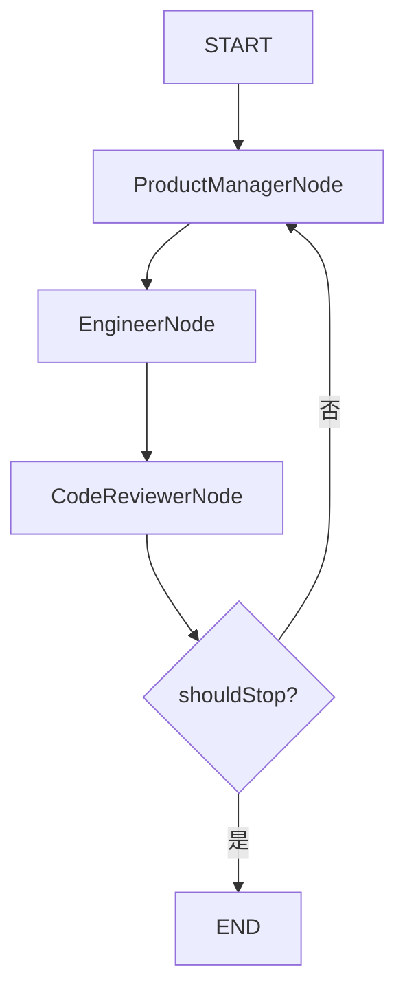

# AutoGen多智能体群聊与Spring AI Alibaba从0到1掌握指南

## 1. 这篇文档到底要解决什么问题

很多初学者第一次看到 `module-multi-agent-conversation` 时，都会同时卡在两层：

- 第一层是范式层：AutoGen 风格的多智能体群聊到底和 CAMEL、Supervisor 有什么本质区别
- 第二层是框架层：Spring AI Alibaba 里的 `FlowAgent`、`StateGraph`、`OverAllState` 到底分别负责什么

最常见的困惑通常有这几类：

1. 这不就是三个角色轮流调模型吗，为什么还要上 `FlowAgent`
2. `StateGraph` 到底只是描述结构，还是会真的驱动运行
3. `shared_messages` 为什么要专门放进状态里，普通消息列表不行吗
4. `OverAllState` 和普通 `Map<String, Object>` 到底是什么关系
5. 为什么这里明明有 `ReactAgent`，真正干活的却又是 `Node`
6. Spring AI、Spring AI Alibaba、项目自己的 `AgentLlmGateway` 三者到底怎么分工

这篇文档不是单纯介绍一个模块，也不是脱离仓库讲框架百科。

它真正要做的事情是：

**借 `module-multi-agent-conversation` 这个落地案例，把 Spring AI Alibaba 的多智能体群聊运行时，从 0 到 1 讲明白。**

读完之后，你应该能自己回答下面这些问题：

- AutoGen 风格 Conversation 的本质到底是什么
- 手写 `while` 版和 Spring AI Alibaba 图编排版到底在对照什么
- `FlowAgent` 第一次执行时，框架内部到底发生了什么
- 三个角色共享上下文的事实，是怎么在状态里流转的
- 这套实现为什么既保留手写版，也保留框架版

---

## 2. 先说人话：AutoGen Conversation 到底是什么

你可以先不要把它想成“高级多智能体框架”。

它最朴素的意思其实是：

**让多个专家待在同一个群聊里，共享同一份历史，然后按固定顺序轮流发言。**

这个模块里的例子很具体：

- `ProductManager` 负责拆需求
- `Engineer` 负责交付完整 Python 脚本
- `CodeReviewer` 负责检查脚本是否达标

他们不是各聊各的，也不是“你问我答”式的一对一接力，而是：

- 共享同一份 `shared_messages`
- 按固定顺序 `ProductManager -> Engineer -> CodeReviewer`
- 审查意见会继续广播回整个群聊
- 只有 `CodeReviewer` 有权决定是否结束

所以 AutoGen Conversation 的重点不是“多几个 Agent 一起聊天”，而是：

**共享上下文 + 固定轮询 + 审查回流 + 明确终止协议。**

这就是 `module-multi-agent-conversation` 这个模块真正要还原的范式本体。

---

## 3. 它和 CAMEL、Supervisor 到底差在哪

很多人第一次看 conversation 模块，会下意识把它和仓库里另外两个多智能体模块混在一起：

- `module-multi-agent-roleplay`
- `module-multi-agent-supervisor`

这三个都叫“多智能体”，但控制逻辑完全不是一回事。

### 3.1 AutoGen Conversation

更像：

**三个人在同一个群里轮流发言。**

关键点是：

- 所有人共享同一份历史
- 发言顺序相对固定
- 没有一个中心调度者每轮重新分配任务

### 3.2 CAMEL Roleplay

更像：

**两个角色按协议接力对话。**

关键点是：

- 强调角色边界
- 强调交接顺序
- 更关注“当前是谁掌控流程”

### 3.3 Supervisor

更像：

**一个主管统一拆任务、派任务、收结果、决定下一步。**

关键点是：

- 中心化控制
- Worker 不直接构成持续共享群聊
- Supervisor 始终掌握总调度权

可以直接把三者记成一句话：

- `Conversation / AutoGen`：重点是共享群聊上下文
- `Roleplay / CAMEL`：重点是角色接力和控制权交接
- `Supervisor`：重点是中心化任务编排

---

## 4. 先建立一张技术栈地图

如果不先把技术栈分层看清，你会很容易把很多概念混在一起。

这个模块里的多智能体 conversation，实际上分成 4 层：

| 层次 | 代表对象 | 在本模块里的职责 |
| --- | --- | --- |
| 范式层 | `module-multi-agent-conversation` | 组织 AutoGen 风格的共享群聊、轮询推进和终止协议 |
| 统一协议层 | `framework-core`、`AgentLlmGateway`、`Message` | 对模型调用、消息结构、记忆结构提供统一抽象 |
| Spring AI 适配层 | `ChatModel`、自动装配模块 | 把统一 `llm.*` 配置接到真实模型 |
| Spring AI Alibaba 图运行时层 | `FlowAgent`、`StateGraph`、`OverAllState` | 把多角色协作做成显式状态图和可执行回环 |

这张图最重要的启发是：

- `AgentLlmGateway` 解决的是“统一模型边界”
- Spring AI 解决的是“对接真实模型”
- Spring AI Alibaba 解决的是“流程怎么作为图运行起来”

它们不是同一层能力。

换句话说：

- 你可以不用 Spring AI Alibaba，也能写出手写版群聊 runtime
- 但如果你想把群聊回环、状态流转、条件路由提升成显式图运行时，Spring AI Alibaba 就开始发挥价值

---

## 5. 本模块里的两套实现，到底在对照什么

这个模块不是只写了一种 conversation，而是故意保留了两条实现线。

### 5.1 手写版 `RoundRobinGroupChat`

它回答的是：

**如果完全不用图框架，AutoGen 风格的群聊 runtime 最小应该怎么写。**

手写版显式暴露了这些底牌：

- 一份全局 `ConversationMemory`
- 一份共享 `sharedMessages`
- 一个 `while (turnCount < maxTurns)` 回环
- 一个固定发言序列
- 一个由 `CodeReviewer` 决定的结束协议

所以手写版最适合回答的问题是：

> AutoGen 风格群聊的本质，到底是不是就是一套共享上下文上的轮询循环？

答案是：是的。

### 5.2 Spring AI Alibaba 版 `AlibabaConversationFlowAgent`

它回答的是：

**如果把同一件事交给图运行时治理，应该怎么做。**

这个版本里，开发者不再手写 `while` 主循环，而是改成：

- 用 `StateGraph` 定义节点和边
- 用 `OverAllState` 保存共享事实
- 用 `Conditional Edge` 决定继续还是结束
- 用 `FlowAgent` 作为整张图的调度外壳

所以这两条实现线不是重复，而是在对照两种 runtime 思路：

- 手写 runtime
- 图编排 runtime

仓库保留这两套实现，正是为了贯彻整个项目的“左右互搏、对照学习”哲学。

---

## 6. 先把 Spring AI Alibaba 的 6 个核心词翻成人话

真正卡新手的，通常不是代码，而是术语。

你可以先把这 6 个词翻译成人话：

| 术语 | 在这个模块里是什么意思 | 大白话理解 |
| --- | --- | --- |
| `FlowAgent` | 图编排 Agent 的总外壳 | 一个“会跑流程图”的调度器 |
| `StateGraph` | 状态图本体 | 流程图图纸，定义节点和边 |
| `Node` | 图里的一个执行步骤 | 一个具体环节，比如 PM、工程师、评审 |
| `Conditional Edge` | 条件边 | 根据当前状态决定下一步去哪 |
| `OverAllState` | 图运行时共享状态 | 全流程共用的一本草稿本 |
| `invoke(...)` | 启动图执行 | 真正按图把流程跑起来 |

这里最关键的两个理解是：

### 6.1 `StateGraph` 不是装饰图，而是运行依据

很多人第一次看图框架时会误以为：

- `StateGraph` 只是让结构更好看
- 真正执行逻辑还是别的代码在管

这个理解不对。

在 Spring AI Alibaba 这里，`StateGraph` 不是流程图展示，而是运行时真正依赖的执行结构。

换句话说：

**框架后面真的会按这张图去找节点、走边、做回环。**

### 6.2 `OverAllState` 不是普通上下文字符串，而是共享事实容器

你可以把 `OverAllState` 理解成：

**整张图运行过程中所有节点共同读写的一份事实快照。**

在这个 conversation 模块里，它里面放的不是随便什么字符串，而是流程推进真正依赖的关键事实，比如：

- 原始任务
- `conversation_id`
- `turn_count`
- `current_python_script`
- `review_status`
- `done`
- `shared_messages`
- `transcript`

节点之间的协作不是靠“我把上轮输出再拼一遍 prompt”，而是靠共享状态交接。

---

## 7. 图编排版 Conversation 到底怎么跑起来

这一节是全文最重要的部分。

先直接给你结论：

**图不是在构造器里就跑起来的，而是在 `run(task)` 调到 `invoke(input)` 时才真正开始执行。**

### 7.1 第一步：`run(task)` 先构造初始状态

`AlibabaConversationFlowAgent.run(String task)` 做的第一件事，不是立刻找模型，而是先构造输入状态。

它初始化了几类信息：

| 状态键 | 含义 |
| --- | --- |
| `input` | 原始任务文本 |
| `conversation_id` | 本轮群聊的统一会话标识 |
| `active_role` | 当前活动角色，初始为 `product_manager` |
| `turn_count` | 已推进总轮次 |
| `last_product_output` / `last_engineer_output` / `last_reviewer_output` | 最近一轮输出，便于调试和断言 |
| `current_python_script` | 当前沉淀出的最新 Python 脚本 |
| `review_status` | 当前评审状态，初始为 `pending` |
| `done` | 是否结束 |
| `stop_reason` | 停止原因 |
| `shared_messages` | 所有人共享的群聊消息历史 |
| `transcript` | 用于回放和审计的简化轮次记录 |

这里最关键的设计不是“键值对很多”，而是：

**它把原本散落在 while 循环变量里的运行事实，全部显式提升成了状态。**

### 7.2 第二步：`invoke(input)` 启动整张图

`run(task)` 在准备好初始输入之后，会调用：

```java
invoke(input)
```

这一步才是真正把状态图跑起来的入口。

学习时你可以先只记一句话：

**`invoke(...)` 不是普通方法调用，而是“把当前输入状态交给图 runtime 执行”。**

### 7.3 第三步：`buildSpecificGraph(...)` 定义流程图

`AlibabaConversationFlowAgent` 通过 `buildSpecificGraph(...)` 定义这张图：



这里的图结构非常直白：

1. 从 `START` 进入 `ProductManagerNode`
2. 然后固定走到 `EngineerNode`
3. 再固定走到 `CodeReviewerNode`
4. 审查结束后走条件边
5. 如果未完成，就回到 `ProductManagerNode`
6. 如果完成，进入 `END`

这正是手写版 `while` 回环的图运行时映射。

### 7.4 第四步：每个 Node 只做“读状态 -> 生成 -> 写状态”

这套实现里每个节点的职责都很克制。

#### `ProductManagerNode`

它做的事是：

1. 从状态里读出 `shared_messages`
2. 在最前面拼上自己的 `system prompt`
3. 通过 `AgentLlmGateway` 生成下一步需求
4. 把输出追加回 `shared_messages`
5. 把一条简化记录写进 `transcript`
6. 把 `active_role` 切到 `Engineer`

#### `EngineerNode`

它做的事是：

1. 读取共享群聊历史
2. 生成最新完整 Python 脚本
3. 对代码块做标准化清洗
4. 把脚本写回 `shared_messages`
5. 同时更新 `current_python_script`
6. 把 `active_role` 切到 `CodeReviewer`

#### `CodeReviewerNode`

它做的事是：

1. 读取共享群聊历史
2. 基于最新脚本给出审查结论
3. 把审查意见写回 `shared_messages`
4. 检查是否包含 `<AUTOGEN_TASK_DONE>`
5. 更新 `review_status`、`done`、`stop_reason`
6. 如果未完成，把 `active_role` 切回 `ProductManager`

所以你会发现，这里的 Node 不是“大而全的 Agent”，而是：

**围绕共享状态做单步状态推进的执行节点。**

### 7.5 第五步：条件边决定继续还是结束

真正决定流程是否回环的，不是某个节点里直接 `while`，而是 `CodeReviewerNode` 后面的条件边。

这个条件判断本质上看两件事：

- `done == true`
- `turn_count >= maxTurns`

只要满足任意一个，流程就进入 `END`。

这就是图编排版最核心的治理价值：

**继续还是结束，不再是隐含在循环体里的控制流，而是显式写成了图路由规则。**

---

## 8. `shared_messages` 和 `transcript` 为什么要分开

这是很多新手第一次看这个模块时最容易忽略，但工程上非常重要的一点。

它们虽然都像“历史记录”，但职责不一样。

### 8.1 `shared_messages`

它服务的是：

**让所有角色共享同一份真实群聊上下文。**

里面保存的是完整消息结构，例如：

- `messageId`
- `conversationId`
- `role`
- `content`
- `name`

这是给模型继续消费的真实上下文。

### 8.2 `transcript`

它服务的是：

**让人类更容易回放和审计。**

里面保存的是更轻量的轮次记录：

- 第几轮
- 谁发言
- 发言内容

它更像操作日志，而不是模型上下文本体。

所以这两个结构看起来相似，但不要合并理解：

- `shared_messages` 是给 Agent 用的
- `transcript` 是给人和测试用的

这也是为什么框架版会专门有一个 `ConversationStateSupport`：

**它负责把对象结构转成状态里稳定可保存的 Map 形态，并在读取时恢复回来。**

---

## 9. 为什么这里既有 `AgentLlmGateway`，又有 `ChatModel`，还出现了 `ReactAgent`

这是这份代码里最容易让人一眼看懵的地方。

你可以按下面这条链路理解：

### 9.1 `AgentLlmGateway` 是项目统一模型边界

整个仓库的铁律是：

**上层范式模块只依赖统一 `AgentLlmGateway`，不直接绑定某家模型 SDK。**

所以无论是手写版还是 conversation 图编排版，真正发起模型调用时，最终都还是回到这个统一网关。

### 9.2 `ConversationGatewayBackedChatModel` 是适配桥

Spring AI Alibaba 的一些 Agent 抽象希望接收的是 `ChatModel`。

但本仓库又要求统一走 `AgentLlmGateway`。

所以这里多了一层适配器：

- 把 Spring AI 的 `Prompt`
- 转成框架统一的 `LlmRequest`
- 再通过 `AgentLlmGateway` 调用真实模型

这层桥的意义是：

**既接入 Spring AI / Spring AI Alibaba 抽象，又不破坏仓库统一网关边界。**

### 9.3 当前实现里的 `ReactAgent` 更像“角色元数据对象”

这份代码里确实创建了三个 `ReactAgent`：

- `autogen-product-manager-agent`
- `autogen-engineer-agent`
- `autogen-code-reviewer-agent`

但从当前实现方式来看，真正推进群聊状态、并直接通过统一网关生成内容的，主要还是各个 `Node`。

所以更准确的理解应该是：

- `Node` 负责当前这份实现里的实际状态推进
- `ReactAgent` 负责把角色信息、模型配置和框架 Agent 抽象对齐

不要把这里的 `ReactAgent` 误解成“它单独就把整条 conversation 跑完了”。

基于当前代码，更准确的说法是：

**当前 conversation 图编排版，是 `FlowAgent + StateGraph + Node` 为主，`ReactAgent` 作为角色元数据补齐。**

---

## 10. 为什么这里要用 Spring AI Alibaba，而不是自己写 while

如果只是做一个最小 demo，手写 `RoundRobinGroupChat` 其实完全够用。

但一旦你把目标从“能跑”提升到“可治理、可扩展、可审计”，Spring AI Alibaba 的价值就会开始体现出来。

### 10.1 状态显式化

手写版里很多事实会散落在局部变量里：

- 当前轮次
- 当前脚本
- 是否完成
- 最近一次审查结果

图编排版把这些都提升进了 `OverAllState`。

这样做最大的好处是：

**流程运行的关键事实不再藏在代码细节里，而是变成了显式状态。**

### 10.2 控制流显式化

手写版的回环逻辑在 `while` 里。

图编排版把它拆成：

- 节点
- 普通边
- 条件边
- 结束节点

这样做的价值是：

**流程结构本身可被阅读、可被扩展、可被治理。**

### 10.3 更适合后续演进

如果未来你要把这个简单三角色群聊扩展成：

- 更多专家角色
- 分支审查流程
- 人工审批插点
- 工具节点接入
- 外部系统事件回灌

那么图运行时天然比手写 `while` 更容易承接这些复杂性。

所以这不是“为了上框架而上框架”，而是：

**当协作流程开始变复杂时，图运行时能把复杂性从业务逻辑里抽出来。**

---

## 11. 手写版和 Spring AI Alibaba 版到底怎么一一对应

这是最值得新手对照看的部分。

| 维度 | 手写版 `RoundRobinGroupChat` | Spring AI Alibaba 版 `AlibabaConversationFlowAgent` |
| --- | --- | --- |
| 主循环 | `while (turnCount < maxTurns)` | `StateGraph + Conditional Edge` |
| 共享上下文 | `ConversationMemory.sharedMessages` | `OverAllState.shared_messages` |
| 人类可读回放 | `ConversationMemory.transcript` | `OverAllState.transcript` |
| 角色切换 | `speakerIndex` 轮询 | 固定边 + 条件边 |
| 结束协议 | Reviewer 输出 `<AUTOGEN_TASK_DONE>` | Reviewer 写 `done`，条件边进入 `END` |
| 产物沉淀 | `latestPythonScript` 局部变量 | `current_python_script` 状态键 |
| 控制权位置 | Java 代码自己管循环 | 图运行时根据状态路由 |

所以你可以把它们看成：

- 手写版把 runtime 写在 Java 控制流里
- 图编排版把 runtime 写在状态图结构里

两边解决的是同一个问题，只是“运行时的承载形式”不同。

---

## 12. 新手看源码的正确顺序

如果你第一次接触这个模块，不建议一上来就从 `Node` 文件往下啃。

更推荐按这个顺序看：

### 第一步：先看模块 README

先建立总认知：

- 它复刻的是哪个理论范式
- 两套实现分别是什么
- 它和 CAMEL 的差异是什么

### 第二步：看 `AlibabaConversationFlowAgent`

这是图编排版的总入口。

重点看 3 件事：

1. `run(task)` 初始化了哪些状态
2. `buildSpecificGraph(...)` 把图怎么连起来
3. 停止逻辑到底写在哪里

### 第三步：看三个 `Node`

按顺序看：

1. `ProductManagerNode`
2. `EngineerNode`
3. `CodeReviewerNode`

重点不是抠语法，而是看每个节点的统一模式：

- 读哪些状态
- 生成什么内容
- 写回哪些状态

### 第四步：看 `ConversationStateSupport`

这里能帮你彻底理解：

- 为什么状态里不是直接塞对象
- `shared_messages` / `transcript` 为什么要转成 Map
- 图状态恢复时是怎么还原对象的

### 第五步：回头对照 `RoundRobinGroupChat`

到这一步再回看手写版，你会突然看明白很多东西：

- 图编排版到底把哪些 while 逻辑抽走了
- 哪些状态原本只是局部变量
- 条件边到底是在替代哪一段传统控制流

### 第六步：最后看对照测试

最推荐看的是：

- `ConversationRoundRobinComparisonTest`

因为它钉住了这个模块最核心的事实：

- 两套实现都必须完成同一个任务
- 都必须经过至少一轮审查后继续协作
- 都必须围绕共享群聊历史推进

---

## 13. 本地怎么跑，学习效果最好

这个模块已经提供了两类入口。

### 13.1 离线对照测试

最适合学习阶段先看的，是离线脚本化测试：

- `ConversationRoundRobinComparisonTest`

它不依赖真实模型，而是用脚本化网关固定返回值，所以你能稳定看到：

- 第一轮 PM 怎么拆任务
- 第二轮 Engineer 怎么交代码
- 第三轮 Reviewer 怎么提出阻塞问题
- 第二次 Engineer 怎么修复
- Reviewer 最后怎么输出 `<AUTOGEN_TASK_DONE>`

这类测试最适合先理解运行时形态。

### 13.2 真实 OpenAI Demo

如果你已经想看真实模型效果，模块还提供了两个真实 Demo：

- `HandwrittenConversationOpenAiDemo`
- `AlibabaConversationFlowOpenAiDemo`

它们都要求：

1. 启用 `openai-conversation-demo` profile
2. 在配置文件里提供真实 `llm.api-key`
3. 开启 `demo.conversation.openai.enabled=true`

学习顺序建议是：

1. 先读离线对照测试
2. 再看手写版 runtime
3. 再看图编排版 runtime
4. 最后再跑真实 OpenAI Demo

因为真实模型效果会有随机性，而离线测试能先帮你钉住运行时本质。

### 13.3 运行前的一个环境提醒

当前父工程要求 `Java 21`。

如果你本地默认 JDK 还是 17，直接跑 Maven 很可能先卡在 `maven-enforcer-plugin` 的版本校验上。

所以学习这个模块前，先确保本地终端已经切到 JDK 21。

---

## 14. 最后用一句话收束

`module-multi-agent-conversation` 真正要教你的，不是“如何把三个提示词拼在一起”，而是下面这件事：

**当多个智能体需要围绕同一份群聊历史持续协作时，Spring AI Alibaba 可以把这件事从隐含的 while 循环，提升成显式的状态图运行时。**

如果你已经读到这里，可以把这套实现压缩成一句最核心的话：

- 手写版告诉你 AutoGen Conversation 的底牌是什么
- Spring AI Alibaba 版告诉你这张底牌在企业工程里该怎么治理

这也正是这个仓库保留双实现对照的真正价值。
