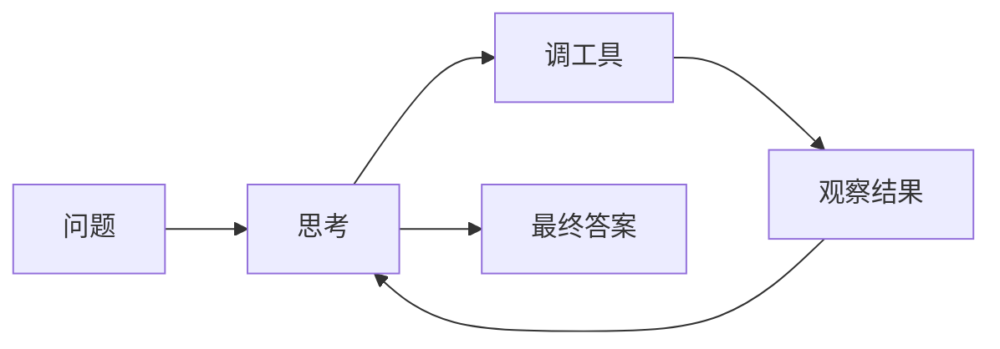
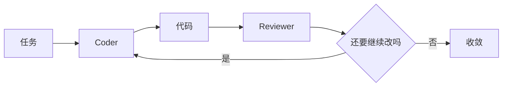
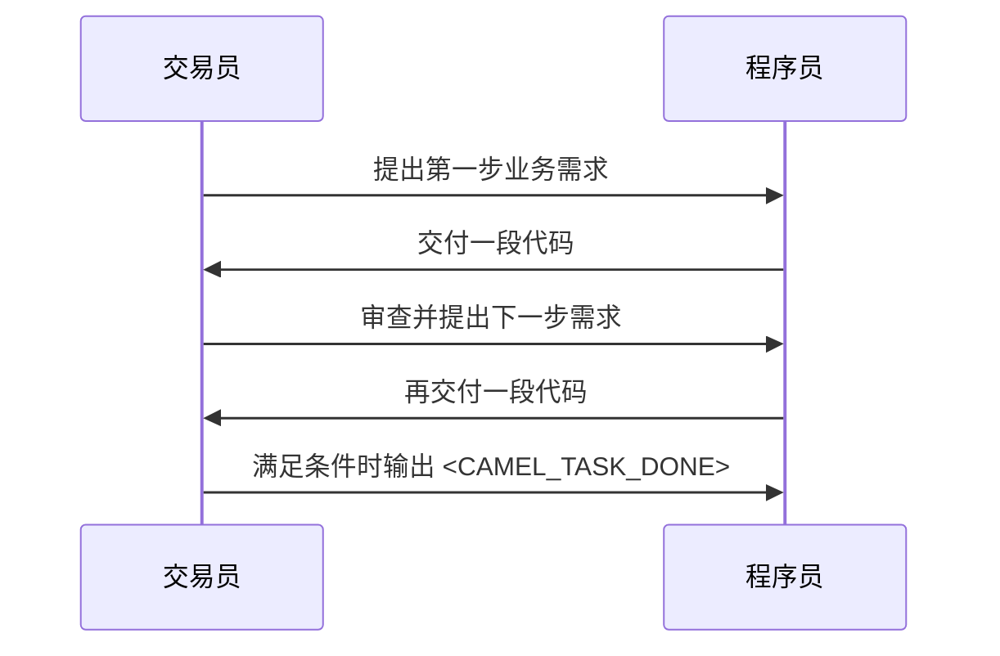
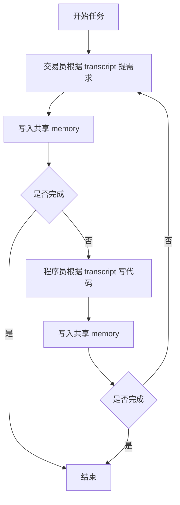
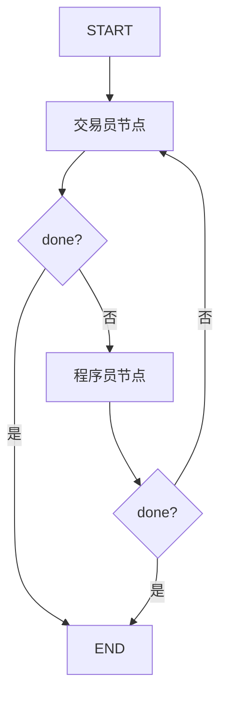

# CAMEL范式从0到1掌握指南

## 1. 先说人话：CAMEL 到底是什么

CAMEL 你可以先别把它想复杂。

它最朴素的意思就是：

**不要让一个大模型既当产品经理、又当程序员、又当评审。**

而是先把角色拆开，再让它们按规则协作。

比如你现在这个例子里：

- 交易员负责提需求和验收
- 程序员负责写代码

他们不是随便聊天，而是要遵守一套很死的协议：

- 一问一答
- 严格轮流
- 程序员每次只交一段代码
- 满足条件后输出 `<CAMEL_TASK_DONE>`

所以 CAMEL 的核心不是“多几个 Agent”，而是：

**让不同角色各守边界，然后通过对话把任务一步一步推进。**

---

## 2. 它和 ReAct、Plan-and-Solve、Reflection 到底差在哪

很多人第一次看 CAMEL，会觉得：

- ReAct 里也有步骤
- Plan-and-Solve 里也有 planner 和 executor
- Reflection 里也有 coder 和 reviewer

那 CAMEL 不也是“多个东西一起配合”吗？

表面上像，底层逻辑不一样。

### 2.1 ReAct

ReAct 更像：

**一个人自己想、自己调工具、自己继续想。**

它的核心链路是：

这里没有“角色协作”，只有“一个智能体自己工作”。

### 2.2 Plan-and-Solve

Plan-and-Solve 更像：

**先做计划，再按计划执行。**

它更像固定流水线，不是双边来回协商。

### 2.3 Reflection

Reflection 更像：

**先写一版，再站到评审视角挑毛病，再改。**

这已经有“两个角色味道”了，但本质上仍然是围绕同一个产物做自我优化。

### 2.4 CAMEL

CAMEL 更像真正的角色协作：

它的重点不是“谁先谁后”，而是：

- 角色边界
- 协作协议
- 控制权交接

---

## 3. 你到底该怎么理解 CAMEL 的核心组成

学 CAMEL，先抓 5 个词就够了。

### 3.1 Task

就是共同任务。

比如：

> 编写一个 Java 程序，通过公共 API 获取特定股票的实时价格，并计算移动平均线。

### 3.2 Role

就是角色分工。

比如：

- 交易员：提需求、做验收
- 程序员：写实现、交付代码

### 3.3 Inception Prompting

就是一开始先把规矩写死。

不是泛泛地说一句：

> 你是一个资深程序员

而是要明确写：

- 你只能做什么
- 你不能做什么
- 你每次输出什么
- 什么时候允许终止

### 3.4 Conversation Loop

就是消息接力。

一轮一轮地推进：

### 3.5 Termination

就是停止协议。

没有这个，两个 Agent 很容易没完没了地说下去。

你现在这个模块里用的是：

- `<CAMEL_TASK_DONE>`
- 或者最大轮次上限

---

## 4. 为什么 CAMEL 一定要“强约束 Prompt”

这是 CAMEL 最容易被做歪的地方。

如果 prompt 只是写：

- 你是交易员
- 你是程序员

那最后很容易变成：

- 交易员开始自己写代码
- 程序员开始自己改需求
- 两个人都在重复说废话

所以 CAMEL 的 prompt 不是“人设文案”，而是“岗位说明书 + 协作协议”。

你现在这个仓库里的设计就是这个思路：

- 交易员 prompt 强调：只提需求、只验收、不写代码
- 程序员 prompt 强调：只根据最后一条需求写代码、不改业务目标

一句话总结：

**Prompt 在 CAMEL 里不是装饰品，而是运行规则。**

---

## 5. 这个模块里的两套实现，为什么都要保留

`module-multi-agent-roleplay` 里现在有两条实现线。

### 5.1 手写版

入口类：

- `HandwrittenCamelAgent`

它的价值是：

- 把 CAMEL 最原始的运行逻辑彻底摊开
- 让你看清楚消息是怎么接力的
- 让你看清楚 transcript 是怎么维护的
- 让你看清楚停止条件是谁判断的

核心流程图：

这个版本最适合回答：

> CAMEL 不靠框架时，最小 runtime 到底该怎么写？

### 5.2 Spring AI Alibaba 版

入口类：

- `AlibabaCamelFlowAgent`

它的价值是：

- 把消息路由从业务代码里抽走
- 把控制权交接做成状态图
- 让多角色协作可以扩展到更多节点和更多分支

核心流程图：

这个版本最适合回答：

> 企业里如果不想把控制流程都硬编码在 while 循环里，该怎么做？

---

## 6. 手写版到底在干什么

先用一句最直白的话说：

**手写版就是你自己当 runtime。**

你自己负责：

- 保存对话历史
- 决定先让谁说
- 决定下一轮轮到谁
- 检查什么时候该停

在这个项目里，手写版最关键的 3 个对象是：

- `CamelTraderAgent`
- `CamelProgrammerAgent`
- `CamelConversationMemory`

### 6.1 `CamelConversationMemory` 的作用

它不是简单聊天记录，而是：

**共享 transcript + 角色视角转换器**

因为同一份对话，对交易员和程序员看到的视角不一样。

比如交易员看时：

- 自己过去说的话是 assistant
- 程序员说的话是 user

程序员看时正好反过来。

所以它做的不是“存字符串”，而是：

**把共享 transcript 映射成当前角色应该看到的消息列表。**

### 6.2 `HandwrittenCamelAgent` 的作用

它就是调度器。

你可以把它理解成：

> 一个写死了“交易员 -> 程序员 -> 交易员 -> 程序员”接力规则的 while 循环

这是最原汁原味的 CAMEL 思路。

因为你能非常清楚地看到：

- 谁先发第一棒
- 谁消费上一棒
- 谁写回 memory
- 谁触发停止

---

## 7. FlowAgent 版到底在干什么

FlowAgent 版的重点不是“更高级的模型调用”，而是：

**更高级的流程控制。**

它不再关心完整 prompt 历史怎么拼，而是把每一轮真正要传递的最小信息写入状态。

比如：

- `message_for_programmer`
- `message_for_trader`
- `current_java_code`
- `done`
- `turn_count`

这就叫 baton，也就是“接力棒”。

### 7.1 为什么这比手写拼历史更工程化

因为在企业里，一旦角色变多、分支变多，继续手工拼全量历史会越来越难维护。

而状态图的思路是：

- 每个节点只读自己需要的字段
- 每个节点只写下一跳需要的字段
- 流程是否继续，由条件边统一判断

一句话：

**手写版传的是整段聊天味道，框架版传的是最小业务状态。**

---

## 8. 这个模块里最该重点看的类有哪些

如果你第一次读源码，不要从所有文件一起看。

推荐按下面顺序看：

### 第一组：先看手写版主干

- `HandwrittenCamelAgent`
- `CamelTraderAgent`
- `CamelProgrammerAgent`
- `CamelConversationMemory`

这组能帮你先建立 CAMEL 的最小运行直觉。

### 第二组：再看框架版主干

- `AlibabaCamelFlowAgent`
- `CamelTraderHandoffNode`
- `CamelProgrammerHandoffNode`

这组能帮你理解“同一套协作逻辑，怎么从 while 循环升级到状态图”。

### 第三组：最后看约束层

- `CamelPromptTemplates`
- `CamelRoleContract`
- `CamelRoleType`

这组能帮你理解：

> 为什么两个 Agent 不只是“名字不同”，而是真的职责不同。

---

## 9. 开发者第一次自己写 CAMEL，最容易犯什么错

### 9.1 只写人设，不写协议

错误示例：

- 你是资深交易员
- 你是资深程序员

这种写法太松，角色会漂。

正确思路是把这几件事写死：

- 输入是什么
- 输出是什么
- 禁止做什么
- 谁来宣布完成

### 9.2 两个角色职责重叠

如果交易员也能写代码，程序员也能改需求，那最后就不是协作，而是互相抢活。

### 9.3 没有停止协议

没有 `<CAMEL_TASK_DONE>` 或最大轮次上限，两个角色可能一直来回说。

### 9.4 把所有历史都硬塞给每个节点

小 demo 还行，工程里很快就会失控。

---

## 10. 你应该怎么学这个模块，顺序最省脑子

推荐顺序：

1. 先读 `HandwrittenCamelAgent`
2. 再读 `CamelConversationMemory`
3. 再读两个角色 agent 的 prompt 和职责
4. 再读 `AlibabaCamelFlowAgent`
5. 最后读两个 handoff node

原因很简单：

- 先理解手写版，容易建立直觉
- 再看图编排版，才知道框架到底帮你抽走了什么

---

## 11. 最后给一个最短总结

如果你读到这里还想记一句话，那就记这句：

**CAMEL 不是“多几个 Agent 一起聊天”，而是“先把角色边界和协作协议钉死，再让它们按规则接力完成任务”。**

而 `module-multi-agent-roleplay` 的价值就在于：

- 用手写版告诉你 CAMEL 原始 runtime 是怎么跑的
- 用 FlowAgent 版告诉你企业里怎么把这套协作做成可维护的状态图
