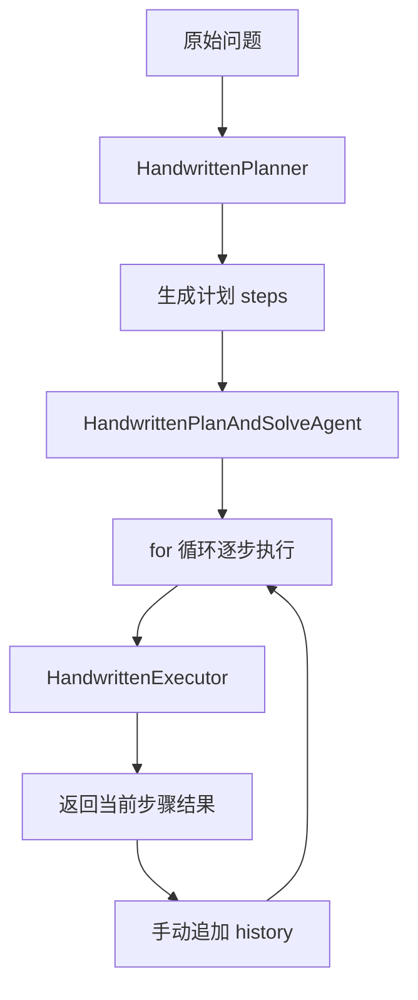
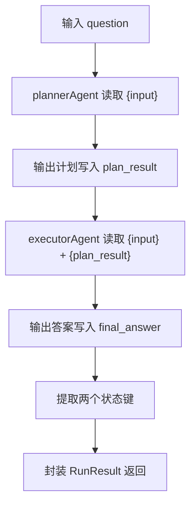

# Plan-and-Solve范式从0到1掌握指南

## 1. 这篇文档到底要解决什么问题

很多人第一次看 `module-plan-replan-paradigm` 时，通常会卡在这几层：

- 第一层是范式层：Plan-and-Solve 到底和 ReAct、Reflection、Sequential 有什么本质区别
- 第二层是框架层：`SequentialAgent`、`outputKey`、`OverAllState` 到底怎么把阶段编排真正跑起来的

最常见的困惑通常有这几类：

1. 这不就是"先列步骤再依次做"吗，为什么还要叫 Plan-and-Solve
2. 手写版的 `history` 和框架版的状态键，到底差在哪
3. `outputKey` 和 `instruction` 里的 `{plan_result}` 到底是怎么对上的
4. `includeContents(false)` 为什么要关掉
5. 为什么最后还原出来的 `RunResult` 里，`planResult` 是个 `AssistantMessage` 包装

这篇文档不是脱离仓库讲框架百科，也不是只讲模块目录说明。

它真正要做的事情是：

**借 `module-plan-replan-paradigm` 这个落地案例，把 Plan-and-Solve 范式本体和 Spring AI Alibaba 的原生实现过程，从 0 到 1 讲明白。**

读完之后，你应该能自己回答下面这些问题：

- Plan-and-Solve 的本质到底是什么
- 手写版和框架版到底在对照什么
- Spring AI Alibaba 里的 `SequentialAgent` 到底怎样串联两个独立 Agent
- 为什么下游 Agent 能读取到上游的输出
- 这套模块在仓库整体学习路径里处于什么位置

---

## 2. 先说人话：Plan-and-Solve 到底是什么

你可以先别把 Plan-and-Solve 想成"更高级的多步骤名词"。

它最朴素的意思其实是：

**不要一上来就让模型边想边做，而是先让规划器把步骤定清楚，再让执行器按步骤一步一步来。**

你可以把它想成一个非常典型的项目执行场景：

- 项目经理先把任务拆分成有序的执行步骤
- 执行者按照步骤一步一步做
- 每一步都能看到前面步骤的结果
- 最后一步的结果就是最终答案

所以 Plan-and-Solve 的重点不在"有几个模型调用"，而在：

- 规划和执行是两个独立阶段
- 执行阶段依赖规划阶段的输出
- 历史结果会被带进下一步的上下文

一句话说透：

**Plan-and-Solve 不是"让模型想多次"，而是"先拆计划，再按计划执行，历史状态贯穿始终"。**

---

## 3. 它和 ReAct、Reflection、Supervisor 到底差在哪

仓库里已经有多个相邻范式模块，如果边界不建立清楚，很容易混淆。

### 3.1 ReAct

更像：

**边想边做，模型随时可以要求调工具。**

关键点是：

- 没有预先的计划
- 每一轮由模型决定下一步
- 需要工具调用才能推进
- 适合"实时从外部环境获取信息"的任务

### 3.2 Reflection

更像：

**先交初稿，再做 review，再决定要不要继续改。**

关键点是：

- 侧重质量改进，不是任务分解
- Coder 和 Reviewer 交替执行
- 终止条件是"质量满足要求"
- 适合"生成然后自我优化"的任务

### 3.3 Supervisor

更像：

**一个主管每轮拿回控制权，动态决定下一步找谁。**

关键点是：

- 中心化调度，路由是动态的
- 子 Agent 完成后必须返回主管
- 不是固定顺序，而是由主管判断
- 适合"需要动态协调多个专家"的任务

### 3.4 Plan-and-Solve

更像：

**先把路线定下来，再按路线一步一步走。**

关键点是：

- 规划和执行明确分离
- 执行顺序是固定的（不动态路由）
- 每一步都依赖前一步的结果
- 适合"步骤有明确依赖关系的计算/分析任务"

可以直接记成一句话：

- `ReAct`：重点是实时工具调用和动态推进
- `Reflection`：重点是生成-审查-改进的质量闭环
- `Supervisor`：重点是中心化动态调度和多轮收敛
- `Plan-and-Solve`：重点是先规划再执行、步骤状态显式传递

---

## 4. 先建立一张技术栈地图

这个模块同样分成 4 层：

| 层次 | 代表模块/类型 | 在 Plan-and-Solve 里的职责 |
| --- | --- | --- |
| 范式层 | `module-plan-replan-paradigm` | 组织"先规划、再执行"的业务闭环 |
| 统一 LLM 抽象层 | `framework-core`、`AgentLlmGateway`、`LlmRequest`、`LlmResponse` | 给手写版提供统一模型协议 |
| Spring AI 适配层 | `framework-llm-autoconfigure`、`framework-llm-springai`、`ChatModel` | 把统一 `llm.*` 配置接到真实模型 |
| 图编排层 | Spring AI Alibaba `ReactAgent`、`SequentialAgent`、`OverAllState` | 给框架版提供阶段编排、状态传递与统一执行入口 |

这张图最重要的启发是：

- 手写版在"统一抽象层"上理解范式本体
- 框架版在"图编排层"上理解企业级落地

---

## 5. 本模块里的最小对照样例

这个模块用"买苹果问题"做最小对照：

> 一个水果店周一卖出了15个苹果。周二卖出的苹果数量是周一的两倍。周三卖出的数量比周二少了5个。请问这三天总共卖出了多少个苹果？

这道题适合 Plan-and-Solve 的原因很简单：

- 步骤天然有顺序
- 每一步都依赖前一步结果
- 很容易把过程拆成明确计划
- 很适合对照"手写 history"与"状态键交接"

---

## 6. 两套实现到底在对照什么

### 6.1 手写版 Plan-and-Solve runtime

核心类：

- `HandwrittenPlanner`
- `HandwrittenExecutor`
- `HandwrittenPlanAndSolveAgent`
- `PlanStep`
- `StepExecutionRecord`

它演示的是：

- Planner 如何先输出结构化步骤
- Executor 如何按单步执行
- Java 如何自己维护 `history`
- Java 如何自己推进循环

### 6.2 Spring AI Alibaba 顺序编排版

核心类：

- `AlibabaSequentialPlanAndSolveAgent`
- `ReactAgent plannerAgent`
- `ReactAgent executorAgent`
- `SequentialAgent`

它演示的是：

- 如何把 Planner 和 Executor 提升成显式子 Agent
- 如何用 `outputKey` 把阶段结果写入状态
- 如何让下游 Agent 通过状态占位符读取上游输出
- 如何把阶段串联交给框架 runtime

所以这两套实现真正的对照点是：

- 手写 runtime
- 顺序编排 runtime

---

## 7. 手写版到底怎么跑

先看运行链路：



### 7.1 `HandwrittenPlanner` 干了什么

它的职责非常清楚：

- 接收原始问题
- 调模型生成编号步骤（格式：`1. 步骤说明`）
- 用正则 `^(\d+)\. (.+)$` 逐行解析成 `PlanStep` 对象

所以它不是"顺手先问一句模型"，而是把原始问题转成了：

**后续执行阶段真正可消费的计划对象。**

### 7.2 `HandwrittenExecutor` 干了什么

它不会重新规划，而是严格读取：

- 原始问题
- 完整计划
- 历史执行记录（已完成步骤的结果）
- 当前步骤

Executor 的 Prompt 模板是：

```
原始问题：{question}

完整计划：
{plan}

历史步骤与结果：
{history}

当前步骤：{current_step}
```

这说明 Plan-and-Solve 的执行器不是"自由发挥的第二个模型"，而是：

**严格依附计划和历史状态的单步执行者。**

### 7.3 `HandwrittenPlanAndSolveAgent` 才是真正的 runtime

它的工作是：

1. 先调用 Planner 生成计划
2. 初始化 `history`（空列表）
3. 用 Java `for` 循环逐步执行每个 `PlanStep`
4. 每一轮都把结果追加成 `StepExecutionRecord`，传入下一步
5. 最后把最后一步结果作为最终答案返回

核心循环：

```
for (PlanStep step : plan) {
    result = executor.execute(question, plan, history, step, conversationId)
    history.add(new StepExecutionRecord(step, result))   // ← 显式累加
}
```

这意味着：

- 计划是你自己维护的
- 历史是你自己维护的
- 执行顺序是你自己推进的

所以手写版更像：

**程序员自己维护一个 mini runtime。**

---

## 8. `history` 在手写版里为什么这么关键

这不是"顺手记个日志"，而是后续步骤的输入来源。

买苹果问题里：

- 第二步要依赖第一步结果（周一卖了多少）
- 第三步要依赖第二步结果（周二卖了多少）
- 第四步要依赖前三步结果（三天合计）

因此 `history` 本质上承担的是：

- 历史记录
- 后续步骤的显式上下文

这也是为什么一旦流程复杂起来，手写版协调器会越来越像调度器。

---

## 9. 框架版完整实现过程：从网关到 SequentialAgent

这一节是全文最重要的部分。

先直接给你结论：

**框架版不是"定义两个 Agent 然后自然就会跑"，而是按一条明确的装配链把顺序编排运行时搭起来。**

### 9.1 第一步：声明两个具体能力 Agent

入口类在：

- `module-plan-replan-paradigm/src/main/java/com/xbk/agent/framework/planreplan/infrastructure/agentframework/AlibabaSequentialPlanAndSolveAgent.java`

在构造器里，框架版先声明两个专业 Agent：

- `plannerAgent`：负责把问题拆成执行计划
- `executorAgent`：负责读取计划并完成求解

两个 Agent 的共同特征是：

- 都基于同一个 `ChatModel`
- 都有自己的 `systemPrompt`
- 都有自己的 `instruction`（支持占位符）
- 都声明了自己的 `outputKey`
- 都关闭了内容继承和推理回传

这一步的本质不是"创建了两个普通 Agent"，而是：

**把两段专业能力先标准化成可被 SequentialAgent 调度的执行单元。**

### 9.2 第二步：`outputKey` 和 `instruction` 是怎么对上的

这是理解框架版状态交接的关键。

Planner 的配置：

```
outputKey = "plan_result"
instruction = "请基于这个问题生成执行计划：{input}"
```

Executor 的配置：

```
outputKey = "final_answer"
instruction = """
原始问题：{input}
规划结果：{plan_result}
请根据这份计划完成求解...
"""
```

这里的 `{plan_result}` 占位符，会在运行时被 `OverAllState` 里键名为 `plan_result` 的值自动替换。

所以整条链路是：

1. Planner 执行完，把结果写入状态键 `plan_result`
2. Executor 的 `instruction` 里 `{plan_result}` 被自动替换成上一步的输出
3. Executor 执行完，把结果写入状态键 `final_answer`

框架版的核心不是"Prompt 写得更花哨"，而是：

**阶段之间靠显式状态键交接，而不是靠模糊的上下文继承。**

### 9.3 第三步：`includeContents(false)` 为什么要关掉

这个字段表达的是阶段隔离设计意图：

- Planner 只看当前输入，不继承无关内容
- Executor 只读 `{input} + {plan_result}`，避免被杂乱上下文污染

如果不关掉，前一个 Agent 的全量消息历史会被带进下一个 Agent，可能导致干扰。

### 9.4 第四步：把两个 Agent 装配进 `SequentialAgent`

```
SequentialAgent.builder()
    .subAgents(List.of(plannerAgent, executorAgent))
    .build()
```

这一步完成之后，才真正具备了一个可执行的顺序编排运行时。

换句话说：

**不是两个 `ReactAgent` 自己串起来，而是 `SequentialAgent` 把它们组织成了有序的多阶段执行流。**

### 9.5 第五步：调用 `run(question)`，框架开始真正执行

`run(String question)` 做的事情很清楚：

1. 调用 `sequentialAgent.invoke(Map.of("input", question))`
2. 让框架返回 `Optional<OverAllState>`
3. 从 `OverAllState` 中提取：
   - `plan_result` 键（`AssistantMessage` 包装，需调用 `getText()` 取文本）
   - `final_answer` 键（同上）
4. 封装成统一 `RunResult`

这里最关键的一点是：

**状态值被包装成 `AssistantMessage`，直接取 `value()` 得到的不是字符串，而是 `AssistantMessage` 对象。**

所以框架版的状态提取：

```
state.value("plan_result") instanceof AssistantMessage assistantMessage
→ assistantMessage.getText()
```

### 9.6 完整运行链路图



---

## 10. `SequentialAgent` 和手写 `for` 循环，到底差在哪

### 手写版

优点：

- 控制力最强
- 每一步上下文完全可控
- 更适合理解范式本体

缺点：

- 阶段一多，协调器会迅速膨胀
- 任何状态交接都要自己维护

### 顺序编排版

优点：

- 阶段边界显式
- 状态交接显式（`outputKey` + 占位符）
- 更适合扩成长链路流程
- 更适合做企业级治理和调试

缺点：

- 理解门槛更高
- 前期必须先把状态协议设计清楚

---

## 11. 两套实现怎么一一对照

如果你把手写版和框架版拆着看，很容易只看到两堆不同代码；把它们放到同一张表里，会立刻清楚很多。

| 维度 | 手写版 | 框架版（Alibaba Sequential） |
|-----|-------|----------------------------|
| 核心依赖 | `AgentLlmGateway` | `ChatModel` + `SequentialAgent` |
| Planner 实现 | 类 `HandwrittenPlanner` | `ReactAgent` with `systemPrompt` + `instruction` |
| Executor 实现 | 类 `HandwrittenExecutor` | `ReactAgent` with `systemPrompt` + `instruction` |
| 阶段协调 | Java `for` 循环 | `SequentialAgent.invoke()` |
| 历史管理 | 手动 `history.add(...)` | 框架自动维护 `OverAllState` |
| 状态交接 | 手动字符串拼接进 Prompt | 占位符 `{plan_result}` 自动替换 |
| 输出键 | N/A | `plan_result`、`final_answer` |
| 最终结果 | `RunResult(question, plan, history, finalAnswer)` | `RunResult(question, planResult, finalAnswer, state)` |
| 理解难度 | 最透明，逻辑完全在 Java 里 | 门槛高，需要理解框架状态协议 |
| 工程可扩展性 | 阶段多了协调器会膨胀 | 通过配置就能扩展长链路 |

这张表真正想说明的是：

**两套实现的差异不是"一个聪明、一个笨"，而是"一个把机制摊开写，一个把机制交给框架原生运行时"。**

---

## 12. 测试到底在保证什么

如果你只是看目录，不一定知道这个模块到底保证了哪些行为。测试刚好回答这个问题。

### 12.1 `PlanAndSolveAppleProblemDemoTest`

这是最关键的一组行为测试。

**手写版测试钉住：**

- `plan.size() == 4`：Planner 必须输出 4 个步骤
- `history.size() == 4`：Executor 必须执行 4 次
- `finalAnswer.contains("70")`：最终答案必须正确
- 每一步 history 中前序结果必须出现在下一步的 Prompt 里（验证 history 累加链路）

**框架版测试钉住：**

- `plannerAgent.getOutputKey() == "plan_result"`：outputKey 必须正确设置
- `executorAgent.getOutputKey() == "final_answer"`
- `plannerAgent.isIncludeContents() == false`：内容继承必须关闭
- `state.value("plan_result") instanceof AssistantMessage`：状态值是 AssistantMessage 包装
- `finalAnswer.contains("70")`：最终答案必须正确

这里的脚本化网关非常重要，因为它避免了测试依赖真实模型，把关注点纯化成：

**Plan-and-Solve 的状态交接链路本身是否正确。**

### 12.2 `OpenAiPlanSolveDemoPropertySupportTest`

这组测试钉住的是：

- 本地配置文件能不能被读取
- `llm.api-key` 是否被正确识别（区分真实值和占位符 `your-openai-api-key`）
- `demo.plan-solve.openai.enabled` 是否生效
- 配置检查不依赖 `System.getProperty()`，只从显式加载的 YAML 文件读取

### 12.3 `OpenAiPlanSolveDemoTestConfigTest`

这组测试钉住的是：

- 在最小自动装配条件下，是否真的能拿到 `AgentLlmGateway`
- 是否真的能拿到 `ChatModel`

它回答的是：

**真实 Demo 运行前，最底层接模能力是不是已经打通。**

---

## 13. 真实 OpenAI Demo 怎么跑

本模块同样保留了两套真实模型 Demo：

- `HandwrittenPlanAndSolveOpenAiDemo`
- `AlibabaSequentialPlanAndSolveOpenAiDemo`

### 13.1 你需要哪些配置文件

测试资源目录里有：

- `application-openai-plan-solve-demo.yml`
- `application-openai-plan-solve-demo-local.yml.example`

本地可选覆盖文件：

- `application-openai-plan-solve-demo-local.yml`

### 13.2 最小可用配置

至少要提供：

- `llm.provider=openai-compatible`
- `llm.base-url`
- `llm.api-key`
- `llm.model`
- `llm.chat-completions-path`
- `demo.plan-solve.openai.enabled=true`

### 13.3 `OpenAiPlanSolveDemoPropertySupport` 为什么存在

它负责：

- 检查 Demo 是否显式开启
- 检查 API Key 是否是真实值（而不是占位符 `your-openai-api-key`）
- 只从显式加载的 YAML 文件读取，不回退到系统环境变量
- 避免 `mvn test` 因为 Demo 失败影响主测试链路

所以真实 Demo 的定位应该理解为：

**一个受开关保护的真实模型对照实验，而不是默认常驻测试。**

---

## 14. 推荐怎么顺着源码看

如果你是第一次接触这个模块，建议顺序如下。

### 14.1 第一遍：先看测试，建立"结果预期"

先看：

- `PlanAndSolveAppleProblemDemoTest`

你会先知道两套实现最终都要做到什么：

- 正确生成计划
- 正确按计划执行
- 正确把阶段结果交接给下一步

### 14.2 第二遍：看手写版

顺序建议：

1. `HandwrittenPlanner`
2. `HandwrittenExecutor`
3. `HandwrittenPlanAndSolveAgent`

重点看：

- 计划怎么生成
- 单步怎么执行
- `history` 怎么维护
- 循环怎么推进

### 14.3 第三遍：看框架版

顺序建议：

1. `AlibabaSequentialPlanAndSolveAgent`
2. `plannerAgent` 的构造配置（`outputKey`、`instruction`）
3. `executorAgent` 的构造配置（`{plan_result}` 占位符）

重点看：

- `outputKey` 怎么定义阶段交接
- `instruction` 里的状态占位符怎么工作
- `OverAllState` 最后保留了哪些运行事实
- 状态值为什么是 `AssistantMessage` 包装

### 14.4 第四遍：看真实模型 Demo

最后再看：

- `HandwrittenPlanAndSolveOpenAiDemo`
- `AlibabaSequentialPlanAndSolveOpenAiDemo`
- `OpenAiPlanSolveDemoPropertySupport`

---

## 15. Plan-and-Solve、ReAct、Reflection 的边界

### Plan-and-Solve 最适合什么

它最适合：

- 多步骤长链路任务
- 子任务依赖明显的任务
- 需要先规划、再逐步执行的任务

### 它不适合什么

如果任务更像下面两类，就不该硬用 Plan-and-Solve：

- 需要动态查工具、根据实时结果不断决定下一步
- 第一次结果已基本正确，只需要再做一轮严格审查

前者更像 ReAct，后者更像 Reflection。

---

## 16. 最后记住 5 个判断标准

如果你之后要自己设计 Plan-and-Solve Agent，可以先问自己这 5 个问题：

1. 这个任务是否真的需要先规划再执行
2. 我的计划有没有明确的步骤边界和完成标准
3. 我是否需要手写 runtime，还是应该直接升级到顺序编排
4. 阶段之间到底该靠 `history` 传递，还是靠状态键传递
5. 这个任务是不是其实更适合 ReAct 或 Reflection

如果这 5 个问题都答得清楚，你就已经真正理解这个模块了。
