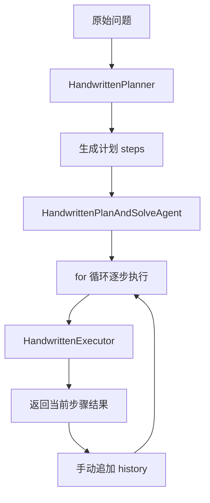

# Plan-and-Solve范式新手导读

## 1. 先抓住 Plan-and-Solve 的本质

Plan-and-Solve 可以先用一句最直白的话理解：

**先列步骤，再按步骤做。**

它和 ReAct 最大的差别不是“会不会调工具”，而是认知顺序不同：

- ReAct 更像边想边做
- Plan-and-Solve 更像先把路线定下来，再往前走

这就是它适合复杂任务的原因：

- 任务长
- 子步骤多
- 前后依赖明显
- 错误成本高

在这些场景里，先规划再执行，几乎总比一路即兴更稳。

## 2. 这篇导读到底讲什么

这篇文档重点讲 4 件事：

1. `framework-core`、Spring AI、Spring AI Alibaba 在这个模块里分别负责什么
2. 手写版 Plan-and-Solve runtime 是怎么自己维护计划和执行历史的
3. `SequentialAgent`、`outputKey`、`OverAllState` 在框架版里分别起什么作用
4. 真实 OpenAI Demo 需要哪些配置，应该怎么顺着源码看

## 3. 先建立一张技术栈地图

这个模块同样分成 4 层：

| 层次 | 代表模块/类型 | 在 Plan-and-Solve 里的职责 |
| --- | --- | --- |
| 范式层 | `module-plan-replan-paradigm` | 组织“先规划、再执行”的业务闭环 |
| 统一 LLM 抽象层 | `framework-core`、`AgentLlmGateway`、`LlmRequest`、`LlmResponse` | 给手写版提供统一模型协议 |
| Spring AI 适配层 | `framework-llm-autoconfigure`、`framework-llm-springai`、`ChatModel` | 把统一 `llm.*` 配置接到真实模型 |
| 图编排层 | Spring AI Alibaba `ReactAgent`、`SequentialAgent`、`OverAllState` | 给框架版提供阶段编排、状态传递与统一执行入口 |

这张图最重要的启发是：

- 手写版在“统一抽象层”上理解范式本体
- 框架版在“图编排层”上理解企业级落地

## 4. 本模块里的最小对照样例

这个模块用“买苹果问题”做最小对照：

> 一个水果店周一卖出了15个苹果。周二卖出的苹果数量是周一的两倍。周三卖出的数量比周二少了5个。请问这三天总共卖出了多少个苹果？

这道题适合 Plan-and-Solve 的原因很简单：

- 步骤天然有顺序
- 每一步都依赖前一步结果
- 很容易把过程拆成明确计划
- 很适合对照“手写 history”与“状态键交接”

## 5. 两套实现到底在对照什么

### 5.1 手写版 Plan-and-Solve runtime

核心类：

- `HandwrittenPlanner`
- `HandwrittenExecutor`
- `HandwrittenPlanAndSolveAgent`
- `PlanStep`
- `StepExecutionRecord`

它演示的是：

- Planner 如何先输出结构化步骤
- Executor 如何按单步执行
- Java 如何自己维护 `history`
- Java 如何自己推进循环

### 5.2 Spring AI Alibaba 顺序编排版

核心类：

- `AlibabaSequentialPlanAndSolveAgent`
- `ReactAgent plannerAgent`
- `ReactAgent executorAgent`
- `SequentialAgent`

它演示的是：

- 如何把 Planner 和 Executor 提升成显式子 Agent
- 如何用 `outputKey` 把阶段结果写入状态
- 如何让下游 Agent 通过状态占位符读取上游输出
- 如何把阶段串联交给框架 runtime

所以这两套实现真正的对照点是：

- 手写 runtime
- 顺序编排 runtime

## 6. 手写版到底怎么跑

先看运行链路：

### 6.1 `HandwrittenPlanner` 干了什么

它的职责非常清楚：

- 接收原始问题
- 调模型生成编号步骤
- 把步骤解析成 `PlanStep`

所以它不是“顺手先问一句模型”，而是把原始问题转成了：

**后续执行阶段真正可消费的计划对象。**

### 6.2 `HandwrittenExecutor` 干了什么

它不会重新规划，而是严格读取：

- 原始问题
- 完整计划
- 历史执行记录
- 当前步骤

然后只完成这一轮的单步求解。

这说明 Plan-and-Solve 的执行器不是“自由发挥的第二个模型”，而是：

**严格依附计划和历史状态的单步执行者。**

### 6.3 `HandwrittenPlanAndSolveAgent` 才是真正的 runtime

它的工作是：

1. 先调用 Planner 生成计划
2. 初始化 `history`
3. 用 Java `for` 循环逐步执行每个 `PlanStep`
4. 每一轮都把结果追加成 `StepExecutionRecord`
5. 最后把最后一步结果作为最终答案返回

这意味着：

- 计划是你自己维护的
- 历史是你自己维护的
- 执行顺序是你自己推进的

所以手写版更像：

**程序员自己维护一个 mini runtime。**

## 7. `history` 在手写版里为什么这么关键

这不是“顺手记个日志”，而是后续步骤的输入来源。

买苹果问题里：

- 第二步要依赖第一步结果
- 第三步要依赖第二步结果
- 第四步要依赖前三步结果

因此 `history` 本质上承担的是：

- 历史记录
- 后续步骤的显式上下文

这也是为什么一旦流程复杂起来，手写版协调器会越来越像调度器。

## 8. Spring AI / Spring AI Alibaba 在这里怎么落地

### 8.1 手写版：统一网关抽象，Spring AI 做底层适配

手写版业务代码依赖的是：

- `AgentLlmGateway`
- `LlmRequest`
- `LlmResponse`

真实模型接入链路和 reflection / react 一样：

1. `framework-llm-autoconfigure` 读取统一 `llm.*` 配置
2. 自动装配 `AgentLlmGateway`
3. `framework-llm-springai` 创建 Spring AI `ChatModel`
4. `SpringAiLlmClient` 把统一请求转换成 Spring AI `Prompt`
5. 底层 `ChatModel.call(...)` 发起真实调用

### 8.2 框架版：直接围绕 `SequentialAgent` 做阶段编排

`AlibabaSequentialPlanAndSolveAgent` 的核心做法是：

- 先创建 `plannerAgent`
- 再创建 `executorAgent`
- 最后用 `SequentialAgent` 把它们串起来

这表示框架版不再关心“我下一轮 prompt 该怎么手工拼”，而是关心：

- 上游输出写到哪个状态键
- 下游从哪个状态键读取
- 阶段边界应该怎么声明

## 9. `outputKey`、`includeContents`、`returnReasoningContents` 到底在表达什么

这是理解顺序编排版最关键的一组字段。

### 9.1 `outputKey`

可以先把它理解成：

**当前阶段的结果，要写入全局状态里的哪个键。**

在这个模块里：

- Planner 把结果写到 `plan_result`
- Executor 把结果写到 `final_answer`

### 9.2 `includeContents(false)`

这里的设计意图很明确：

- Planner 只看当前输入，不继承无关内容
- Executor 只读 `input + plan_result`，避免被杂乱上下文污染

也就是说，框架版强调的是：

**阶段之间靠显式状态键交接，而不是靠模糊的上下文继承。**

### 9.3 `returnReasoningContents(false)`

这个字段表达的是企业级常见默认策略：

- 传结果
- 不传隐藏推理过程

这样对父流程更稳定，也更容易治理。

## 10. `SequentialAgent` 和手写 `for` 循环，到底差在哪

### 10.1 手写版

优点：

- 控制力最强
- 每一步上下文完全可控
- 更适合理解范式本体

缺点：

- 阶段一多，协调器会迅速膨胀
- 任何状态交接都要自己维护

### 10.2 顺序编排版

优点：

- 阶段边界显式
- 状态交接显式
- 更适合扩成长链路流程
- 更适合做企业级治理和调试

缺点：

- 理解门槛更高
- 前期必须先把状态协议设计清楚

## 11. 真实 OpenAI Demo 怎么跑

本模块同样保留了两套真实模型 Demo：

- `HandwrittenPlanAndSolveOpenAiDemo`
- `AlibabaSequentialPlanAndSolveOpenAiDemo`

### 11.1 你需要哪些配置文件

测试资源目录里有：

- `application-openai-plan-solve-demo.yml`
- `application-openai-plan-solve-demo-local.yml.example`

本地可选覆盖文件：

- `application-openai-plan-solve-demo-local.yml`

### 11.2 最小可用配置

至少要提供：

- `llm.provider=openai-compatible`
- `llm.base-url`
- `llm.api-key`
- `llm.model`
- `llm.chat-completions-path`
- `demo.plan-solve.openai.enabled=true`

### 11.3 `OpenAiPlanSolveDemoPropertySupport` 为什么存在

它负责：

- 检查 Demo 是否显式开启
- 检查 API Key 是否是真实值
- 避免误用环境变量或系统属性触发真实外网调用

## 12. 推荐怎么顺着源码看

如果你是第一次接触这个模块，建议顺序如下。

### 12.1 第一遍：先看测试，建立“结果预期”

先看：

- `PlanAndSolveAppleProblemDemoTest`

你会先知道两套实现最终都要做到什么：

- 正确生成计划
- 正确按计划执行
- 正确把阶段结果交接给下一步

### 12.2 第二遍：看手写版

顺序建议：

1. `HandwrittenPlanner`
2. `HandwrittenExecutor`
3. `HandwrittenPlanAndSolveAgent`

重点看：

- 计划怎么生成
- 单步怎么执行
- `history` 怎么维护
- 循环怎么推进

### 12.3 第三遍：看框架版

顺序建议：

1. `AlibabaSequentialPlanAndSolveAgent`
2. `plannerAgent`
3. `executorAgent`

重点看：

- `outputKey` 怎么定义阶段交接
- `instruction` 里的状态占位符怎么工作
- `OverAllState` 最后保留了哪些运行事实

### 12.4 第四遍：看真实模型 Demo

最后再看：

- `HandwrittenPlanAndSolveOpenAiDemo`
- `AlibabaSequentialPlanAndSolveOpenAiDemo`
- `OpenAiPlanSolveDemoPropertySupport`

## 13. Plan-and-Solve、ReAct、Reflection 的边界

### 13.1 Plan-and-Solve 最适合什么

它最适合：

- 多步骤长链路任务
- 子任务依赖明显的任务
- 需要先规划、再逐步执行的任务

### 13.2 它不适合什么

如果任务更像下面两类，就不该硬用 Plan-and-Solve：

- 需要动态查工具、根据实时结果不断决定下一步
- 第一次结果已基本正确，只需要再做一轮严格审查

前者更像 ReAct，后者更像 Reflection。

## 14. 最后记住 5 个判断标准

如果你之后要自己设计 Plan-and-Solve Agent，可以先问自己这 5 个问题：

1. 这个任务是否真的需要先规划再执行
2. 我的计划有没有明确的步骤边界和完成标准
3. 我是否需要手写 runtime，还是应该直接升级到顺序编排
4. 阶段之间到底该靠 `history` 传递，还是靠状态键传递
5. 这个任务是不是其实更适合 ReAct 或 Reflection

如果这 5 个问题都答得清楚，你就已经真正理解这个模块了。
