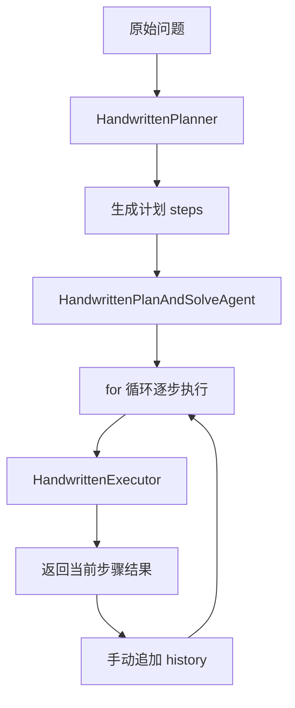
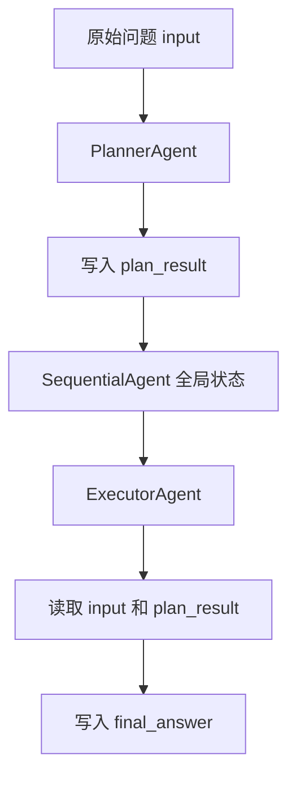

# Plan-and-Solve范式新手导读

## 1. 这篇文档是给谁看的

这篇文档是写给第一次接触 `module-plan-replan-paradigm` 的同学的。  
目标不是讲一堆抽象概念，而是用最小、最具体的“买苹果问题”，把这 4 件事讲明白：

- Plan-and-Solve 到底是什么
- 为什么它和 ReAct 不一样
- 这个模块里“手写版”和“Spring AI Alibaba 版”分别在做什么
- 为什么代码里会出现 `SequentialAgent`、`description`、`systemPrompt`、`instruction`、`outputKey` 这些字段

如果你已经把 ReAct 大概看明白了，但一到 Plan-and-Solve 就开始混乱，这篇文档就是给你的。

---

## 2. 先用一句大白话理解 Plan-and-Solve

Plan-and-Solve 可以先理解成：

**先列步骤，再按步骤做。**

它和 ReAct 最大的区别不是“会不会调工具”，而是：

- ReAct 更像边想边做
- Plan-and-Solve 更像先把路线定下来，再往前走

拿“买苹果问题”举例：

> 一个水果店周一卖出了15个苹果。周二卖出的苹果数量是周一的两倍。周三卖出的数量比周二少了5个。请问这三天总共卖出了多少个苹果？

如果用 Plan-and-Solve，大模型不会一上来就直接报答案，而是更适合先拆成：

1. 先确定周一卖出多少个苹果
2. 再计算周二卖出多少个苹果
3. 再计算周三卖出多少个苹果
4. 最后把三天结果相加

也就是说，它先产出一份“执行路线图”。

---

## 3. 为什么复杂任务更适合 Plan-and-Solve

简单问题里，ReAct 和 Plan-and-Solve 的差距不一定明显。  
但一旦问题变长、变复杂、依赖变多，Plan-and-Solve 的优势就出来了。

因为它会强制把任务拆开。

这样做有 3 个直接好处：

- 不容易在长链路里忘掉中间约束
- 更容易检查每一步到底算得对不对
- 如果后面某一步失败，更容易知道应该改哪一段，而不是整条链都重来

所以你可以把 Plan-and-Solve 理解成：

**它不是让模型更聪明，而是让任务执行过程更可控。**

---

## 4. 这个模块里有哪两种实现

当前 `module-plan-replan-paradigm` 里，为了方便对照学习，专门放了两套实现。

### 4.1 纯手写底层逻辑版

核心类是：

- [HandwrittenPlanner.java](/Users/sxie/xbk/agent-learning/module-plan-replan-paradigm/src/main/java/com/xbk/agent/framework/planreplan/application/executor/HandwrittenPlanner.java)
- [HandwrittenExecutor.java](/Users/sxie/xbk/agent-learning/module-plan-replan-paradigm/src/main/java/com/xbk/agent/framework/planreplan/application/executor/HandwrittenExecutor.java)
- [HandwrittenPlanAndSolveAgent.java](/Users/sxie/xbk/agent-learning/module-plan-replan-paradigm/src/main/java/com/xbk/agent/framework/planreplan/application/coordinator/HandwrittenPlanAndSolveAgent.java)

这一版的特点是：

- Planner 负责生成计划
- Executor 负责执行单步
- Agent 主协调器自己写 `for` 循环
- `history` 也是 Java 代码自己维护

换句话说：

**运行时控制权基本都在你自己的 Java 代码手里。**

### 4.2 Spring AI Alibaba 顺序编排版

核心类是：

- [AlibabaSequentialPlanAndSolveAgent.java](/Users/sxie/xbk/agent-learning/module-plan-replan-paradigm/src/main/java/com/xbk/agent/framework/planreplan/infrastructure/agentframework/AlibabaSequentialPlanAndSolveAgent.java)

这一版的特点是：

- 你不再手写 `for` 循环
- 你把 Planner 和 Executor 分别封装成两个子 Agent
- 再用 `SequentialAgent` 把它们串起来
- 中间结果不再手动拼接回 prompt，而是写入全局状态

换句话说：

**你不再亲自推进每一轮，而是把阶段编排交给框架。**

---

## 5. 两套实现的总图

### 5.1 手写版总图



### 5.2 Alibaba 版总图



这两张图的核心区别只有一句话：

- 手写版：你自己写循环
- Alibaba 版：你声明阶段，框架帮你串起来

---

## 6. 买苹果问题到底是怎么被求解的

### 6.1 手写版的思路

手写版的运行过程可以直接理解成：

1. 把原始问题交给 Planner
2. Planner 返回一组编号步骤
3. Java 代码进入 `for` 循环
4. 每次取一个 `current_step`
5. 把 `{question}`、`{plan}`、`{history}`、`{current_step}` 拼成执行 prompt
6. 调 Executor 执行当前步骤
7. 把这一步结果追加到 `history`
8. 继续下一步

这里最关键的不是“答案是 70”，而是：

**每一轮上下文怎么拼、什么时候进入下一步，都是 Java 自己决定的。**

### 6.2 Alibaba 版的思路

Alibaba 版的运行过程可以理解成：

1. 先往全局状态里写 `input=原始问题`
2. 启动 `SequentialAgent`
3. 第一个子 Agent 是 Planner，它读取 `{input}`
4. Planner 输出计划，并把结果写到 `plan_result`
5. 第二个子 Agent 是 Executor，它读取 `{input}` 和 `{plan_result}`
6. Executor 输出最终答案，并把结果写到 `final_answer`
7. 顺序链跑完，返回整个 `OverAllState`

这里最关键的不是“用了框架”，而是：

**阶段之间不再靠你手动拼字符串，而是靠状态键做交接。**

---

## 7. 为什么手写版一定要维护 `history`

这是很多人第一次看手写版时最容易忽略的点。

`history` 不是“顺手存一下日志”，而是：

**下一轮执行时必须带回去的上下文。**

比如买苹果问题里：

- 第一步得出：周一卖了 15 个
- 第二步计算周二时，要知道周一是 15 个
- 第三步计算周三时，要知道周二是多少
- 第四步求总数时，要知道前三步的结果

所以 `history` 的本质不是“展示用记录”，而是“后续步骤的输入来源之一”。

手写版里，这件事完全由 Java 自己做：

1. 拿到步骤结果
2. 追加进 `history`
3. 下一轮再把 `history` 拼回 prompt

这也是为什么手写版更像：

**程序员自己实现了一个 mini runtime。**

---

## 8. 为什么 Alibaba 版要用 `outputKey`

`outputKey` 可以先理解成：

**把当前阶段的输出，写到状态容器里的哪个键名。**

例如：

- Planner 的 `outputKey = "plan_result"`
- Executor 的 `outputKey = "final_answer"`

这表示：

- Planner 跑完后，它的结果会被写进 `plan_result`
- Executor 跑完后，它的结果会被写进 `final_answer`

你可以把它理解成“阶段交接协议”。

手写版的阶段交接方式是：

- 我自己拼历史文本，手工传给下一轮

Alibaba 版的阶段交接方式是：

- 我把结果写到状态里，让下游按键名去读

这就是工程思维上的差异：

- 手写版更底层、更可控
- 框架版更像在设计状态协议

---

## 9. `SequentialAgent`、`plannerAgent`、`executorAgent` 是什么关系

这也是非常容易混淆的一点。

先直接给结论：

- `SequentialAgent` 是 Spring AI Alibaba 提供的通用顺序编排器
- `plannerAgent` 和 `executorAgent` 不是框架内置的专用 Plan-and-Solve 类
- 它们是我们自己基于通用 `ReactAgent` 封装出来的两个角色

也就是说：

```text
框架提供积木：
ReactAgent + SequentialAgent + State/outputKey

我们自己拼成范式：
PlannerAgent -> ExecutorAgent
```

所以不要把它理解成：

- Spring AI Alibaba 内置了一个现成的 `PlanAndSolveAgent`

更准确的理解是：

- Spring AI Alibaba 提供了编排积木
- 我们用这些积木拼出了 Plan-and-Solve

---

## 10. `description`、`systemPrompt`、`instruction` 到底有什么区别

这是最容易写乱的地方，也是最值得学会的地方。

以 Planner 为例：

```java
.description("负责把买苹果问题拆成可执行计划")
.systemPrompt("""
    你是一名 Plan-and-Solve 规划器。
    你的任务是先规划、后行动。
    请把输入问题拆成清晰的编号步骤，必须使用规范编号列表输出，不要附加多余解释。
    """)
.instruction("请基于这个问题生成执行计划：{input}")
```

### 10.1 `description`

可以理解成：

**给框架和开发者看的职责说明。**

它更像元信息，作用主要是：

- 让代码更容易读懂
- 让日志、调试、编排层更清楚这个 Agent 是做什么的

所以：

- `description` 更像“岗位说明”
- 不是主要放业务规则的地方

### 10.2 `systemPrompt`

可以理解成：

**这个 Agent 的长期稳定规则。**

适合放的内容包括：

- 你是谁
- 你的角色是什么
- 你必须长期遵守哪些规则
- 你的输出格式应该长什么样

比如：

- 你是规划器
- 你要先规划再行动
- 你必须输出编号步骤
- 你不要附加多余解释

这些内容不管用户问的是什么，都基本不变。

### 10.3 `instruction`

可以理解成：

**这一轮的具体任务。**

适合放的内容包括：

- 当前要处理什么输入
- 当前要读取哪些状态键
- 当前这一轮的动作目标是什么

比如：

- `请基于这个问题生成执行计划：{input}`

这里的 `{input}` 就不是长期规则，而是运行时传进来的本轮数据。

### 10.4 为什么不建议全塞进 `systemPrompt`

技术上不是绝对不能。  
但工程上不建议。

因为那会把 3 种不同层级的东西混在一起：

- 元信息
- 长期规则
- 本轮任务

后果就是：

- prompt 不好维护
- 动态状态变量和稳定规则混在一起
- 复用性变差
- 后面一改就容易牵一大片

你可以用一句话记住：

- `description`：这个 Agent 是干什么的
- `systemPrompt`：这个 Agent 长期应该怎么做
- `instruction`：这个 Agent 这一次具体要做什么

### 10.5 什么时候该用 `systemPrompt`，什么时候该用 `instruction`

这是最常见、也最容易写乱的问题。

先记一句最实用的话：

- **长期不变的规则** 放 `systemPrompt`
- **这一轮具体要做的事** 放 `instruction`

如果再说得更白一点：

- `systemPrompt` 回答的是：**你是谁，你长期应该怎么做**
- `instruction` 回答的是：**你这次具体要做什么**

可以直接看这个对照表：

| 该写什么 | 更适合放哪里 | 为什么 |
|---|---|---|
| 你是一名 Plan-and-Solve 规划器 | `systemPrompt` | 这是长期角色，不随本次输入变化 |
| 你必须输出编号步骤 | `systemPrompt` | 这是长期格式规则 |
| 最终回答请使用简洁中文 | `systemPrompt` | 这是长期输出风格 |
| 请基于 `{input}` 生成计划 | `instruction` | 这是本轮任务，而且依赖运行时状态 |
| 请根据 `{plan_result}` 完成求解 | `instruction` | 这是本轮动作，读取的是上游状态 |
| 请只执行 `{current_step}` | `instruction` | 这是当前阶段的具体动作 |

你也可以用一个更简单的判断问题：

**这句话如果换 100 次请求，还会不会基本不变？**

- 如果答案是“基本不变”，更适合放 `systemPrompt`
- 如果答案是“会跟输入、状态、阶段变化”，更适合放 `instruction`

再用你项目里的两个例子看，就会更清楚。

#### 例子 1：旅行助手为什么可以没有 `instruction`

旅行助手这类调用通常是：

- `systemPrompt` 规定长期规则
- 用户消息直接作为本轮问题传进来

例如：

- `systemPrompt` 里写：
  - 你是一名智能旅行助手
  - 缺信息时先调用工具
  - 最终回答用中文
- 用户消息里直接写：
  - 今天北京天气如何？根据天气推荐一个合适的旅游景点。

这时“本轮任务”已经直接由用户消息提供了，所以不一定还要额外写一个 `instruction`。

#### 例子 2：Plan-and-Solve 为什么更适合写 `instruction`

Plan-and-Solve 的 Alibaba 版不是直接把用户消息喂给某个子 Agent，而是先把问题写进状态：

- `input = 原始问题`

然后 Planner 再通过：

- `请基于这个问题生成执行计划：{input}`

去读取状态里的 `input`。  
Executor 再通过：

- `{input}`
- `{plan_result}`

继续往下求解。

所以在这种“状态驱动”的场景里，`instruction` 很重要，因为它不仅说明“本轮要做什么”，还说明“本轮该从哪里取数据”。

最后再用一句口诀收住：

- `systemPrompt`：长期规则
- `instruction`：当前任务
- `description`：职责说明

---

## 11. `{input}`、`{plan_result}`、`{final_answer}` 是怎么流转的

这是 Alibaba 版最核心的运行时链路。

### 11.1 第一步：把原始问题放进状态

代码里有这样一句：

```java
state = sequentialAgent.invoke(Map.of("input", question))
        .orElseThrow(...);
```

它的意思不是“直接把 question 传给某个方法参数”。

它真正的意思是：

**先把原始问题放进全局状态，键名叫 `input`。**

这样后面的 Agent 才能通过 `{input}` 读到它。

这里可以先把这件事想成“往模板变量里塞值”：

- 状态里写入：
  - `input = question`
- 后面 `instruction` 模板里引用：
  - `{input}`

也就是说，这里不是把 `question` 直接作为某个普通方法参数往下传，
而是先把它存进运行时状态，后面谁需要这份值，谁就通过占位符去取。

### 11.2 第二步：Planner 读取 `input`

Planner 的 `instruction` 是：

```java
请基于这个问题生成执行计划：{input}
```

运行时框架会把 `{input}` 替换成状态里的原始问题。

例如，模板在替换前可能是：

```text
请基于这个问题生成执行计划：{input}
```

如果状态里有：

```text
input = 一个水果店周一卖出了15个苹果。周二卖出的苹果数量是周一的两倍。周三卖出的数量比周二少了5个。请问这三天总共卖出了多少个苹果？
```

那么框架在真正调用模型前，会先把它渲染成：

```text
请基于这个问题生成执行计划：一个水果店周一卖出了15个苹果。周二卖出的苹果数量是周一的两倍。周三卖出的数量比周二少了5个。请问这三天总共卖出了多少个苹果？
```

所以更准确地说，不是大模型自己认识 `{input}` 这个占位符，
而是 **Spring AI Alibaba 先把 `{input}` 替换成真实文本，再把替换后的结果发给大模型。**

然后 Planner 生成计划，并把结果写到：

- `plan_result`

### 11.3 第三步：Executor 读取 `input` 和 `plan_result`

Executor 的 `instruction` 里会同时出现：

- `{input}`
- `{plan_result}`

这表示它会从状态里同时拿到：

- 原始问题
- 上游 Planner 生成的计划

然后它基于这两份材料求解，并把最终结果写到：

- `final_answer`

### 11.4 第四步：整条链跑完后返回完整状态

最后拿到的是一个 `OverAllState`，里面通常会有：

- `input`
- `plan_result`
- `final_answer`
- 以及框架自己的内部键，例如 `_graph_execution_id_`

所以你后面才可以调用：

- `state.value("plan_result")`
- `state.value("final_answer")`

---

## 12. 为什么 `invoke(...)` 返回的是 `Optional<OverAllState>`

这也是很多新手会卡住的点。

框架这里的设计意思是：

- 这次顺序链执行后，可能返回状态
- 也可能没有返回状态

所以类型不是：

- `OverAllState`

而是：

- `Optional<OverAllState>`

于是代码里才会有：

```java
.orElseThrow(() -> new IllegalStateException("SequentialAgent did not return state"))
```

这句的意思很简单：

- 如果有状态，就取出来
- 如果没有状态，就立刻报错

这是一种典型的 fail fast 写法。  
目的是避免：

- 明明这条链没有正常产出状态
- 但代码还带着空结果继续往下跑

---

## 13. Alibaba 版日志应该怎么看

现在 Alibaba 版真实 Demo 的日志已经做了适合终端阅读的分段格式。

对应文件在：

- [AlibabaSequentialPlanAndSolveOpenAiDemo.java](/Users/sxie/xbk/agent-learning/module-plan-replan-paradigm/src/test/java/com/xbk/agent/framework/planreplan/AlibabaSequentialPlanAndSolveOpenAiDemo.java)

推荐按下面这个顺序看日志：

1. `STATE_KEYS`
   - 看当前状态里有哪些键

2. `STATE_META`
   - 看 `plan_result` 和 `final_answer` 在底层实际上是什么对象类型

3. `PLAN_RESULT`
   - 看 Planner 最终生成了什么步骤计划

4. `FINAL_ANSWER`
   - 看 Executor 最终给出的答案

一个典型日志会长这样：

```text
=== SequentialAgent Plan-and-Solve + OpenAI(gpt-4o) 执行完成后的状态回放 ===
STATE_KEYS -> [_graph_execution_id_, input, messages, plan_result, final_answer]
STATE_META -> plan_result=AssistantMessage, final_answer=AssistantMessage

PLAN_RESULT
  1. 确定周一卖出的苹果数量。
  2. 计算周二卖出的苹果数量（周一的两倍）。
  3. 计算周三卖出的苹果数量（比周二少5个）。

FINAL_ANSWER
  周一卖出15个苹果。
  周二卖出30个苹果。
  周三卖出25个苹果。
  最终答案：70个苹果。
```

这个日志的重点不是“答案是 70”，而是让你看清：

- 状态是怎么逐步累起来的
- 计划和答案分别落在哪个键里

---

## 14. 推荐阅读顺序

如果你现在准备正式顺着源码学，建议按这个顺序：

1. [HandwrittenPlanner.java](/Users/sxie/xbk/agent-learning/module-plan-replan-paradigm/src/main/java/com/xbk/agent/framework/planreplan/application/executor/HandwrittenPlanner.java)
   - 先看 Planner 怎么要求模型输出编号步骤

2. [HandwrittenExecutor.java](/Users/sxie/xbk/agent-learning/module-plan-replan-paradigm/src/main/java/com/xbk/agent/framework/planreplan/application/executor/HandwrittenExecutor.java)
   - 再看 Executor 怎么把 `{question}`、`{plan}`、`{history}`、`{current_step}` 拼进去

3. [HandwrittenPlanAndSolveAgent.java](/Users/sxie/xbk/agent-learning/module-plan-replan-paradigm/src/main/java/com/xbk/agent/framework/planreplan/application/coordinator/HandwrittenPlanAndSolveAgent.java)
   - 看手写版如何自己推进循环并维护 `history`

4. [AlibabaSequentialPlanAndSolveAgent.java](/Users/sxie/xbk/agent-learning/module-plan-replan-paradigm/src/main/java/com/xbk/agent/framework/planreplan/infrastructure/agentframework/AlibabaSequentialPlanAndSolveAgent.java)
   - 看框架版如何声明状态键、子 Agent 和顺序流

5. [PlanAndSolveAppleProblemDemoTest.java](/Users/sxie/xbk/agent-learning/module-plan-replan-paradigm/src/test/java/com/xbk/agent/framework/planreplan/PlanAndSolveAppleProblemDemoTest.java)
   - 看最稳定的对照测试

6. [HandwrittenPlanAndSolveOpenAiDemo.java](/Users/sxie/xbk/agent-learning/module-plan-replan-paradigm/src/test/java/com/xbk/agent/framework/planreplan/HandwrittenPlanAndSolveOpenAiDemo.java)
   - 看手写版真实模型轨迹

7. [AlibabaSequentialPlanAndSolveOpenAiDemo.java](/Users/sxie/xbk/agent-learning/module-plan-replan-paradigm/src/test/java/com/xbk/agent/framework/planreplan/AlibabaSequentialPlanAndSolveOpenAiDemo.java)
   - 看 Alibaba 版真实模型轨迹

---

## 15. 最后用一句话收束

如果你读到这里，只需要记住一句话：

**手写版是在学习 Plan-and-Solve 的原始运行时逻辑，Alibaba 版是在学习如何把这套逻辑交给框架做状态编排。**

前者让你知道“范式本身怎么工作”，后者让你知道“企业项目里应该怎么落地”。
