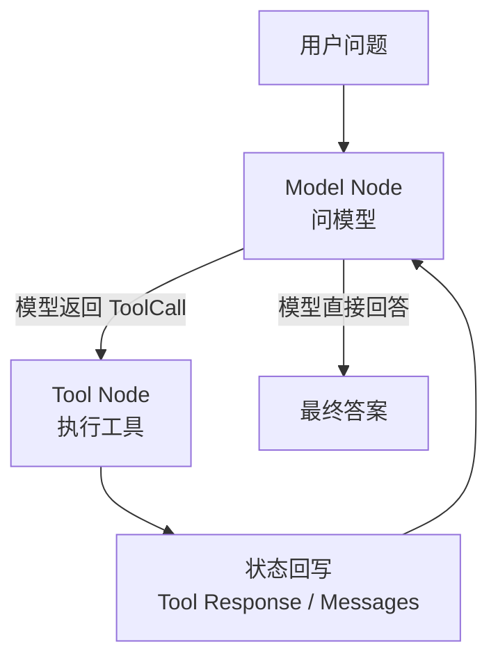

# ReActAgent 对照学习：手写防腐层版 vs Spring AI Alibaba 官方版

## 1. 背景与目的

在 `module-react-paradigm` 中，我们为同一个“智能旅行助手”场景实现了两套 ReAct 方案：

- 手写防腐层版：`module-react-paradigm/src/main/java/com/xbk/agent/framework/react/application/executor/ReActAgent.java`
- 官方 Spring AI Alibaba 版：`module-react-paradigm/src/test/java/com/xbk/agent/framework/react/SpringAIReActTravelDemo.java`

这两套实现不是互相替代的关系，而是典型的“框架内核实现”和“官方能力对照样例”的关系。

这里需要特别说明：

- 本文主要对照的是离线脚本版官方 Demo：`SpringAIReActTravelDemo.java`
- 不直接讨论真实模型版：`SpringAIReActTravelOpenAiDemo.java`
- 真实模型接入方式已经切到统一 `llm.*` 配置，并通过 `framework-llm-springai` 完成 Spring AI 适配

也就是说，这份文档回答的是“官方 ReAct Runtime 替我们接管了哪些控制流”，而不是“真实模型配置应该怎么接”。

这份文档的目标只有一个：帮助我们从源码层面看清楚，Spring AI Alibaba 官方 `ReactAgent` 到底帮我们自动处理了哪些原本需要手写的 ReAct 运行时逻辑。

## 2. 一句话结论

手写版是在我们自己的 `framework-core` 协议之上，显式实现一套可控的 ReAct Runtime；官方版则是在 Spring AI Alibaba 的 Graph Runtime 之上，声明式组装出一套现成的 ReAct Agent。

更通俗一点：

- 手写版关注“ReAct 机制是怎么跑起来的”
- 官方版关注“告诉框架要什么，框架替你把 ReAct 跑起来”

## 3. 对比对象与职责定位

### 3.1 手写版 ReActAgent

类路径：

- `module-react-paradigm/src/main/java/com/xbk/agent/framework/react/application/executor/ReActAgent.java`

核心定位：

- 只依赖我们自己的 `framework-core`
- 不引入任何 `org.springframework.ai.*`
- 用统一的 `Message`、`AgentLlmGateway`、`ToolRegistry` 组成 ReAct 运行时
- 用显式 `while (step < maxSteps)` 作为安全阀

它更适合作为框架内核，因为领域协议主权完全掌握在我们自己手里。

### 3.2 官方 Spring AI Alibaba 版

类路径：

- `module-react-paradigm/src/test/java/com/xbk/agent/framework/react/SpringAIReActTravelDemo.java`
- 真实模型对应样例：`module-react-paradigm/src/test/java/com/xbk/agent/framework/react/SpringAIReActTravelOpenAiDemo.java`

核心定位：

- 直接使用 `ReactAgent`
- 直接使用 `ChatModel`、`@Tool`、`MemorySaver`
- 直接让 Graph Runtime 帮我们自动推进“问模型 -> 调工具 -> 再问模型”的闭环
- 用 `call()` 取最终答案，用 `invoke()` 取完整状态

它更适合作为教学 Demo、能力验证样例和官方 API 对照基线。

如果你的目标是学习真实模型接入，不应该只看这一份离线对照文档，还要同时看：

- `module-react-paradigm/src/test/java/com/xbk/agent/framework/react/ReActTravelOpenAiDemo.java`
- `module-react-paradigm/src/test/java/com/xbk/agent/framework/react/SpringAIReActTravelOpenAiDemo.java`
- `module-react-paradigm/src/test/resources/application-openai-react-demo.yml`

## 4. 同一个旅行助手场景，两个实现分别怎么思考

用户问题是：

> 今天北京天气如何？根据天气推荐一个合适的旅游景点。

两套方案都在执行同一个 ReAct 闭环：

1. 先思考当前缺少什么信息
2. 决定调用天气工具
3. 根据天气结果继续思考
4. 决定调用景点推荐工具
5. 综合结果输出最终答案

区别不在业务目标，而在“谁来负责驱动这个闭环”。

### 4.1 手写版的思维模型

手写版把 ReAct 拆成我们自己可见的控制流：

1. 自己维护 `history`
2. 自己把 `history + tools` 组装成 `LlmRequest`
3. 自己调用 `AgentLlmGateway.chat(...)`
4. 自己判断响应是“工具调用”还是“最终答案”
5. 自己从 `ToolRegistry` 找工具并执行
6. 自己把工具结果包装成 `Observation`
7. 自己继续下一轮循环

这本质上是在我们自己的框架里写一个轻量级 Agent Runtime。

### 4.2 官方版的思维模型

官方版只需要声明：

1. 使用哪个 `ChatModel`
2. 注册哪些工具
3. 设定什么 `systemPrompt`
4. 是否需要状态保存器

然后 `ReactAgent` 就会替我们自动处理：

1. Prompt 组织
2. ToolCall 解析
3. Tool Node 路由
4. Observation 回填
5. 图上的循环推进
6. 终止条件判断

这说明官方版把运行时控制流下沉到了 Graph Runtime。

如果你对“Graph Runtime 自动流转”这句话还是有点抽象，可以先把它理解成：

- 不是我们自己写 `while`
- 而是框架替我们决定“下一步该继续问模型，还是该去执行工具”

更直白地说：

- `Model Node`
  - 负责问模型：是直接回答，还是先调工具
- `Tool Node`
  - 负责执行工具，并把结果写回状态
- Graph Runtime
  - 负责在这两个节点之间自动切换，直到模型给出最终答案

流程大概就是这样：

所以“在 Model Node 与 Tool Node 间自动流转”真正想表达的是：

- 模型一旦要求调工具，框架就自动切到工具节点执行
- 工具执行完后，框架再自动把结果带回模型节点继续推理
- 这一来一回不需要我们自己手写控制流

## 5. 核心流程逐段对照

## 5.1 构造阶段

### 手写版

构造器在 `ReActAgent` 中直接注入：

- `AgentLlmGateway`
- `ToolRegistry`
- `maxSteps`

特点：

- 运行时依赖完全由我们定义
- 不暴露第三方 Agent 类型
- `maxSteps` 由我们自己负责执行和兜底

### 官方版

官方版通过 `ReactAgent.builder()` 组装：

- `model(chatModel)`
- `methodTools(new TravelTools())`
- `systemPrompt(...)`
- `saver(new MemorySaver())`

特点：

- 运行时由官方 Builder 接管
- 工具注册被简化为 Java 方法扫描
- 状态保存能力由官方图运行时接管

结论：

- 手写版是“自己造运行时”
- 官方版是“声明式使用运行时”

## 5.2 循环控制

### 手写版

手写版在 `run(String userQuery)` 中有最核心的一段：

- `while (step < maxSteps)`

它负责保证：

1. 每一轮都是真正的一次 ReAct 尝试
2. 模型如果持续发出工具调用，不会无限循环
3. 超过上限后直接返回“未能在最大步骤内完成任务”

这是一种明确、可审计、可测试的安全阀设计。

### 官方版

官方版没有显式 `while`。

原因不是没有循环，而是循环已经内嵌在 `ReactAgent + Graph Runtime` 里：

1. Model Node 产出 ToolCall
2. Tool Node 执行工具
3. Tool Response 回填到状态
4. 再回到 Model Node
5. 直到模型不再发出工具调用而是给出最终答案

结论：

- 手写版把循环写在代码里
- 官方版把循环藏在图运行时里

## 5.3 消息历史维护

### 手写版

手写版自己维护：

- `List<Message> history`
- `MemorySession memorySession`

每轮都手工完成：

1. 用户消息写入 history
2. 助手消息写入 history
3. 工具 Observation 写入 history
4. 再把完整 history 发回模型

你可以非常清楚地看到上下文是怎么长出来的。

### 官方版

官方版不需要显式维护 `history` 变量。

在 `SpringAIReActTravelDemo` 中，`ScriptedTravelChatModel.logPrompt(...)` 打印出的 `Prompt` 已经清楚表明：

1. 系统提示自动在前
2. 用户消息自动在状态里
3. 工具调用消息自动回写
4. `ToolResponseMessage` 自动回写
5. 下一轮模型自动拿到完整上下文

结论：

- 手写版：你自己决定消息怎么追加
- 官方版：Graph Runtime 自动管理消息状态

## 5.4 工具注册与执行

### 手写版

手写版使用 `ToolRegistry`：

1. `ToolRegistry.definitions()` 暴露可用工具给 LLM
2. 收到 `ToolCall` 后构造 `ToolRequest`
3. 构造 `ToolContext`
4. 调用 `toolRegistry.execute(...)`

这是典型的框架内核设计：

- 统一工具协议
- 统一上下文传递
- 统一错误处理入口

### 官方版

官方版使用 `methodTools(new TravelTools())`。

在 `TravelTools` 中，工具只是两个带注解的方法：

- `queryWeather(...)`
- `recommendAttraction(...)`

然后由官方运行时自动完成：

1. Java 方法转成 Tool Spec
2. AssistantMessage 里的 ToolCall 自动匹配到方法
3. 方法执行结果自动转换成 ToolResponseMessage
4. 结果自动回填到后续 Prompt

结论：

- 手写版是“协议驱动工具系统”
- 官方版是“注解驱动方法工具系统”

## 5.5 最终答案判定

### 手写版

手写版需要自己判断何时结束：

1. 如果 `response.getToolCalls()` 非空，则继续行动
2. 如果没有工具调用，则尝试提取最终答案
3. 还要兼容 `Final Answer:` 前缀

这意味着终止条件完全由我们自己控制。

### 官方版

官方版里，`call()` 直接给出最终 `AssistantMessage`。

也就是说：

- 什么时候该停
- 什么时候该继续调工具
- 什么时候该把最后一条消息视为最终答案

这些都已经由官方 Agent Runtime 接管。

结论：

- 手写版：终止逻辑显式可见
- 官方版：终止逻辑由框架托管

## 5.6 状态调试能力

### 手写版

手写版为了方便调试，专门暴露了：

- `latestHistory()`

这让我们可以回看最后一次运行的所有消息。

但注意，它仍然是“我们自己定义的一份消息快照能力”。

### 官方版

官方版的优势在于：

- `call()` 取最终答案
- `invoke()` 取完整 `OverAllState`

在 Demo 中，我们直接用 `invoke()` 读取状态中的 `messages`。

这说明官方版天然就把“状态机运行结果”暴露成一等公民。

结论：

- 手写版调试依赖自定义快照接口
- 官方版调试依赖图状态回放能力

## 6. 对比表：官方版到底帮我们省掉了什么

| 能力点 | 手写版需要自己做 | 官方版是否自动处理 |
|---|---|---|
| 管理消息历史 | 是 | 是 |
| 解析工具调用 | 是 | 是 |
| 工具路由执行 | 是 | 是 |
| Observation 回填 | 是 | 是 |
| 循环推进 | 是 | 是 |
| 终止条件判定 | 是 | 是 |
| 状态保存 | 可自定义实现 | `MemorySaver` 现成支持 |
| 线程态区分 | 自己设计 conversationId | `RunnableConfig.threadId(...)` 现成支持 |
| Prompt 拼装 | 自己组装 | 自动组装 |

这个表说明，官方 `ReactAgent` 真正强大的地方，不是“少写几行代码”，而是把一整层 Agent Runtime 抽象掉了。

## 7. 两种实现分别适合什么位置

### 更适合放进框架内核的：手写版

原因：

- 符合我们的防腐层原则
- 领域协议由自己掌控
- 不让 `org.springframework.ai.*` 渗透进核心抽象
- 将来替换底层实现成本更低

适合：

- `framework-core`
- `module-react-paradigm` 的正式框架实现
- 后续作为其它范式的可复用底座

### 更适合做样例和对照验证的：官方版

原因：

- 官方 API 链路清晰
- 便于验证 Spring AI Alibaba 原生能力
- 便于教学和快速实验
- 便于和社区样例对齐

适合：

- `src/test/java` 下的 demo
- 教学演示
- POC
- 与手写版做源码对照学习

## 8. 为什么两套实现都要保留

如果只保留手写版，你会失去和官方 Agent Runtime 对照学习的基线。

如果只保留官方版，你会失去框架的协议主权，后续所有范式都会被第三方类型反向塑形。

所以更合理的策略是：

- 用手写版守住框架边界
- 用官方版校验能力理解
- 用两者对照，反向验证我们的抽象是否正确

这正是“从教程学习”向“构建自主框架”过渡时最重要的一步。

## 9. 推荐学习顺序

建议按下面这个顺序阅读源码：

1. 先看手写版 `run(String userQuery)` 主循环
2. 再看手写版的工具执行与 Observation 回填
3. 再看官方版 `createTravelAssistantAgent(...)`
4. 再看官方版 `ScriptedTravelChatModel.call(...)`
5. 最后结合日志观察 Model Node 与 Tool Node 的往返流转

这样你会很快建立一个清晰认知：

- ReAct 的本质，不在某个类名
- ReAct 的本质，是“模型思考 + 工具行动 + 结果观察 + 继续推理”的可迭代闭环
- 手写版和官方版只是把这个闭环放在了不同层级来实现

## 10. 最终建议

对 `spring-ai-agent-framework` 这个项目来说，建议长期坚持下面的工程策略：

- 生产级框架实现：优先走手写防腐层版
- 官方能力验证与教学样例：保留官方 Spring AI Alibaba 版
- 每落一个新范式，都尽量有一份“手写版 vs 官方版”的对照材料

这样做的价值非常大：

- 既不脱离官方生态
- 又不丢掉自己的架构主权
- 还能持续训练团队对 Agent Runtime 本质的理解

这会让我们的框架不是“照着文档调 API”，而是真正具备可演进的底层设计能力。
