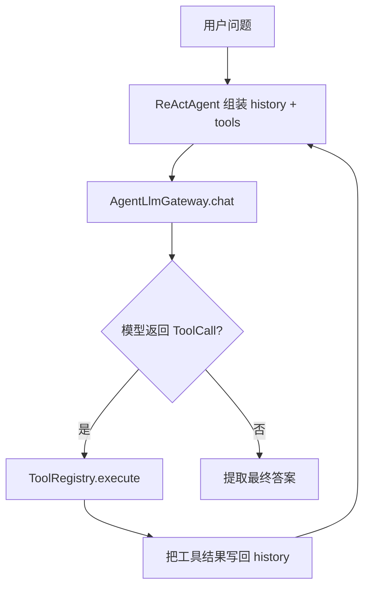
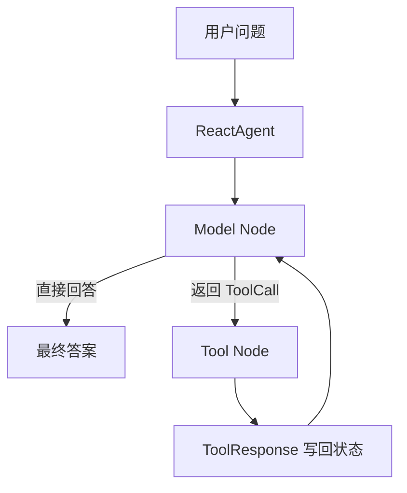

# ReAct范式新手导读

## 1. 先抓住 ReAct 的本质

ReAct 不是“会调工具的聊天模型”，而是把下面 4 件事显式串成闭环：

- 先思考当前缺什么信息
- 再决定要不要调用外部工具
- 再把工具结果回灌给模型
- 最后基于新事实继续思考或直接给答案

如果只让模型单轮回答，它只能“想”；
而 ReAct 的工程价值在于让模型能在运行时不断被外部事实校正。

这也是为什么 ReAct 适合做：

- 需要查天气、查库存、查接口的任务
- 需要根据工具结果动态调整下一步动作的任务
- 单 Agent、中等复杂度、但必须和外部世界交互的任务

## 2. 这篇导读到底讲什么

`module-react-paradigm` 之前的文档更偏“学习路径”和“手写版 vs 官方版对照”，但缺一篇像 reflection / plan-replan 那样的正式新手导读。

这篇文档重点讲 4 件事：

1. `framework-core`、Spring AI、Spring AI Alibaba 在 ReAct 里分别负责什么
2. 手写版 `ReActAgent` 到底是怎样把 Thought -> Action -> Observation 跑起来的
3. 官方 `ReactAgent` 到底接管了哪些原本需要手写的运行时工作
4. 真实 OpenAI Demo 需要什么配置、应该怎么顺着源码看

## 3. 先建立一张技术栈地图

这个模块里的 ReAct 不是单层结构，而是分成 4 层：

| 层次 | 代表模块/类型 | 在 ReAct 里的职责 |
| --- | --- | --- |
| 范式层 | `module-react-paradigm` | 组织 Thought -> Action -> Observation -> Final Answer 闭环 |
| 统一协议层 | `framework-core`、`AgentLlmGateway`、`Message`、`ToolRegistry` | 给手写版提供统一的模型、消息、工具协议 |
| Spring AI 适配层 | `framework-llm-autoconfigure`、`framework-llm-springai`、`ChatModel` | 把统一 `llm.*` 配置接到真实模型 |
| 图运行时层 | Spring AI Alibaba `ReactAgent`、`OverAllState`、`MemorySaver` | 给官方版提供模型节点、工具节点、状态保存和自动回环 |

这张图最重要的启发是：

- 手写版主要在“统一协议层”上工作
- 官方版主要在“图运行时层”上工作

两边不是谁替代谁，而是在对照：

- ReAct 的范式本体
- ReAct 的工程化运行时

## 4. 本模块里的两套实现，到底在对照什么

### 4.1 手写版 ReAct runtime

核心类：

- `ReActAgent`
- `ToolRegistry`
- `Message`
- `LlmRequest`
- `LlmResponse`

离线 Demo：

- `ReActTravelDemo`

它演示的是：

- 不依赖 Spring AI Alibaba runtime，ReAct 怎么自己跑
- 历史消息怎么维护
- `ToolCall` 怎么解析
- 工具怎么执行
- 死循环保护怎么写

### 4.2 Spring AI Alibaba 官方版

核心类：

- `ReactAgent`
- `MemorySaver`
- `RunnableConfig`
- `OverAllState`

离线 Demo：

- `SpringAIReActTravelDemo`

它演示的是：

- 模型节点和工具节点如何由 Graph Runtime 自动流转
- Java 方法如何通过 `@Tool` 暴露成可调用工具
- `call()` 和 `invoke()` 各自适合看什么
- 为什么官方版不需要我们自己写 `while`

## 5. 手写版 ReAct 到底怎么跑

先看手写版的运行链路：

### 5.1 `ReActAgent` 干的不是“调一下模型”

`ReActAgent.run(String userQuery)` 里真正重要的是这条主链：

1. 把用户问题写进 `history`
2. 把 `history + availableTools` 组装成 `LlmRequest`
3. 通过 `AgentLlmGateway` 调模型
4. 如果模型返回 `ToolCall`，就让 `ToolRegistry` 执行工具
5. 把工具结果包装成 `MessageRole.TOOL` 消息写回 `history`
6. 继续下一轮
7. 如果模型不再要求调工具，就尝试提取最终答案

所以手写版最值得看的不是语法，而是控制权：

**每一轮要不要继续、工具怎么执行、结果怎么回灌，都是 Java 自己推进的。**

### 5.2 为什么 `while (step < maxSteps)` 非常关键

这不是一个无关紧要的小实现，而是 ReAct runtime 的安全阀。

因为 ReAct 的本质就是“模型可能继续想，也可能继续行动”，所以如果没有步数上限：

- 模型可能持续调用工具
- 历史消息可能不断膨胀
- 整个 Agent 可能根本不收敛

因此手写版必须明确治理：

- 最多跑多少轮
- 达到上限后如何返回

## 6. `framework-core` 在手写版里到底扮演什么角色

### 6.1 `Message`

可以先把它理解成：

**Agent 世界里的统一消息单位。**

不管是：

- 用户输入
- 模型回复
- 工具结果

最终都会变成一条 `Message` 进入 `history`。

### 6.2 `LlmRequest` / `LlmResponse`

它们分别表示：

- 一次发给模型的完整输入包
- 一次模型返回的完整结果包

`LlmResponse` 里最关键的不是普通文本，而是可能带着：

- `ToolCall`

这表示模型并没有想直接回答，而是要求 runtime 去执行一个动作。

### 6.3 `ToolRegistry`

它在手写版里承担两件事：

- 向模型暴露“当前有哪些工具可用”
- 在模型真的返回 `ToolCall` 后，找到对应工具并执行

所以它不只是“工具目录”，还是 runtime 的真实执行入口。

### 6.4 `AgentLlmGateway` 和 Spring AI 的关系

手写版业务代码看起来没有直接依赖 `ChatModel`，但这不代表它脱离了 Spring AI。

真实接入链路是：

1. `framework-llm-autoconfigure` 读取统一 `llm.*` 配置
2. 自动装配 `AgentLlmGateway`
3. `framework-llm-springai` 创建 Spring AI `ChatModel`
4. `SpringAiLlmClient` 把统一请求转成 Spring AI `Prompt`
5. 底层 `ChatModel.call(...)` 发起真实调用

所以你可以把手写版理解成：

- 上层范式代码依赖统一网关
- 底层模型适配仍然可以由 Spring AI 承担

## 7. 官方 `ReactAgent` 到底接管了什么

先看官方版的大致运行链路：

### 7.1 `ReactAgent.builder()` 不只是 builder 语法糖

在 `SpringAIReActTravelDemo` 里，builder 配的几项配置分别对应运行时积木：

- `model(chatModel)`：模型节点调用哪个模型
- `methodTools(new TravelTools())`：自动把 Java 方法注册成工具
- `systemPrompt(...)`：注入角色长期规则
- `saver(new MemorySaver())`：让图运行时保存线程态

这和手写版最大的不同是：

- 手写版是“我来组织 runtime”
- 官方版是“我声明我要什么 runtime”

### 7.2 `@Tool` 为什么重要

在官方版里，工具不再通过 `ToolRegistry.register(...)` 手动注册，而是通过：

- `@Tool`
- `@ToolParam`

把普通 Java 方法变成工具。

这意味着工具系统的组织方式也变了：

- 手写版是协议驱动的工具注册
- 官方版是注解驱动的方法工具

### 7.3 `MemorySaver` 和 `RunnableConfig.threadId` 是干什么的

这是理解官方版状态管理的关键。

你可以先把它记成一句话：

**`threadId` 是这次图执行的会话标识，`MemorySaver` 负责按这个标识保存状态。**

所以在 `SpringAIReActTravelDemo` 里：

- `call()` 和 `invoke()` 故意使用不同的 `threadId`
- 这样两次演示的状态不会串线

### 7.4 `call()` 和 `invoke()` 到底差在哪

这两个方法是新手最应该对照看的：

- `call()`：只关心最终答案
- `invoke()`：返回完整 `OverAllState`

学习阶段更推荐先看 `invoke()`，因为你能直接看到：

- 状态里有哪些键
- `messages` 是怎么被追加回去的
- 工具响应是怎么进入上下文的

## 8. 为什么官方版没有显式 `while`

不是没有循环，而是循环已经被 Graph Runtime 吸收了。

你可以把官方版理解成：

- `Model Node` 负责问模型“下一步直接回答还是先调工具”
- `Tool Node` 负责执行工具
- Graph Runtime 负责在两者之间自动切换

也就是说：

- 手写版把循环写在 Java 代码里
- 官方版把循环下沉到图运行时里

## 9. 真实 OpenAI Demo 怎么跑

这个模块除了离线教学版，还保留了两套真实模型对照 Demo：

- `ReActTravelOpenAiDemo`
- `SpringAIReActTravelOpenAiDemo`

### 9.1 你需要哪些配置文件

测试资源目录里有：

- `application-openai-react-demo.yml`
- `application-openai-react-demo-local.yml.example`

本地可选覆盖文件：

- `application-openai-react-demo-local.yml`

主配置的思路和其它模块一致：

- 默认不填真实 `llm.api-key`
- 默认 `demo.react.openai.enabled=false`
- 通过 `spring.config.import` 可选加载本地覆盖文件

### 9.2 最小可用配置

至少要提供：

- `llm.provider=openai-compatible`
- `llm.base-url`
- `llm.api-key`
- `llm.model`
- `llm.chat-completions-path`
- `demo.react.openai.enabled=true`

### 9.3 `OpenAiReactDemoPropertySupport` 为什么存在

它的作用和 reflection / plan-replan 模块一致：

- 检查 Demo 是否被显式启用
- 检查 API Key 是否是真实值
- 避免回退到环境变量或系统属性后误打真实模型

## 10. 推荐怎么顺着源码看

如果你是第一次接触这个模块，建议按下面顺序看。

### 10.1 第一遍：先看手写版运行时

先看：

- `ReActAgent`

你重点看的是：

- `history` 怎么维护
- `ToolCall` 怎么判断
- 工具怎么执行
- 什么时候继续下一轮
- 什么时候停止

### 10.2 第二遍：看离线 Demo

再看：

- `ReActTravelDemo`
- `SpringAIReActTravelDemo`

你重点看的是：

- 两边如何对同一旅行助手场景做控制变量对照
- 手写版和官方版分别把哪些工作交给 runtime

### 10.3 第三遍：看真实模型 Demo 与配置

最后再看：

- `ReActTravelOpenAiDemo`
- `SpringAIReActTravelOpenAiDemo`
- `OpenAiReactDemoPropertySupport`

这一步你重点理解：

- 统一 `llm.*` 配置怎么进入 Spring Boot
- 真实模型和离线 Demo 的边界在哪

## 11. ReAct、Reflection、Plan-and-Solve 的边界

### 11.1 ReAct 适合什么

ReAct 最适合：

- 需要动态拿外部信息再继续决策的任务
- 单 Agent 工具调用任务
- 中等复杂度、但必须和现实世界交互的任务

### 11.2 ReAct 不适合什么

如果任务明显更像下面两类，就不该硬堆 ReAct：

- 需要先拆完整蓝图再逐步执行
- 第一次结果基本能用，但需要再来一轮严格审查

前者更像 Plan-and-Solve，后者更像 Reflection。

## 12. 最后记住 5 个判断标准

如果你之后要自己设计 ReAct Agent，可以先问自己这 5 个问题：

1. 我有没有把“思考”和“行动”真的通过工具系统连起来
2. 我有没有给 runtime 一个显式的最大步数保护
3. 我有没有把工具结果可靠地回写进上下文
4. 我到底需要手写 runtime，还是直接用官方 `ReactAgent` 更合适
5. 这个任务真的是 ReAct 型任务，还是其实更适合 Reflection / Plan-and-Solve

如果这 5 个问题都答得清楚，你就已经真正理解这个模块了。
