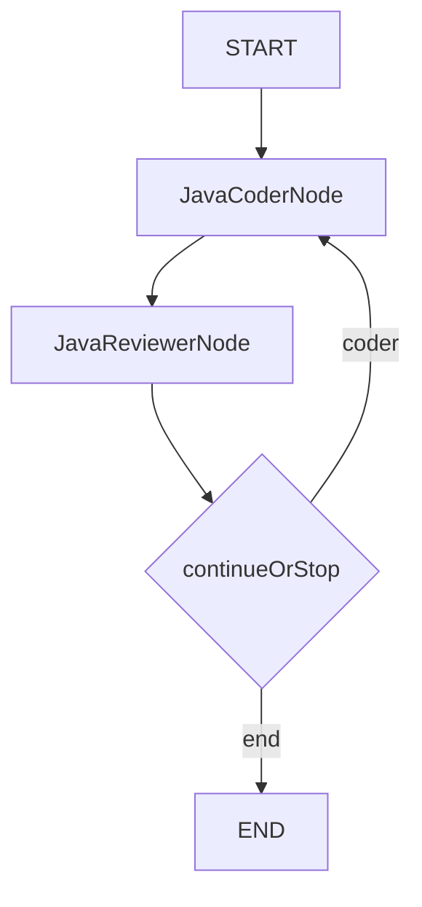
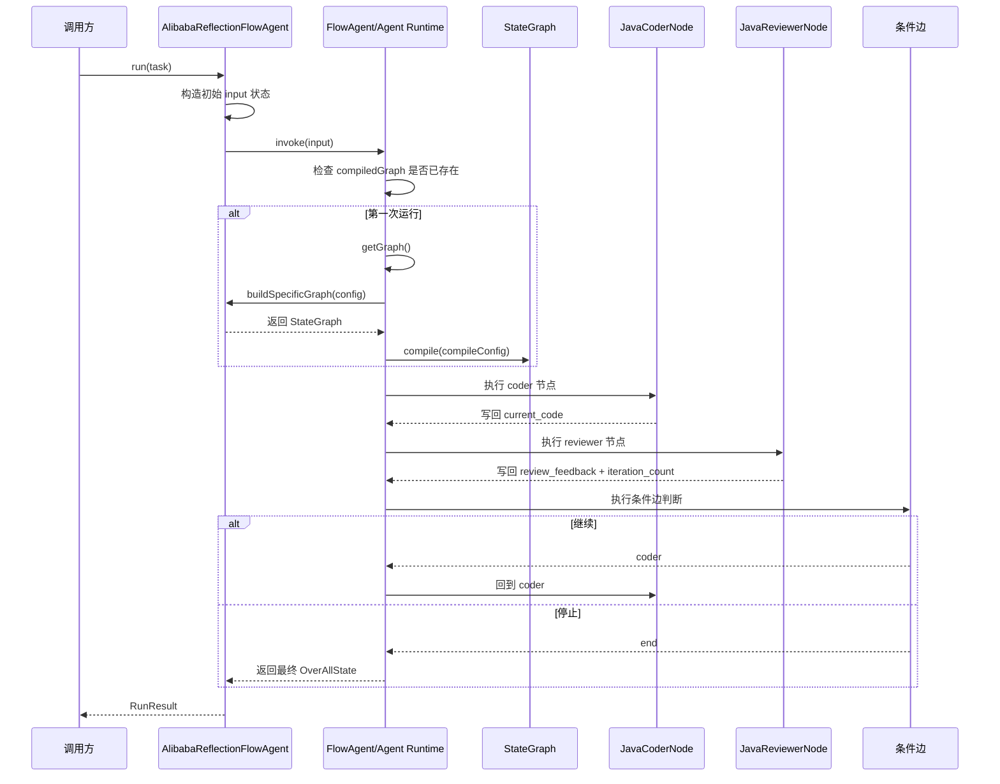

# Reflection范式从0到1掌握指南

## 1. 这篇文档到底要解决什么问题

很多初学者第一次看 Reflection 图编排版时，都会卡在同一个地方：

- 代码能看懂一点点
- `StateGraph` 这个词也大概认识
- 但就是不知道这张图到底是怎么“跑起来”的

最常见的困惑通常有这几类：

1. `buildSpecificGraph(...)` 到底什么时候执行
2. `StateGraph` 只是描述结构，还是会真的驱动运行
3. `OverAllState` 到底是什么，和普通 `Map` 有什么关系
4. 节点执行完之后，结果是怎么传给下一个节点的
5. 条件边为什么能让流程回到前面的节点
6. 为什么这里明明有 `ReactAgent`，真正执行时却又在 `Node` 里直接 `chatModel.call(...)`

这篇导读不再只讲“Reflection 是什么”，而是重点解决：

**这套 Spring AI Alibaba 图编排版 Reflection，在运行时到底是怎么一步一步执行的。**

目标不是让你“知道有这么个框架”，而是让你读完后能自己回答下面这些问题：

- 第一次 `run(...)` 时，框架内部发生了什么
- 第一轮 coder 和 reviewer 分别读了什么、写了什么
- 第二轮为什么会重新回到 coder
- 什么时候停止，谁来决定停止
- 这套图结构和手写 `while` 循环到底是一一对应到哪里

---

## 2. 先抓住 Reflection 的本质

Reflection 不是“把同一个问题多问模型几次”，而是把下面这条质量改进链路做成显式运行时流程：

1. 先生成一个可运行初稿
2. 再站在评审者视角指出问题
3. 再基于评审意见修订结果
4. 最后由运行时明确判断是否继续

如果说 ReAct 更像“边想边做”，那么 Reflection 更像：

**先交初稿，再做 review，再决定要不要继续改。**

这个模块故意选了“素数生成代码优化”作为示例，因为它很适合演示 Reflection：

- 第一版很容易写出暴力试除法
- reviewer 很容易指出时间复杂度问题
- 优化方向很自然会收敛到更优算法
- “是否还需要继续优化”也容易设计出明确停止条件

---

## 3. 本模块里的两套实现，到底在对照什么

这个模块不是只写了一种 Reflection，而是故意写了两种：

### 3.1 手写版

核心类：

- `HandwrittenJavaCoder`
- `HandwrittenJavaReviewer`
- `ReflectionMemory`
- `HandwrittenReflectionAgent`

它演示的是：

- 如果完全不用图框架，Reflection 最小 runtime 应该怎么自己写
- 初稿 prompt 和修订 prompt 怎么拼
- reviewer 如何给出停止信号
- `while` 循环如何推进整条链路

### 3.2 图编排版

核心类：

- `JavaCoderNode`
- `JavaReviewerNode`
- `AlibabaReflectionFlowAgent`

它演示的是：

- 怎样把 Reflection 拆成显式节点
- 怎样把运行事实写进状态
- 怎样用条件边替代手写 `while`
- 怎样把“继续还是停止”做成图路由规则

所以这两套实现不是重复，而是在对照两种 runtime 思路：

- 手写 runtime
- 图编排 runtime

---

## 4. 先看一眼图编排版的静态结构

先看最终图长什么样：



这张图非常简单，只有 2 个业务节点：

- `JavaCoderNode`：生成或修订代码
- `JavaReviewerNode`：评审代码并决定是否还值得继续优化

难点不在“图长什么样”，而在：

**框架拿到这张图之后，是怎么按图执行起来的。**

---

## 5. 先把 8 个核心词翻成人话

| 术语 | 在这个例子里是什么意思 | 大白话理解 |
| --- | --- | --- |
| `FlowAgent` | 图编排 Agent 的抽象基类 | 一个“会跑流程图”的调度器外壳 |
| `StateGraph` | 状态图本体 | 流程图图纸，定义节点、边、回环和终点 |
| `Node` | 图里的一个执行步骤 | 流程里的一个环节，比如 coder 或 reviewer |
| `Edge` | 节点之间的连线 | 执行完这一步之后，下一步去哪里 |
| `Conditional Edge` | 条件边 | 看当前状态决定走哪条路 |
| `OverAllState` | 图运行时共享状态 | 整张图共用的一本草稿本 |
| `compile` | 编译图 | 把图纸变成能运行的 runtime |
| `invoke` | 执行图 | 真正启动这次流程 |

这里最重要的两个理解：

### 5.1 `StateGraph` 不是“展示结构”，而是“运行依据”

很多人第一次看图框架，会误以为：

- `StateGraph` 只是帮你把流程画出来
- 真正执行逻辑还藏在别的地方

这个理解不对。

在 Spring AI Alibaba 这里，`StateGraph` 不是装饰品，而是 runtime 真正依赖的执行结构。

换句话说：

**框架后面真的是按这张图去找节点、走边、做回环的。**

### 5.2 `OverAllState` 不是普通聊天记录，而是“共享事实快照”

你可以把 `OverAllState` 理解成：

**当前整张图在运行时共享的一份事实快照。**

这份状态里放着当前流程最关键的事实，例如：

- 原始任务是什么
- 当前代码版本是什么
- 最新评审意见是什么
- 已经完成了多少轮评审

节点之间不是靠“我手动把上轮字符串拼到 prompt 里”交接，而是靠状态键交接。

---

## 6. 先认识图编排版里最关键的 3 个类

### 6.1 `AlibabaReflectionFlowAgent`

文件：

- `module-reflection-paradigm/src/main/java/com/xbk/agent/framework/reflection/infrastructure/agentframework/AlibabaReflectionFlowAgent.java`

它的职责不是“直接写代码”或“直接做评审”，而是：

- 定义这张图的结构
- 定义停止规则
- 启动整张图的执行
- 从最终状态里提炼结果

可以把它理解成：

**图编排版 Reflection 的总调度器。**

### 6.2 `JavaCoderNode`

文件：

- `module-reflection-paradigm/src/main/java/com/xbk/agent/framework/reflection/infrastructure/agentframework/node/JavaCoderNode.java`

它负责：

- 读状态中的任务、旧代码、评审意见
- 生成当前轮代码
- 把最新代码写回状态

### 6.3 `JavaReviewerNode`

文件：

- `module-reflection-paradigm/src/main/java/com/xbk/agent/framework/reflection/infrastructure/agentframework/node/JavaReviewerNode.java`

它负责：

- 读状态中的任务和当前代码
- 输出评审意见
- 推进迭代轮次

---

## 7. 运行时总览：从 `new` 到 `run(...)` 返回，框架到底经历了什么

这是整篇文档最重要的一节。

先直接给你结论：

**图不是在构造器里就跑起来的，而是在第一次 `invoke(...)` 时才真正开始构图、编译、执行。**

### 7.1 先看关键入口

图编排版的入口方法是 `AlibabaReflectionFlowAgent.run(String task)`。

它做了两件事：

1. 先构造初始输入状态
2. 再调用 `invoke(input)` 启动图执行

### 7.2 按时间顺序看完整调用链



下面把这条链路拆开讲。

---

## 8. 第 1 步：`new AlibabaReflectionFlowAgent(...)` 时发生了什么

构造器位置：

- `AlibabaReflectionFlowAgent(ChatModel chatModel, int maxReflectionRounds)`

它现在做的事情主要是“准备材料”，包括：

- 保存 `ChatModel`
- 保存最大反思轮次
- 创建 `CompileConfig`
- 把 `javaCoderAgent`、`javaReviewerAgent` 这些子 Agent 交给父类

这里一个特别容易误解的点是：

**这一步还没有执行 `buildSpecificGraph(...)`。**

也就是说，构造器阶段只是“先把这个 FlowAgent 对象准备好”，但图还没真正搭出来。

大白话理解：

- `new` 的时候，你只是买好了锅碗瓢盆
- 还没开始下锅做菜

---

## 9. 第 2 步：`run(task)` 先创建初始状态

`run(...)` 一开始会创建一个 `Map<String, Object>`：

- `input = task`
- `current_code = ""`
- `review_feedback = ""`
- `iteration_count = 0`

这个动作非常重要，因为它定义了这次图执行一开始拥有哪些事实。

### 9.1 为什么要先置空

第一次运行 coder 节点时，还没有旧代码，也没有 reviewer 的反馈。

所以这里先把：

- 当前代码设为空
- review 反馈设为空
- 轮次设为 0

这样 coder 节点后面就能判断：

- 如果 `current_code` 为空，说明这是第一轮，要先生成初稿
- 如果 `current_code` 和 `review_feedback` 都有值，说明这已经是修订轮

### 9.2 这里不是“普通参数”，而是“流程初始状态”

很多人看到这个 `Map.of(...)`，会以为只是给方法传几个参数。

更准确的理解是：

**这里是在初始化整张图第一次运行时的全局状态。**

---

## 10. 第 3 步：`invoke(input)` 才是真正启动 runtime

`run(...)` 里最关键的一行是：

```java
Optional<OverAllState> optionalState = invoke(input);
```

这行代码的意义不是“调用一个普通方法”，而是：

**把这份初始状态交给框架，然后让框架按图去跑完整个流程。**

### 10.1 `invoke(...)` 做的不是一个节点，而是整张图

初学者很容易误会成：

- `invoke(...)` 是不是只调用一次 coder
- 或者只跑一步

不是。

`invoke(...)` 的语义是：

**从图的起点开始，一直跑到终点，最后把整次执行结束后的状态返回。**

---

## 11. 第 4 步：第一次 `invoke(...)` 时，框架才会懒加载构图

这是理解 Spring AI Alibaba 图 runtime 的第一个大难点。

### 11.1 `buildSpecificGraph(...)` 不是构造器里执行的

从框架实现看，`FlowAgent` 真正会在需要图时调用 `initGraph()`，而 `initGraph()` 再去调用你重写的 `buildSpecificGraph(...)`。

这意味着：

- `new AlibabaReflectionFlowAgent(...)` 时，不会立刻跑 `buildSpecificGraph(...)`
- 第一次真正 `invoke(...)` 时，框架发现图还没准备好，才会来调用它

### 11.2 为什么要这样设计

因为框架通常会缓存：

- `graph`
- `compiledGraph`

所以同一个 Agent 实例第一次运行时会：

1. 构图
2. 编译
3. 执行

而后面如果你还用同一个实例继续 `run(...)`，通常就会直接复用已经构好的图和编译结果。

### 11.3 大白话理解

不是“类一加载就把图搭好”，而是：

**第一次真要跑的时候，框架才问你：这张图到底怎么搭？**

---

## 12. 第 5 步：`buildSpecificGraph(...)` 到底做了什么

这个方法定义在：

- `AlibabaReflectionFlowAgent.buildSpecificGraph(...)`

它只做三类事情：

1. 创建图
2. 注册节点
3. 连接边

具体代码逻辑可以拆成下面几步。

### 12.1 创建空图

```java
StateGraph stateGraph = new StateGraph();
```

含义：

- 先拿到一张空白流程图

### 12.2 把两个业务节点挂到图上

```java
stateGraph.addNode(CODER_NODE, new JavaCoderNode(chatModel));
stateGraph.addNode(REVIEWER_NODE, new JavaReviewerNode(chatModel));
```

含义：

- 告诉框架，图里有两个节点
- 节点名字分别是 `java_coder_node` 和 `java_reviewer_node`
- 节点真正干活的代码分别在 `JavaCoderNode` 和 `JavaReviewerNode`

这里要特别注意：

**真正挂到 `StateGraph` 里的，是 `JavaCoderNode` 和 `JavaReviewerNode`，不是 `createJavaCoderAgent(...)` 里创建出来的 `ReactAgent`。**

这也是很多人第一次读源码时容易绕进去的地方，后面专门再展开讲。

### 12.3 添加固定边

```java
stateGraph.addEdge(StateGraph.START, CODER_NODE);
stateGraph.addEdge(CODER_NODE, REVIEWER_NODE);
```

含义：

- 流程开始后，先去 coder
- coder 跑完后，固定去 reviewer

这两条边没有任何条件，属于“写死的下一步”。

### 12.4 添加条件边

```java
stateGraph.addConditionalEdges(REVIEWER_NODE, continueOrStop(), Map.of(
        "coder", CODER_NODE,
        "end", StateGraph.END));
```

含义：

- reviewer 执行完后，不再固定去某个节点
- 而是先运行 `continueOrStop()` 这个条件判断
- 条件判断会返回一个标签
- 如果返回 `"coder"`，就跳回 coder
- 如果返回 `"end"`，就跳到终点

### 12.5 这个方法的本质是什么

它不是“开始执行”。

它本质上是在告诉框架：

**这张流程图的节点有哪些，边怎么连，分支标签怎么映射。**

大白话理解：

- 这一步只是把路线图画好
- 还没有真的开始一站一站开车

---

## 13. 第 6 步：`compile` 到底在干什么

第二个大难点，是很多初学者不知道 `compile` 的意义。

### 13.1 `compile` 不是调用模型

很多人第一次看到图框架，会下意识理解成：

- compile 是不是已经执行节点了
- compile 是不是已经开始调 LLM 了

不是。

`compile` 做的是：

**把你定义好的 `StateGraph` 编译成一个可执行的运行时对象。**

### 13.2 它更像“把图纸变成机器”

图纸阶段你只有：

- 节点定义
- 边定义
- 条件边规则

compile 之后，框架会得到一份真正能跑的结构，后续才能：

- 从 `START` 出发
- 调节点
- 合并状态
- 根据条件边跳转
- 最终到达 `END`

### 13.3 `CompileConfig` 在这里有什么用

当前实现里最重要的 compile 配置是：

- `recursionLimit`

它的作用是：

- 给图回环一个上限保护
- 防止因为条件判断问题或模型输出异常导致无限回环

所以在这个例子里，停止控制其实有两层：

1. 业务层停止：review 说“无需改进”
2. runtime 层保护：递归深度到上限

---

## 14. 第 7 步：图开始真正执行，第一站是 coder

图开始运行后，会先从：

- `START -> CODER_NODE`

这条固定边进入 `JavaCoderNode`。

也就是说，第一轮真正开始干活的是：

- `JavaCoderNode.apply(OverAllState state)`

---

## 15. 第一轮执行，到底发生了什么

这一节非常关键，因为初学者只要彻底吃透第一轮，后面的回环就不难了。

### 15.1 第一轮开始前，状态长什么样

初始状态是：

| key | value |
| --- | --- |
| `input` | 原始任务 |
| `current_code` | `""` |
| `review_feedback` | `""` |
| `iteration_count` | `0` |

这就是第一轮 coder 看到的完整上下文。

### 15.2 coder 节点会读什么

`JavaCoderNode` 会从状态里读：

- `input`
- `current_code`
- `review_feedback`

然后拼出 prompt。

由于第一轮时：

- `current_code` 是空
- `review_feedback` 是空

所以这个 prompt 的真实含义就是：

**请根据原始任务，先给我一版可运行初稿。**

### 15.3 coder 节点会写什么

`JavaCoderNode` 调完模型后，只返回一项：

- `current_code = 本轮生成出来的完整代码`

注意这个设计非常重要：

**节点不是把整个状态重写一遍，而是只返回自己负责更新的那部分状态。**

也就是说，coder 不会去管：

- `review_feedback`
- `iteration_count`

它只关心：

- 我这一轮产出的代码是什么

### 15.4 第一轮 coder 执行后，状态会变成什么

框架会把 coder 返回的状态片段合并回全局状态。

这时状态大概变成：

| key | value |
| --- | --- |
| `input` | 原始任务 |
| `current_code` | 第一版代码 |
| `review_feedback` | `""` |
| `iteration_count` | `0` |

### 15.5 大白话理解

coder 做的事很像：

- 从草稿本上读题目
- 写出第一版代码
- 再把“当前最新版代码”回填到草稿本里

---

## 16. 第一轮 coder 之后，为什么一定会进入 reviewer

因为图里有固定边：

- `CODER_NODE -> REVIEWER_NODE`

这意味着 coder 跑完后，框架不用做任何判断，直接就会进入 reviewer。

所以第二个真正执行的节点是：

- `JavaReviewerNode.apply(OverAllState state)`

---

## 17. 第一轮 reviewer，到底发生了什么

### 17.1 reviewer 会读什么

`JavaReviewerNode` 会从状态里读：

- `input`
- `current_code`

它不会读取 `review_feedback`，因为 reviewer 的职责不是看旧反馈再评价，而是：

**针对当前代码给出新的评审意见。**

### 17.2 reviewer 会写什么

reviewer 节点执行完后，会返回两项状态：

- `review_feedback = 本轮评审意见`
- `iteration_count = 当前轮次 + 1`

这说明两件事：

1. reviewer 是评审意见的唯一写入者
2. 轮次是在 reviewer 节点里推进的

### 17.3 为什么轮次要在 reviewer 里加一

因为这个例子里，轮次的语义不是“coder 跑了几次”，而是：

**已经完成了几轮正式评审。**

只有 reviewer 跑完，这一轮 Reflection 才算真正完成了一轮质量闭环。

所以把 `iteration_count` 放在 reviewer 节点里推进，是合理的。

### 17.4 第一轮 reviewer 执行后，状态会变成什么

| key | value |
| --- | --- |
| `input` | 原始任务 |
| `current_code` | 第一版代码 |
| `review_feedback` | 第一轮评审意见 |
| `iteration_count` | `1` |

到这里，第一轮 Reflection 的核心产物就完整了：

- 一版代码
- 一条评审意见
- 已完成 1 轮评审

---

## 18. reviewer 之后为什么不会直接结束，而是先走条件边

因为 reviewer 后面接的不是普通边，而是条件边。

这一点非常关键。

普通边的逻辑是：

- “下一步固定去哪”

条件边的逻辑是：

- “先看当前状态，再决定去哪”

所以 reviewer 执行完后，框架会去执行：

- `continueOrStop()`

而不是立刻固定跳到某个节点。

---

## 19. `continueOrStop()` 到底在判断什么

当前实现里，条件边会从状态里读两项：

- `review_feedback`
- `iteration_count`

然后判断：

1. 如果 `review_feedback` 包含“无需改进”，就停止
2. 如果 `iteration_count >= maxReflectionRounds`，也停止
3. 否则继续回到 coder

### 19.1 这里的返回值不是节点对象，而是“分支标签”

条件边返回的是：

- `"end"`
- `"coder"`

这两个字符串不是随便写的，它们必须和 `addConditionalEdges(...)` 里配置的分支标签对应起来。

也就是说：

- 返回 `"coder"`，框架就去你 map 里找 `"coder"` 对应的节点
- 返回 `"end"`，框架就去你 map 里找 `"end"` 对应的终点

### 19.2 大白话理解

条件边就像一个岔路口上的交警。

reviewer 结束后，流程不会自己猜下一步，而是先问交警：

- 还要继续改吗
- 还是可以收工了

交警根据当前草稿本里的内容做决定。

---

## 20. 第二轮为什么会重新回到 coder

如果 reviewer 的反馈不是“无需改进”，并且轮次也没超上限，那么条件边会返回：

- `"coder"`

于是图就会沿着条件边重新跳回 coder。

这时候第二轮 coder 看到的状态，已经不是第一轮的空白状态了，而是：

| key | value |
| --- | --- |
| `input` | 原始任务 |
| `current_code` | 第一版代码 |
| `review_feedback` | 第一轮评审意见 |
| `iteration_count` | `1` |

这时 coder 再次拼 prompt，语义就变成：

**请基于当前代码和评审意见，输出优化后的完整代码。**

这就是 Reflection 和“一次性生成”的本质差别：

- 一次性生成只关心第一次 prompt
- Reflection 更关心后续轮次如何把“旧代码 + reviewer 反馈”重新喂给生成者

---

## 21. 第二轮及后续轮次的执行模式，其实和第一轮完全同构

第二轮开始后，流程还是：

1. coder 读取状态
2. 生成新代码并写回 `current_code`
3. reviewer 读取新代码
4. 生成评审意见并写回 `review_feedback`
5. reviewer 顺手把 `iteration_count + 1`
6. 条件边决定继续还是停止

差别只在于：

- 第一轮 coder 看到的是空旧代码和空反馈
- 后续轮 coder 看到的是上一轮的代码和 feedback

所以从 runtime 视角看，图本身没有“第一轮特殊逻辑”和“第二轮特殊逻辑”两套分支。

真正让第一轮和后续轮表现不同的，是状态内容不同。

这正是状态图的思路：

**流程结构保持稳定，行为差异来自状态差异。**

---

## 22. 状态到底是怎么在节点之间流动的

这是理解图框架的第三个大难点。

### 22.1 节点不是接管整份状态，而是“读整份、写局部”

当前这两个节点都遵循同一个模式：

- 先从 `OverAllState` 读取自己需要的字段
- 再返回一个只包含增量修改的 `Map<String, Object>`

例如：

- coder 只返回 `current_code`
- reviewer 只返回 `review_feedback` 和 `iteration_count`

### 22.2 框架负责把局部输出合并回全局状态

这意味着节点不需要自己关心：

- 别的状态键还在不在
- 全局状态怎么完整复制

它们只要关心：

- 我这一步修改了什么

其余合并工作由框架 runtime 完成。

### 22.3 同名 key 会被新值覆盖

比如：

- 第二轮 coder 产出新代码后，会覆盖旧的 `current_code`
- 第二轮 reviewer 产出新反馈后，会覆盖旧的 `review_feedback`

所以 `OverAllState` 更像：

**当前最新状态**

而不是：

**所有历史版本的永久档案**

### 22.4 如果你想保留历史怎么办

那就不能只靠当前这 3 个状态键。

你需要额外设计：

- 历史版本列表
- review 记录列表
- 或者像手写版那样引入 `ReflectionMemory`

当前这个图编排版的重点，不是完整历史审计，而是：

**用最小状态演示 Reflection 回环如何成立。**

---

## 23. 这 3 个状态键一定要彻底看懂

| 状态键 | 谁负责写 | 谁负责读 | 它的真实语义 |
| --- | --- | --- | --- |
| `current_code` | `JavaCoderNode` | `JavaReviewerNode`、下一轮 `JavaCoderNode` | 当前轮最新可用代码版本 |
| `review_feedback` | `JavaReviewerNode` | 条件边、下一轮 `JavaCoderNode` | 当前最新一轮评审意见 |
| `iteration_count` | `JavaReviewerNode` | 条件边 | 已完成多少轮正式评审 |

这里有几个容易误解的点。

### 23.1 `current_code` 不是“初稿”

它不是专门存第一版代码的，而是始终表示：

**当前最新代码版本。**

### 23.2 `review_feedback` 不是“累计所有意见”

它只代表：

**最近一轮 reviewer 的最新意见。**

### 23.3 `iteration_count` 不是“生成次数”

它表示：

**reviewer 已经正式评审了几轮。**

这个点如果不看 `JavaReviewerNode` 的实现，很容易理解错。

---

## 24. 为什么“把停止条件写进 prompt”还不够，必须有条件边

这是很多初学者第一次接触 Reflection 时容易犯的设计错误。

### 24.1 prompt 只能表达意图，不能替代 runtime 规则

你可以在 reviewer prompt 里写：

- 如果无需继续优化，请输出“无需改进”

这当然有用，但它只是在告诉模型：

- 你应该如何表达判断结果

它并不能代替程序层的执行规则。

### 24.2 真正决定流程走向的是 runtime

图到底要不要继续，最终还是要靠程序自己判断：

- 当前状态里有没有“无需改进”
- 当前轮次是否已经达到上限

这就是为什么这里一定要有 `continueOrStop()`。

### 24.3 大白话理解

prompt 负责“让模型说人话”。

条件边负责“让程序做决定”。

两者缺一不可。

---

## 25. `ReactAgent` 和 `Node` 的关系，为什么这么容易把人绕晕

这是当前源码里最容易让初学者困惑的点之一。

因为你会同时看到两套东西：

- `createJavaCoderAgent(...)` / `createJavaReviewerAgent(...)`
- `new JavaCoderNode(chatModel)` / `new JavaReviewerNode(chatModel)`

看起来像是：

- 已经有了 `ReactAgent`
- 为什么真正执行节点时又直接写 `chatModel.call(...)`

### 25.1 从当前这份源码看，真正挂进图的是 Node

在 `buildSpecificGraph(...)` 里，挂到 `StateGraph` 上的是：

- `JavaCoderNode`
- `JavaReviewerNode`

也就是说，当前这份例子里：

**真正参与图执行链路的直接节点实现，是两个 Node。**

### 25.2 `ReactAgent` 在这里更像“角色元数据 + Flow 组成部分”

当前实现里，`javaCoderAgent` 和 `javaReviewerAgent` 主要承担的是：

- 角色命名
- 角色描述
- 作为 `FlowAgent` 的子 Agent 元信息

所以如果你追踪：

- 模型调用到底在哪发生
- 状态到底在哪里读取和写回

应该优先看：

- `JavaCoderNode.apply(...)`
- `JavaReviewerNode.apply(...)`

### 25.3 为什么示例要这么写

因为这个例子想把“状态 -> prompt -> 输出 -> 状态回写”的链路展示得足够直接。

如果把实际执行完全藏进 `ReactAgent` 内部，初学者很容易看不到：

- 节点具体读了哪些状态键
- prompt 到底怎么拼
- 最后写回了哪个状态键

所以这是一种教学友好的取舍：

- 角色元数据保留在 `ReactAgent`
- 真正的节点动作显式写在 `Node` 里

### 25.4 `JavaCoderNode` 里的 `chatModel` 到底怎么来的

很多人看到 `JavaCoderNode` 里的：

```java
private final ChatModel chatModel;
```

第一反应会是：

- 这个 `chatModel` 是不是节点自己 new 的
- 不是说项目统一走 `AgentLlmGateway` 吗，为什么这里直接拿到了 `ChatModel`

先把来源讲清楚。

这条链在当前图编排版里是这样的：

1. Spring Boot 启动时，根据统一 `llm.*` 配置先在容器里装配一个 `ChatModel`
2. Demo 或调用方从 Spring 容器里拿到这个 `ChatModel`
3. 调用方把 `ChatModel` 传给 `AlibabaReflectionFlowAgent`
4. `AlibabaReflectionFlowAgent` 在构图时，再把同一个 `ChatModel` 传给 `JavaCoderNode` 和 `JavaReviewerNode`

也就是说：

**`JavaCoderNode` 里的 `chatModel` 不是自己创建的，而是上游 Spring 容器准备好后，一路传下来的。**

大白话理解：

- Spring 容器先把发动机准备好
- `AlibabaReflectionFlowAgent` 把这台发动机分给 coder 和 reviewer 两个节点去用

### 25.5 不是说统一走网关吗，为什么这里又直接用 `ChatModel`

这里最容易出现的误解是：

- 统一网关和 `ChatModel` 是不是两套互相冲突的体系

不是。

更准确的理解是：

**`AgentLlmGateway` 是项目自己的统一抽象，`ChatModel` 是 Spring AI 的底层模型抽象。**

它们的关系不是“二选一”，而是“上层封装下层”。

你可以把它理解成：

- `ChatModel`：底层发动机
- `AgentLlmGateway`：项目自己定义的一套统一驾驶接口

所以这个仓库里其实同时存在两条合理的接入边界：

1. 手写范式：业务代码依赖 `AgentLlmGateway`
2. 图编排范式：节点代码直接依赖 `ChatModel`

为什么要这样分？

- 手写版的教学重点是“项目自己的统一协议怎么隔离底层模型实现”
- 图编排版的教学重点是“Spring AI Alibaba 的图节点怎么直接读状态、拼 prompt、调模型、写状态”

所以图编排版为了把 runtime 链路展示得更直白，故意少绕一层，直接在节点里使用 `ChatModel`。

### 25.6 把真正执行顺序按时间线展开

如果你一看到 `ReactAgent` 和 `Node` 同时出现就开始乱，最有效的办法不是继续盯类型名，而是直接按运行时间线看一遍。

当调用方执行：

```java
agent.run(task)
```

当前这份图编排版源码里，真正发生的顺序是：

1. `run(task)` 先构造初始状态，把 `input`、`current_code`、`review_feedback`、`iteration_count` 放进 `OverAllState`
2. `run(task)` 内部调用 `invoke(input)`，这时 Flow runtime 才真正开始准备执行图
3. 框架回调 `buildSpecificGraph(...)`，把当前这张 Reflection 图搭出来
4. 挂进图里的执行节点是 `JavaCoderNode` 和 `JavaReviewerNode`
5. 流程从 `START` 进入 `JavaCoderNode`
6. `JavaCoderNode.apply(...)` 从状态里读取 `input`、`current_code`、`review_feedback`，拼出 prompt，然后调用 `chatModel.call(...)`
7. coder 节点把模型返回结果写回 `current_code`
8. 流程继续进入 `JavaReviewerNode`
9. `JavaReviewerNode.apply(...)` 读取 `input` 和 `current_code`，再次调用 `chatModel.call(...)`
10. reviewer 节点把评审意见写回 `review_feedback`，同时把 `iteration_count` 加 1
11. reviewer 后面的条件边根据 `review_feedback` 和 `iteration_count` 判断下一跳
12. 如果还要继续优化，就回到 coder；如果已经“无需改进”或达到上限，就结束

把它压缩成最小执行链，就是：

```text
run(task)
    ->
invoke(input)
    ->
buildSpecificGraph()
    ->
JavaCoderNode.apply(state)
    ->
JavaReviewerNode.apply(state)
    ->
条件边判断
    ->
回到 coder 或结束
```

这时候就不容易绕了，因为你会发现：

- `ReactAgent` 虽然也被创建了，但这条“当前示例的直接执行链”里，真正被图调度的是 `Node`
- 真正直接触发 `chatModel.call(...)` 的位置，也是在两个 `Node` 的 `apply(...)` 里面

所以这一节最该建立的直觉不是：

- `ReactAgent` 和 `Node` 谁更高级

而是：

- **在当前这个例子里，`ReactAgent` 更像角色定义，`Node` 才是图里的执行工位**

### 25.7 两条调用链并排看，就不会混了

#### 手写版：统一走 `AgentLlmGateway`

```text
业务类
HandwrittenJavaCoder / HandwrittenJavaReviewer
    ↓
AgentLlmGateway
    ↓
DefaultAgentLlmGateway
    ↓
SpringAiLlmClient
    ↓
ChatModel.call(prompt)
    ↓
真实模型
```

这条链的特点是：

- 业务层不直接依赖 Spring AI
- 业务层只看见项目统一协议
- 后续如果底层模型接入方式变了，业务层更稳定

#### 图编排版：直接走 `ChatModel`

```text
Spring 容器
ChatModel Bean
    ↓
AlibabaReflectionFlowAgent(chatModel, ...)
    ↓
JavaCoderNode / JavaReviewerNode
    ↓
chatModel.call(new Prompt(...))
    ↓
真实模型
```

这条链的特点是：

- 更贴近 Spring AI Alibaba 官方图 runtime
- 节点逻辑更直观
- 初学者更容易直接看清“读状态 -> 拼 prompt -> 调模型 -> 写状态”

#### 底层其实是同一个模型来源

虽然上面看起来是两条链，但底层来源其实是一致的：

- Spring Boot 根据统一 `llm.*` 配置先装配 `ChatModel`
- 然后项目既可以直接暴露这个 `ChatModel`
- 也可以基于这个模型再包装出 `AgentLlmGateway`

所以一定不要理解成：

- 手写版在用一套模型体系
- 图编排版又在用另一套模型体系

真实情况是：

**两边底层最终都可以落到 `ChatModel.call(...)`，只是对外暴露的抽象边界不同。**

### 25.8 这一节你只要记住一句话

如果后面你又看晕了，就回到这句话：

**统一网关不是 `ChatModel` 的对立面，而是建立在 `ChatModel` 之上的项目内统一抽象。**

---

## 26. `AsyncNodeAction` 和 `CompletableFuture` 该怎么理解

又一个容易让初学者迷糊的点是：

- 节点方法为什么返回 `CompletableFuture<Map<String, Object>>`
- 这是不是说明当前代码已经是异步并行执行了

当前这个例子里，更准确的理解是：

### 26.1 框架接口层支持异步

`AsyncNodeAction` 和 `AsyncEdgeAction` 说明：

- Spring AI Alibaba 的图框架支持异步风格节点和边

### 26.2 但这份示例的节点实现本身是“同步调用后再包装完成结果”

当前代码里，节点内部实际是：

1. 先同步执行 `chatModel.call(...)`
2. 拿到结果
3. 再 `CompletableFuture.completedFuture(...)`

所以这份示例不是在演示：

- 节点并行执行
- 真正异步 LLM 调用

它演示的是：

**图框架的节点接口长什么样。**

大白话理解：

- 外壳是异步接口
- 但这个例子里的肉身实现还是同步的

---

## 27. 这套图结构和手写 `while` 循环到底怎么一一对应

如果你已经看懂手写版，这一节会让你迅速把图编排版吃透。

| 手写版写法 | 图编排版对应物 |
| --- | --- |
| 初始化任务和初始变量 | `run(...)` 里初始化状态 |
| 调一次 coder 生成代码 | `JavaCoderNode` |
| 调一次 reviewer 给反馈 | `JavaReviewerNode` |
| `if (无需改进) break` | 条件边返回 `"end"` |
| `else continue` | 条件边返回 `"coder"` |
| `while` 循环 | reviewer 后面的条件边回环 |
| 内存里记录当前轮信息 | `OverAllState` 中的共享状态 |

### 27.1 手写版是“程序员自己写调度逻辑”

你在 Java 代码里显式写：

- 先干什么
- 再干什么
- 不满足条件就回到哪里

### 27.2 图编排版是“把调度规则交给框架”

你不再手写：

- `while`
- `if/else break/continue`

而是改成：

- 定义节点
- 定义边
- 定义条件边
- 让框架按图执行

### 27.3 真正变化的不是 Reflection 原理，而是运行时承载方式

所以一定要区分清楚：

- 手写版学的是 Reflection 原理
- 图编排版学的是 Reflection 工程化 runtime

---

## 28. 真实 OpenAI Demo 怎么看，才不容易迷路

如果你想把源码和真实运行串起来，建议按下面顺序看。

### 28.1 先看测试，建立结果预期

先看：

- `ReflectionPrimeGenerationDemoTest`

你要先知道这个例子最终想验证什么：

- 初稿先出来
- reviewer 能指出复杂度问题
- coder 能根据 feedback 做优化
- 当 feedback 变成“无需改进”时停止

### 28.2 再看图编排版 3 个关键类

顺序建议：

1. `AlibabaReflectionFlowAgent`
2. `JavaCoderNode`
3. `JavaReviewerNode`

重点看：

- 图是什么时候构建的
- 状态从哪里开始
- 节点分别读什么、写什么
- 回环到底是怎么形成的

### 28.3 最后再看真实 Demo

可以再看：

- `AlibabaReflectionFlowOpenAiDemo`
- `OpenAiReflectionDemoTestConfig`
- `OpenAiReflectionDemoPropertySupport`

重点不是先背配置，而是先确认：

- 这套图 runtime 我已经看懂了
- Demo 只是把真实 `ChatModel` 接进来跑一遍

---

## 29. 初学者最容易卡住的 10 个问题

### 29.1 `buildSpecificGraph(...)` 是类加载时执行的吗

不是。

更准确地说：

- 方法会随着类一起被 JVM 加载
- 但方法真正执行，是在第一次需要图时才发生
- 对这个例子来说，通常就是第一次 `invoke(...)`

### 29.2 每次 `run(...)` 都会重新构图吗

同一个 Agent 实例下，通常不会。

因为框架会缓存：

- `graph`
- `compiledGraph`

所以一般是第一次构图编译，后续复用。

### 29.3 `compile` 是不是已经调模型了

不是。

compile 只是把图结构变成可执行运行时，不是执行 coder/reviewer。

### 29.4 `OverAllState` 是不是普通 `Map`

它不是普通 `Map` 类型，但使用体验上很像“可按 key 取值的共享状态容器”。

你可以先把它理解成：

**带框架语义的全局状态对象。**

### 29.5 为什么节点只返回一小段 `Map`

因为节点采用的是“局部写回”模型。

节点只需要说明：

- 我这一步改了什么

然后由框架把这部分合并进全局状态。

### 29.6 为什么 `iteration_count` 放在 reviewer 里推进

因为这里的轮次语义是：

**完成了几轮正式评审。**

不是“生成了几次代码”。

### 29.7 条件边为什么返回字符串

因为字符串在这里是“路由标签”。

框架拿到标签后，再去你配置的标签映射表里找到真正的下一站。

### 29.8 为什么不直接让 prompt 决定是否继续

因为 prompt 只能让模型表达意图，不能代替程序路由。

流程控制必须由 runtime 自己做。

### 29.9 当前这 3 个状态键为什么不保存历史

因为这个示例的目标是演示最小可运行回环，不是做完整版本审计。

如果你要保存完整历史，需要额外扩展状态或 memory。

### 29.10 这份示例是不是已经并行执行了

不是。

虽然接口用了 `AsyncNodeAction`，但当前实现里还是同步 `chatModel.call(...)` 后再包装成已完成的 future。

---

## 30. 最后用 8 句话把这套 runtime 记住

1. `AlibabaReflectionFlowAgent` 不是直接做代码生成，而是定义并启动整张图。
2. `run(...)` 先创建初始状态，再通过 `invoke(...)` 启动图执行。
3. 图不是在构造器里构建的，而是第一次 `invoke(...)` 时懒加载构图。
4. `buildSpecificGraph(...)` 只负责搭图，不负责执行节点。
5. coder 节点读状态、生成代码、写回 `current_code`。
6. reviewer 节点读状态、生成评审、写回 `review_feedback` 并推进 `iteration_count`。
7. 条件边读取最新状态，决定回到 coder 还是直接结束。
8. 这套图结构本质上就是把手写版 `while` 循环，拆成了“状态 + 节点 + 边 + 条件边”。

如果你能把这 8 句话和前面的第一轮执行过程对上，说明你已经真正看懂这套 Spring AI Alibaba 图编排版 Reflection 了。
