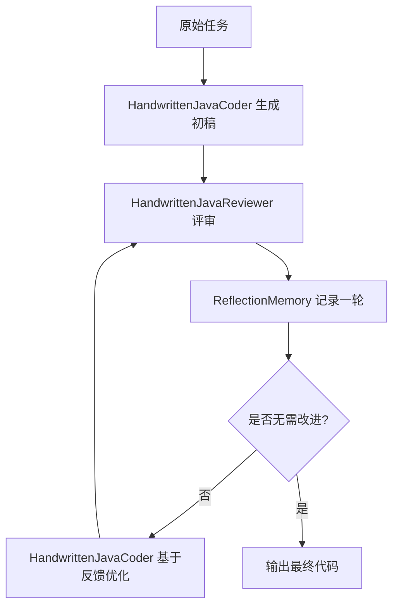
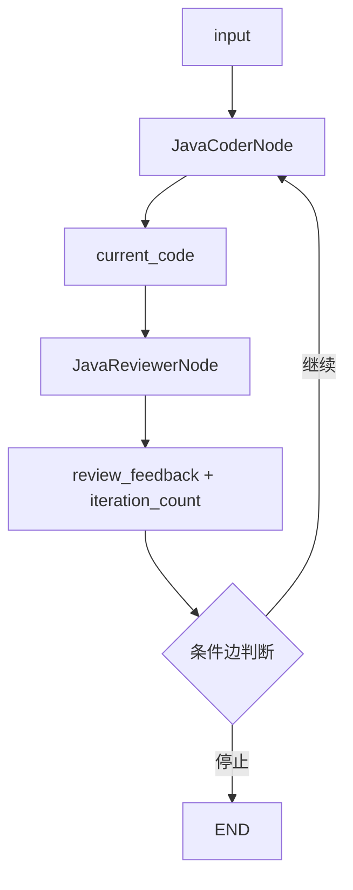

# Reflection范式新手导读

## 1. 先记住一句话

Reflection 不是“把同一个问题多问模型几次”，而是把：

- 生成
- 评审
- 修订
- 停止判断

这 4 件事显式工程化。

如果说 ReAct 更像“边想边做”，那么 Reflection 更像“先做出来，再站在审稿人视角挑错并优化”。

## 2. 为什么要学 Reflection

很多复杂任务第一次输出并不是完全错误，而是“能用但不够好”。

典型问题包括：

- 算法能跑，但复杂度太差
- 方案基本正确，但论证不够严谨
- 文案可读，但结构松散
- 工具链完成了，但结果质量不稳

这类问题的特点是：

**第一次结果往往不是零分，而是离高质量交付还差一次专业审视。**

Reflection 正是为这种场景服务的。

## 3. 本模块用什么例子讲 Reflection

这个模块选了一道非常适合做 Reflection 对照的题：

> 编写一个 Java 方法，找出 1 到 n 之间所有的素数，并返回一个 `List<Integer>`。

为什么这题适合？

- 初稿很容易写出暴力试除法
- 评审者很容易从时间复杂度切入
- 优化路径很明确，可以收敛到埃拉托斯特尼筛法
- “是否还需要继续优化”也比较容易判断

所以它非常适合展示：

- Reflection 怎么从初稿走向更优稿
- 评审意见如何真正影响下一轮生成
- 什么时候该停止反思

## 4. 这两套实现分别在演示什么

本模块里有两套实现：

### 4.1 手写版

核心类：

- `HandwrittenJavaCoder`
- `HandwrittenJavaReviewer`
- `ReflectionMemory`
- `HandwrittenReflectionAgent`

它的目标不是展示“框架有多强”，而是让你看见 Reflection 的底层运行时到底长什么样。

你可以把它理解成：

- 生成者负责出代码
- 评审者负责挑问题
- 协调器负责决定要不要继续
- 记忆容器负责保留每一轮历史

整个闭环由 Java 自己维护。

### 4.2 图编排版

核心类：

- `JavaCoderNode`
- `JavaReviewerNode`
- `AlibabaReflectionFlowAgent`

它的目标不是再写一遍手写逻辑，而是把：

- 节点
- 状态
- 边
- 停止条件

都提升成显式图结构。

你可以把它理解成：

- `JavaCoderNode` 写 `current_code`
- `JavaReviewerNode` 写 `review_feedback`
- 条件边根据 `review_feedback` 和 `iteration_count` 决定下一跳

这里最重要的不是“代码更短”，而是：

**流程结构从隐式 Java 控制流，变成了显式状态图。**

## 5. 手写版到底怎么跑

先看手写版的思路：

这里最关键的是 `HandwrittenReflectionAgent`。

它做了 3 件事：

1. 调 `HandwrittenJavaCoder` 生成初稿
2. 在 `while` 循环里不断调 `HandwrittenJavaReviewer`
3. 根据评审结果决定停止还是继续优化

### 5.1 `ReflectionMemory` 在这里到底干嘛

`ReflectionMemory` 不是为了“看起来高级”，而是为了显式保留每一轮结果。

每一轮都记录：

- 当前代码版本
- 当前评审反馈

这让你可以在运行结束后回放：

- 初稿是什么
- 第一轮评审说了什么
- 第二轮又怎么变了

这种显式历史，在教学、调试和测试里都非常有价值。

## 6. 图编排版到底怎么跑

再看图编排版的思路：

这里最关键的是 `AlibabaReflectionFlowAgent`。

它不是自己手写 `while`，而是定义了：

- 哪些节点存在
- 节点之间怎么连
- 什么时候走回环
- 什么时候到终点

### 6.1 状态键为什么很重要

图编排版的核心状态键是：

- `current_code`
- `review_feedback`
- `iteration_count`

如果你只盯着 Prompt，很容易看不清整个流程。  
但如果你盯着这 3 个状态键，就会发现：

- `current_code` 表示当前代码版本
- `review_feedback` 表示最新评审意见
- `iteration_count` 表示已经做了多少轮正式评审

这就是图编排版最重要的工程价值：

**运行事实进入状态，而不是只存在于模型上下文里。**

## 7. `while` 回环 和 条件边回环 到底差在哪

这是新手最值得反复看的一组对照。

### 7.1 手写版：`while` 回环

优点：

- 直观
- 容易理解
- 每一步上下文完全可控

缺点：

- 随着节点增多，协调器会越来越重
- 分支、回退、并行一多，代码很快像手写调度器

它更适合：

- 学底层原理
- 做最小闭环样例
- 精准控制 Prompt 细节

### 7.2 图编排版：条件边回环

优点：

- 状态流转和路由规则显式
- 更容易扩展成复杂工作流
- 后续更适合做可视化、调试、回放

缺点：

- 理解成本更高
- 一开始需要先想清楚状态键和边规则

它更适合：

- 企业级复杂流程
- 需要可观测性和治理能力的场景
- 未来可能继续扩展分支和节点的系统

## 8. 什么时候该停止 Reflection

Reflection 最大的风险不是“不会优化”，而是“无限优化”。

所以停止条件必须显式。

本模块最小样例里，停止条件有两个：

1. 评审结果明确包含“无需改进”
2. 达到最大反思轮次

注意这不是 Prompt 里的礼貌请求，而是运行时真的会检查的条件。

这点非常重要，因为：

**企业级 Reflection 不能靠模型“自觉收手”，必须靠程序治理。**

## 9. 学这个模块，建议按什么顺序看

推荐顺序：

1. 先看 `ReflectionPrimeGenerationDemoTest`
2. 再看手写版 4 个核心类
3. 再看图编排版 3 个核心类
4. 最后再看 README 的概念说明

为什么先看测试？

因为测试把这道样例真正“钉住”了：

- 初稿应该是什么方向
- 评审要从什么角度切
- 优化版该进化到哪里
- 状态里应该留下什么痕迹

对新手来说，测试是最清晰的行为规范。

## 10. 看完之后你应该能回答的 4 个问题

如果你已经理解这个模块，你应该能回答：

1. Reflection 和 ReAct 的核心差别是什么？
2. 为什么手写版要有 `ReflectionMemory`？
3. 为什么图编排版要把 `current_code` 和 `review_feedback` 放进状态？
4. `while` 回环和条件边回环各适合什么场景？

如果这 4 个问题你都能清楚回答，说明你已经不只是“看过 Reflection”，而是已经理解它在工程上的落地方式了。
