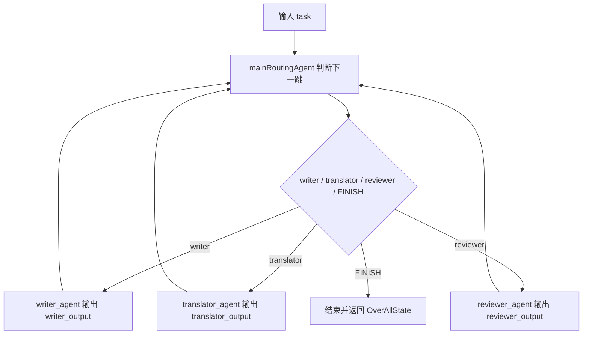
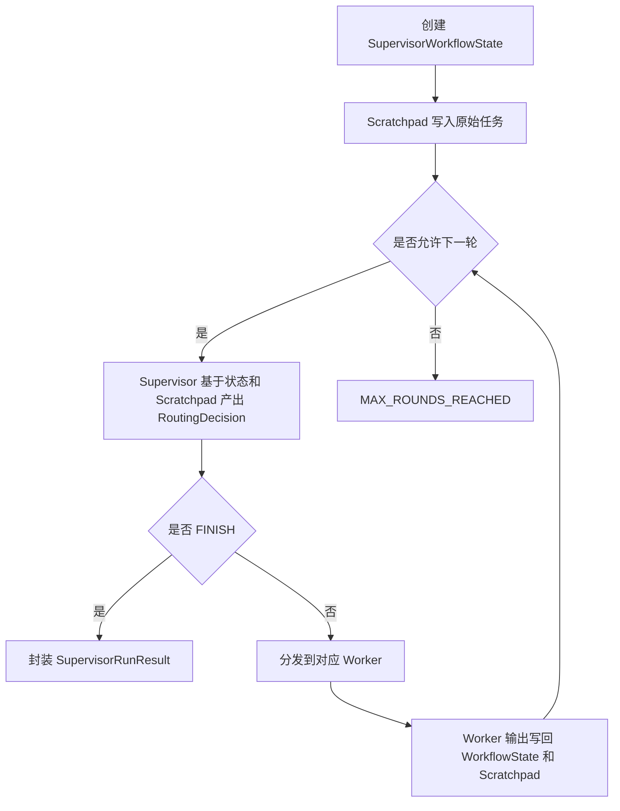

# Supervisor范式从0到1掌握指南

## 1. 这篇文档到底要解决什么问题

很多人第一次看到 `module-multi-agent-supervisor` 时，通常会同时卡在两层：

- 第一层是范式层：Supervisor 到底和 AutoGen、CAMEL、Sequential、Handoffs 有什么本质区别
- 第二层是框架层：Spring AI Alibaba 里的 `SupervisorAgent`、`ReactAgent`、`OverAllState` 到底是怎么把中心化调度真正跑起来的

最常见的困惑通常有这几类：

1. 这不就是“按顺序先写、再翻译、再审校”吗，为什么还要叫 Supervisor
2. `SupervisorAgent` 和普通路由 Agent 到底差在哪
3. 为什么框架版还要额外声明一个 `supervisor_router_agent`
4. `ReactAgent`、`SupervisorAgent`、`ChatModel`、`AgentLlmGateway` 四者到底怎么分工
5. `OverAllState` 里到底放了什么，为什么最后还能还原出统一运行结果
6. 手写版明明已经能跑，为什么还要再保留一套 Spring AI Alibaba 版

这篇文档不是脱离仓库讲框架百科，也不是只讲一个模块的目录说明。

它真正要做的事情是：

**借 `module-multi-agent-supervisor` 这个落地案例，把 Supervisor 范式本体和 Spring AI Alibaba 的原生实现过程，从 0 到 1 讲明白。**

读完之后，你应该能自己回答下面这些问题：

- Supervisor 的本质到底是什么
- 手写版和框架版到底在对照什么
- Spring AI Alibaba 里的 `SupervisorAgent` 到底怎样驱动多轮动态路由
- 为什么子 Agent 做完之后要返回 Supervisor，而不是直接结束
- 这套模块在仓库整体学习路径里处于什么位置

---

## 2. 先说人话：Supervisor 到底是什么

你可以先别把 Supervisor 想成“更高级的多智能体名词”。

它最朴素的意思其实是：

**不要让多个 Agent 自由聊天，而是指定一个中心主管，专门负责拆任务、派任务、收结果、判断下一步和决定何时结束。**

你可以把它想成一个非常典型的项目管理场景：

- 用户只把目标交给主管
- 主管决定先找谁干第一步
- 专家做完之后必须把结果交还给主管
- 主管再决定第二步交给谁
- 直到主管判断任务收敛，才宣布结束

所以 Supervisor 的重点不在“有几个 Agent”，而在：

- 控制权始终在中心节点
- 子 Agent 只负责专业执行
- 每一轮是否继续、交给谁、何时结束，都是 Supervisor 的决定

一句话说透：

**Supervisor 不是“多个人一起干活”，而是“一个人统一指挥，多个人按需执行”。**

---

## 3. 它和 AutoGen、CAMEL、Sequential、Handoffs 到底差在哪

仓库里已经有多个相邻范式模块，如果边界不建立清楚，很容易把它们全混成“多智能体”。

### 3.1 AutoGen Conversation

更像：

**几个人在同一个群里轮流发言。**

关键点是：

- 所有人共享同一份群聊历史
- 发言顺序相对固定
- 没有一个中心调度者每轮重新决定下一步找谁

### 3.2 CAMEL Roleplay

更像：

**两个互补角色按协议来回接力。**

关键点是：

- 强调角色边界
- 强调对话接力
- 强调当前谁掌控流程

### 3.3 Sequential

更像：

**一条固定流水线，A 做完一定轮到 B，B 做完一定轮到 C。**

关键点是：

- 顺序固定
- 不强调动态判断
- 更像流水线而不是调度器

### 3.4 Handoffs

更像：

**控制权真的交给了下一个 Agent。**

关键点是：

- 当前活动 Agent 会发生变化
- 一旦交接，新的 Agent 可以继续主导流程
- 更偏去中心化控制权转移

### 3.5 Supervisor

更像：

**一个主管每轮都重新拿回控制权。**

关键点是：

- 中心化控制
- 子 Agent 完成后必须返回 Supervisor
- 下一步是否继续、交给谁、是否 `FINISH`，全部由 Supervisor 判断

可以直接记成一句话：

- `Conversation / AutoGen`：重点是共享群聊上下文
- `Roleplay / CAMEL`：重点是角色接力和控制权交接
- `Sequential`：重点是固定顺序串行编排
- `Handoffs`：重点是活动 Agent 的真实转移
- `Supervisor`：重点是中心化任务调度与多轮收敛

---

## 4. 先建立一张技术栈地图

如果不先把这个模块里的技术分层看清，很容易把多个概念搅在一起。

`module-multi-agent-supervisor` 实际上分成 4 层：

| 层次 | 代表对象 | 在本模块里的职责 |
| --- | --- | --- |
| 范式层 | `module-multi-agent-supervisor` | 表达 Supervisor 的中心化调度、结果回收和多轮收敛 |
| 统一协议层 | `framework-core`、`AgentLlmGateway`、`Message` | 对模型调用、消息结构和统一运行结果提供项目级抽象 |
| Spring AI 适配层 | `ChatModel`、自动装配模块 | 把统一 `llm.*` 配置接到真实模型 |
| Spring AI Alibaba 运行时层 | `ReactAgent`、`SupervisorAgent`、`OverAllState` | 把 Supervisor 的多轮动态路由提升成框架原生可执行运行时 |

这张图最关键的启发是：

- `AgentLlmGateway` 解决的是“统一模型边界”
- Spring AI 解决的是“对接真实模型”
- Spring AI Alibaba 解决的是“如何把多 Agent 协作组织成原生运行时”

它们不是一层能力，也不应该混着理解。

换句话说：

- 手写版重点研究 Supervisor 的 runtime 本体
- 框架版重点研究 Spring AI Alibaba 怎么把这套 runtime 做成原生能力

---

## 5. 本模块里的两套实现，到底在对照什么

这个模块不是只写了一个 Supervisor，而是故意保留了两条实现线。

### 5.1 手写版 `HandwrittenSupervisorCoordinator`

它回答的是：

**如果完全不用框架图运行时，Supervisor 最小应该怎么写。**

这条线显式暴露了这些底牌：

- 一个 `while` 回环
- 一个 `SupervisorWorkflowState`
- 一份 `SupervisorScratchpad`
- 一个把 LLM JSON 文本解析成 `RoutingDecision` 的解析器
- 一个显式的 Worker 分发逻辑
- 一个 `CompletionPolicy` 来阻止无限回环

所以手写版最适合回答的问题是：

> Supervisor 的最小 runtime，到底是不是“中心化循环 + 状态更新 + 再决策”？

答案是：是的。

### 5.2 框架版 `AlibabaSupervisorFlowAgent`

它回答的是：

**如果把同一件事交给 Spring AI Alibaba 的原生 Supervisor 运行时治理，应该怎么做。**

这个版本里，开发者不再手写 `while` 主循环，而是改成：

- 用 `ReactAgent` 声明三个专业 Worker
- 用一个额外的 `supervisor_router_agent` 只负责判断下一跳
- 用 `SupervisorAgent` 负责把多轮动态路由真正跑起来
- 用 `OverAllState` 承载阶段输出和消息历史
- 最终再把框架状态提取成统一 `SupervisorRunResult`

所以这两条实现线不是重复，而是在对照两种 runtime 思路：

- 手写调度 runtime
- 框架原生调度 runtime

仓库保留这两套实现，正是为了贯彻整个项目的对照学习方式：

**用手写版理解范式本体，用框架版理解企业落地。**

---

## 6. 先把 Spring AI Alibaba 里的 Supervisor 核心对象翻成人话

真正卡新手的，往往不是代码量，而是术语本身。

你可以先把这些对象翻译成人话：

| 术语 | 在本模块里是什么意思 | 大白话理解 |
| --- | --- | --- |
| `ReactAgent` | 一个可独立执行单步任务的专业 Worker | 一个被主管调用的专业员工 |
| `SupervisorAgent` | 负责中心化调度和多轮回环的框架原生总控 | 一个会反复派活、收结果、再判断的主管 |
| `mainAgent` | Supervisor 的主路由 Agent | 只负责“下一步找谁”的路由脑 |
| `subAgents` | 被 Supervisor 调度的 Worker 集合 | 可被派活的专家列表 |
| `outputKey` | 子 Agent 把产物写回状态时的键名 | 每个专家交作业时贴的固定标签 |
| `instruction` | Agent 运行时读取状态的模板 | 告诉 Agent 去状态里拿什么信息干活 |
| `OverAllState` | 整个流程共享的运行时状态 | 全流程共同读写的一本草稿本 |
| `CompileConfig.recursionLimit` | 多轮回环的上限控制 | 防止 Supervisor 无限转圈的保险丝 |

这里最重要的两个理解是：

### 6.1 `SupervisorAgent` 不是普通单次路由器

单次路由器只做一件事：

- 看一下当前输入
- 决定下一跳
- 自己就结束

而 `SupervisorAgent` 不是这样。

它解决的是：

- 调到某个 Worker 后，Worker 产物怎么回到中心节点
- 中心节点如何基于最新状态继续判断下一跳
- 什么情况下回到 `FINISH`

所以它的本质是：

**带多轮回环能力的中心化调度器。**

### 6.2 `outputKey` 和 `instruction` 是框架版状态交接的关键

在这个模块里：

- `writer_agent` 输出写入 `writer_output`
- `translator_agent` 输出写入 `translator_output`
- `reviewer_agent` 输出写入 `reviewer_output`

然后主路由 Agent 的 `instruction` 会读取这些状态，判断：

- 哪个结果还没产出
- 下一步该调谁
- 是否已经可以 `FINISH`

所以框架版的核心，不是“Prompt 写得更花哨”，而是：

**状态交接开始有了明确协议。**

---

## 7. Spring AI Alibaba 实现 Supervisor 的完整过程

这一节是全文最重要的部分。

先直接给你结论：

**框架版不是“定义几个 Agent 然后自然就会跑”，而是按一条非常明确的装配链把 Supervisor 运行时搭起来。**

下面按代码真实结构把这条链拆开。

### 7.1 第一步：先把统一网关适配成 `ChatModel`

入口类在：

- `module-multi-agent-supervisor/src/main/java/com/xbk/agent/framework/supervisor/framework/support/SupervisorGatewayBackedChatModel.java`

为什么这一步必须存在？

因为项目自己的业务边界是 `AgentLlmGateway`，而 Spring AI Alibaba 原生 Agent 体系要消费的是 `ChatModel`。

所以这里做了一层适配：

- 输入：Spring AI 的 `Prompt`
- 转换：把 `Prompt` 里的消息转成项目统一 `Message`
- 调用：统一走 `AgentLlmGateway.chat(...)`
- 输出：再把统一响应包装回 Spring AI 的 `ChatResponse`

也就是说：

**框架版虽然看起来在用 Spring AI Alibaba 原生 Agent，但底层模型调用边界并没有泄漏出去。**

这正是项目整体架构里 `AgentLlmGateway` 作为防腐层的价值。

### 7.2 第二步：声明三个专业 Worker `ReactAgent`

入口类在：

- `module-multi-agent-supervisor/src/main/java/com/xbk/agent/framework/supervisor/framework/agent/AlibabaSupervisorFlowAgent.java`

在构造器里，框架版先声明三个专业 Worker：

- `writerAgent`
- `translatorAgent`
- `reviewerAgent`

它们的共同特征是：

- 都基于同一个 `ChatModel`
- 都有自己的 `systemPrompt`
- 都有自己的 `instruction`
- 都声明了自己的 `outputKey`
- 都关闭了推理内容回传

这一步的本质不是“创建了三个普通 Agent”，而是：

**把三段专业能力先标准化成可被 Supervisor 调度的执行单元。**

### 7.3 第三步：再声明一个只负责路由的 `mainRoutingAgent`

很多人第一次看这里会奇怪：

> 明明已经有 `SupervisorAgent` 了，为什么还要再定义一个 `supervisor_router_agent`？

**关键在于：`SupervisorAgent` 是运行时容器，它自己不会思考；`mainRoutingAgent` 才是大脑，负责每一轮的决策。**

用公司组织的类比来理解这两个角色的分工：

| 角色 | 对应类 | 职责 |
| --- | --- | --- |
| 公司组织架构（流程引擎） | `SupervisorAgent` | 管理”谁是下属”、”循环多少轮”、”怎么调度执行”，是运行时容器 |
| 主管本人（大脑） | `mainRoutingAgent` | 每轮开会，看当前进展，判断”下一步该交给谁” |
| 员工 | `writerAgent` / `translatorAgent` / `reviewerAgent` | 只管做自己那份活，做完交回 |

`SupervisorAgent` 自己的运行逻辑是这样一个循环：

```
每一轮：
  1. 把当前状态交给 mainRoutingAgent 问：”现在该派谁？”
  2. mainRoutingAgent 看状态，回答：”派 writer_agent” 或 “FINISH”
  3. SupervisorAgent 按指令调度对应的 Worker
  4. Worker 完成后把结果写回状态
  5. 回到第 1 步
```

**`SupervisorAgent` 本身不做任何判断，它只是忠实地执行 `mainRoutingAgent` 的指令。**

在这个模块里，`supervisor_router_agent` 的判断逻辑非常单一——检查三个输出字段的完成情况：

```
writer_output     为空 → 返回 [“writer_agent”]
translator_output 为空 → 返回 [“translator_agent”]
reviewer_output   为空 → 返回 [“reviewer_agent”]
三个都有了        → 返回 [“FINISH”]
```

它只做路由判断，不产出任何业务内容。

如果你第一次看到这 4 行容易懵，可以直接按“流水线进度条”理解：

- `writer_output` 表示“中文博客有没有写完”
- `translator_output` 表示“英文翻译有没有产出”
- `reviewer_output` 表示“最终审校稿有没有完成”
- 返回的 `["writer_agent"]`、`["translator_agent"]`、`["reviewer_agent"]`、`["FINISH"]` 不是业务结果，而是主路由 Agent 给框架的“下一跳指令”

把它翻译成大白话就是：

```
第一轮：
  三个 output 都是空
  -> 说明第一步写作还没开始
  -> 返回 ["writer_agent"]

第二轮：
  writer_output 已经有值
  translator_output 还是空
  -> 说明中文稿写完了，但翻译还没做
  -> 返回 ["translator_agent"]

第三轮：
  translator_output 已经有值
  reviewer_output 还是空
  -> 说明翻译完成了，但审校还没做
  -> 返回 ["reviewer_agent"]

第四轮：
  reviewer_output 也有值了
  -> 说明整条流水线已经结束
  -> 返回 ["FINISH"]
```

所以这段路由规则本质上表达的是一条固定顺序的状态机：

```text
writer_agent -> translator_agent -> reviewer_agent -> FINISH
```

虽然底层载体是 `SupervisorAgent`，但这个具体示例并没有做复杂分支决策，而是用 Supervisor 框架把一条三阶段流水线包装成了“基于状态反复判断下一跳”的可执行流程。

所以可以把这两个角色理解为：

**`SupervisorAgent` 是流程引擎（负责循环调度），`mainRoutingAgent` 是决策大脑（负责每轮判断下一跳）。框架把”跑循环”和”做决策”拆成两个独立职责，所以需要两个角色。**

### 7.4 第四步：把 `mainAgent + subAgents` 装配进 `SupervisorAgent`

真正把框架版 Supervisor 搭起来的代码是：

- `SupervisorAgent.builder()`

这里装进去了几类关键配置：

- `name`
  只是 Supervisor 的稳定标识
- `description`
  告诉框架这个总控的职责边界
- `compileConfig.recursionLimit(...)`
  限制多轮回环上限，防止无限调度
- `subAgents(List.of(...))`
  告诉 Supervisor 可调用的 Worker 列表
- `mainAgent(mainRoutingAgent)`
  告诉 Supervisor 每一轮由谁负责判断下一跳

这一步完成之后，才真正具备了一个可执行的中心化监督者运行时。

换句话说：

**不是 `ReactAgent` 自己组成了 Supervisor，而是 `SupervisorAgent` 把这些执行单元组织成了中心化多轮回环。**

### 7.5 第五步：调用 `run(task)`，框架开始真正执行

`AlibabaSupervisorFlowAgent.run(String task)` 做的事情很清楚：

1. 调用 `supervisorAgent.invoke(task)`
2. 让框架返回 `Optional<OverAllState>`
3. 从 `OverAllState` 中提取：
   - 路由轨迹
   - 三阶段输出
   - 步骤记录
   - 消息历史
4. 封装成统一 `SupervisorRunResult`

这里最关键的一点是：

**框架版不是直接返回“最终答案”，而是返回一整份状态快照。**

这使得它不仅能给用户结果，还能给工程侧留下可审计轨迹。

### 7.6 第六步：`invoke(task)` 之后，框架内部是怎么跑的

你可以把框架版的运行过程想成下面这条链：



这条链里最重要的事实是：

- Worker 执行完并不会接管流程
- Worker 输出会回写到状态
- 主路由 Agent 会基于最新状态再次判断
- 只有当主路由 Agent 返回 `FINISH`，流程才真正结束

所以这是一条标准的 Supervisor Loop，只不过：

**手写版把循环写在 Java `while` 里，框架版把循环写进了 `SupervisorAgent` 的运行时。**

### 7.7 第七步：状态到底怎么被写进去

这里要理解两个事实：

#### 事实 1：Worker 的输出会进入固定状态键

因为每个 `ReactAgent` 都声明了 `outputKey`，所以它们的结果会按约定写入：

- `writer_output`
- `translator_output`
- `reviewer_output`

这保证了主路由 Agent 能稳定读取这些结果，而不需要猜测上一个节点的自然语言长什么样。

#### 事实 2：框架消息历史也会进入统一状态

本模块里的 `SupervisorStateExtractor` 会从 `messages` 里提取：

- 路由轨迹
- 消息历史

也就是说，框架运行时不仅保留最终产物，也保留中间轨迹。

### 7.8 第八步：为什么最后还能还原成统一 `SupervisorRunResult`

这是框架版和项目统一协议真正打通的关键一步。

`SupervisorStateExtractor` 做了三类提取工作：

1. `extractOutput(...)`
   从状态键里提取 writer、translator、reviewer 的阶段输出
2. `extractRouteTrail(...)`
   从框架消息历史中还原 `WRITER -> TRANSLATOR -> REVIEWER -> FINISH`
3. `extractMessages(...)` 和 `extractStepRecords(...)`
   还原统一消息历史和步骤记录

最后 `AlibabaSupervisorFlowAgent.run(...)` 再把这些内容统一封装成 `SupervisorRunResult`。

这样做的意义是：

- 调用方不需要理解 Spring AI Alibaba 内部状态结构
- 手写版和框架版可以产出同一种结果对象
- 对照测试可以直接比较两套实现的行为一致性

这一步非常关键，因为它决定了：

**框架版不是一个“只能在框架内部消费”的黑盒，而是能被项目统一协议接住的可审计运行时。**

---

## 8. 手写版 Supervisor 到底怎么跑

如果说框架版重点是“怎么用原生运行时”，那手写版重点就是“Supervisor 的本体到底是什么”。

入口类：

- `module-multi-agent-supervisor/src/main/java/com/xbk/agent/framework/supervisor/handwritten/coordinator/HandwrittenSupervisorCoordinator.java`

手写版的流程可以直接概括成：



这条链路里有几个必须抓住的点：

### 8.1 `SupervisorWorkflowState` 是“当前事实”

它保存的是：

- 原始任务
- 中文初稿
- 英文译稿
- 审校稿
- 路由轨迹
- 已完成步数

它更像“当前事实快照”，而不是完整日志。

### 8.2 `SupervisorScratchpad` 是“审计历史”

它保存的是：

- 原始任务
- 每轮 Supervisor 决策
- 每轮 Worker 输出
- 每步执行记录

它的作用不是直接驱动业务状态，而是：

**让 Supervisor 在下一轮决策时看见上下文，同时给最终结果提供可审计轨迹。**

### 8.3 `SupervisorDecisionJsonParser` 是“把自然语言约束收口成结构化协议”

Supervisor 在手写版里不是随便返回一句文本，而是必须返回：

```json
{
  "next_worker": "WRITER | TRANSLATOR | REVIEWER | FINISH",
  "task_instruction": "..."
}
```

然后再由解析器把这段 JSON 还原成 `RoutingDecision`。

这一步的重要性在于：

**它把路由决策从松散自然语言收口成了可执行协议。**

### 8.4 `CompletionPolicy` 是“防失控保险丝”

Supervisor 最大的风险不是“不会工作”，而是“永远不结束”。

所以手写版显式引入 `CompletionPolicy`，把最大轮次限制单独抽出来。

这意味着：

- 完成条件不是只有 `FINISH`
- 还有“回环超过上限就强制停止”的治理策略

---

## 9. 两套实现怎么一一对照

如果你把手写版和框架版拆着看，很容易只看到两堆不同代码；把它们放到同一张表里，就会立刻清楚很多。

| 维度 | 手写版 | 框架版 |
| --- | --- | --- |
| 调度核心 | `while` 循环 + `askSupervisor(...)` | `SupervisorAgent.invoke(...)` |
| 状态承载 | `SupervisorWorkflowState` | `OverAllState` |
| 审计历史 | `SupervisorScratchpad` | `messages` + 状态快照 |
| 路由协议 | `RoutingDecision` JSON | `mainRoutingAgent` 返回 `["agent"]` / `["FINISH"]` |
| Worker 定义 | `WriterAgent` / `TranslatorAgent` / `ReviewerAgent` | 三个 `ReactAgent` |
| 输出交接 | Java 代码显式写字段 | `outputKey` 写状态键 |
| 终止条件 | `FINISH` 或最大轮次 | `FINISH` 或递归上限 |
| 统一返回 | `SupervisorRunResult` | 先 `OverAllState`，再还原成 `SupervisorRunResult` |

这张表真正想说明的是：

**两套实现的差异不是“一个聪明、一个笨”，而是“一个把机制摊开写，一个把机制交给框架原生运行时”。**

---

## 10. 测试到底在保证什么

如果你只是看目录，不一定知道这个模块到底保证了哪些行为。测试刚好回答这个问题。

### 10.1 `SupervisorPatternComparisonTest`

这是最关键的一组行为测试。

它钉住的是：

- 手写版必须走完 `WRITER -> TRANSLATOR -> REVIEWER -> FINISH`
- 框架版必须走完同一条轨迹
- 三阶段产物必须按顺序收敛
- 两套实现最终都能产出统一结果对象

这里的脚本化网关非常重要，因为它避免了测试依赖真实模型，把关注点纯化成：

**Supervisor 控制流本身是否正确。**

### 10.2 `OpenAiSupervisorDemoPropertySupportTest`

这组测试钉住的是：

- 本地配置文件能不能被读取
- `llm.api-key` 是否被正确识别
- `demo.supervisor.openai.enabled` 是否生效

它解决的是 Demo 安全治理问题，而不是 Supervisor 控制流问题。

### 10.3 `OpenAiSupervisorDemoTestConfigTest`

这组测试钉住的是：

- 在最小自动装配条件下，是否真的能拿到 `AgentLlmGateway`
- 是否真的能拿到 `ChatModel`

它回答的是：

**真实 Demo 运行前，最底层接模能力是不是已经打通。**

---

## 11. 真实 OpenAI Demo 怎么跑

当前模块保留了两套真实 Demo：

- `HandwrittenSupervisorOpenAiDemo`
- `AlibabaSupervisorFlowOpenAiDemo`

对应配置文件：

- `application-openai-supervisor-demo.yml`
- `application-openai-supervisor-demo-local.yml`
- `application-openai-supervisor-demo-local.yml.example`

运行前至少要确认三件事：

1. 本机使用的是 Java 21
2. 本地配置文件里填了真实 `llm.api-key`
3. 显式开启 `demo.supervisor.openai.enabled=true`

这里为什么默认要用 `Assumptions.assumeTrue(...)` 跳过？

因为项目需要保证：

- 日常 `mvn test` 不会误打外网
- 没配 Key 的环境不会因为 Demo 失败
- Demo 是可选验证，不是主测试链路的一部分

所以真实 Demo 的定位应该理解为：

**一个受开关保护的真实模型对照实验，而不是默认常驻测试。**

---

## 12. 推荐阅读顺序

如果你想顺着源码真正掌握这个模块，推荐顺序如下：

1. 先看 `SupervisorPatternComparisonTest`
   先建立“这套模块到底保证什么行为”的直觉
2. 再看手写版
   - `HandwrittenSupervisorCoordinator`
   - `SupervisorWorkflowState`
   - `SupervisorScratchpad`
   - `SupervisorDecisionJsonParser`
3. 再看框架版
   - `AlibabaSupervisorFlowAgent`
   - `FrameworkSupervisorPromptTemplates`
   - `SupervisorGatewayBackedChatModel`
   - `SupervisorStateExtractor`
4. 最后看真实 Demo 与配置支撑
   - `HandwrittenSupervisorOpenAiDemo`
   - `AlibabaSupervisorFlowOpenAiDemo`
   - `OpenAiSupervisorDemoPropertySupport`

这个顺序的核心逻辑是：

**先看行为，再看手写本体，接着看框架落地，最后再看真实模型接入。**

---

## 13. 一句话总结

Supervisor 范式的本质，不是“多加一个总控 Agent”，而是把多智能体系统里的全局治理能力显式工程化。

在这个仓库里，`module-multi-agent-supervisor` 同时保留手写版与 Spring AI Alibaba 版，目的不是重复实现，而是让你真正看清楚：

- 中心化调度到底是什么
- 多轮回环到底怎么收敛
- Spring AI Alibaba 又是怎样把这套机制提升成原生运行时的
