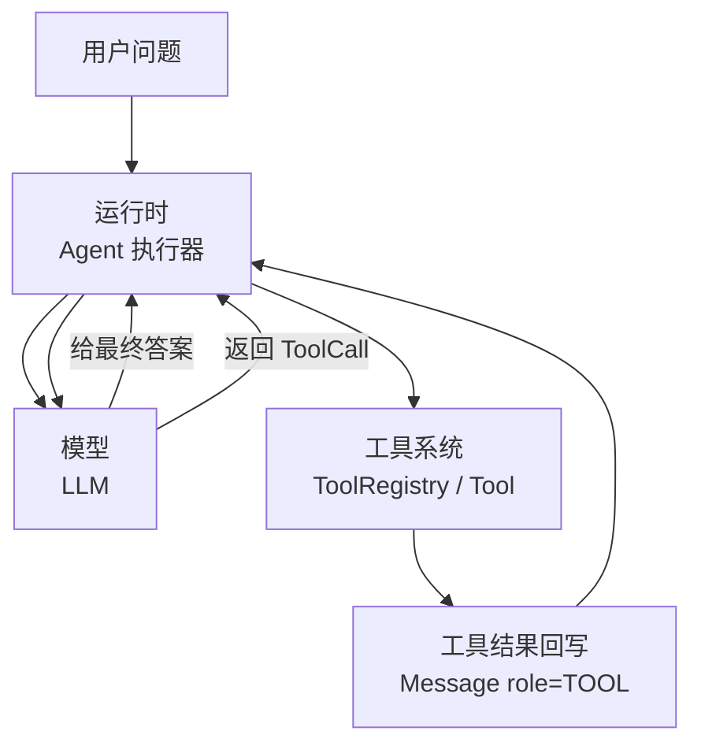
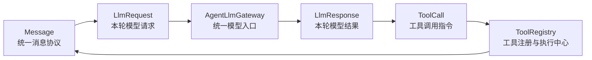
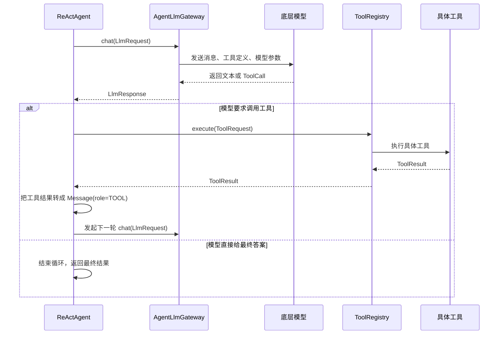
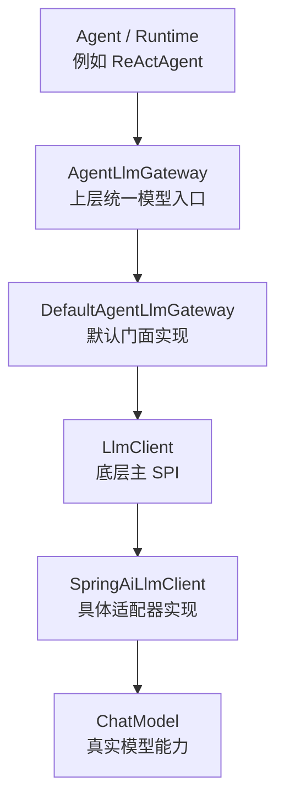

# ReAct 学习路线：手写版与 Spring AI Alibaba 官方版

## 1. 学习目标

这份文档不是为了重复解释 ReAct 理论，而是为了回答三个更实际的问题：

1. 应该先看哪份代码，才能最快理解 ReAct 的运行机制
2. 手写版 ReAct 和 Spring AI Alibaba 官方 `ReactAgent` 分别该怎么看
3. 什么时候开始接真实模型，以及模型该怎么配置

建议把这份文档当成“源码阅读导航”，而不是“架构设计文档”。

## 2. 总体学习顺序

推荐严格按下面顺序学习：

1. 先看手写版主循环
2. 再看手写版离线 Demo
3. 再看 `framework-core` 的底座协议
4. 再看官方 Spring AI Alibaba Demo
5. 最后再跑真实 OpenAI 对照版

这个顺序的核心理由只有一个：

- 先搞清楚 ReAct 是怎么“手动跑起来的”
- 再理解官方框架到底帮你自动接管了哪些事情

## 3. 第一阶段：先学手写版 ReAct

### 3.1 第一眼必须看的文件

- `module-react-paradigm/src/main/java/com/xbk/agent/framework/react/application/executor/ReActAgent.java`

这是整个手写版 ReAct 的核心入口。  
学习时只盯住 `run(String userQuery)` 这一条主链。

你要重点理解的不是每一行语法，而是这 5 个动作：

1. 把当前 `history` 发给模型
2. 读取模型回复
3. 判断模型是要调工具还是已经给最终答案
4. 如果要调工具，就执行工具
5. 把工具结果写回上下文，继续下一轮

其中最关键的安全机制是：

- `while (step < maxSteps)`

它的意义不是语法细节，而是：

- ReAct 允许模型不断“继续思考并继续行动”
- 但工程上绝对不能允许无限循环

### 3.2 第二眼看的文件

- `module-react-paradigm/src/test/java/com/xbk/agent/framework/react/ReActTravelDemo.java`

这个文件适合用来理解“数据是怎么流动的”。

里面有两个最值得看的假模型：

- `TravelDemoAgentLlmGateway`
  - 模拟正常的三轮闭环
  - 先查天气，再推荐景点，最后输出答案
- `AlwaysToolCallingAgentLlmGateway`
  - 故意永远不返回最终答案
  - 专门用来验证 `maxSteps` 安全阀

你在这里要建立的直觉是：

- 手写版 ReAct 不是“模型自己会跑”
- 而是我们把模型回复解释成“下一步动作”
- 然后由运行时继续推进循环

### 3.3 推荐先跑的命令

```bash
export JAVA_HOME=/Users/sxie/Library/Java/JavaVirtualMachines/azul-21.0.10/Contents/Home
export PATH="$JAVA_HOME/bin:$PATH"

/Users/sxie/maven/apache-maven-3.6.3/bin/mvn -q \
  -pl module-react-paradigm -am \
  -Dmaven.repo.local=/Users/sxie/xbk/agent-learning/.m2/repository \
  -Dtest=ReActTravelDemo \
  -Dsurefire.failIfNoSpecifiedTests=false \
  test
```

## 4. 第二阶段：补齐对 `framework-core` 的理解

当你把手写版 `ReActAgent` 的主循环看明白之后，再去看底座协议。

推荐顺序分成两层，不要一上来就把“接口”和“实现”混在一起看。

### 4.1 先看协议层

这一层回答的是：这个框架内部到底约定了哪些核心对象，它们分别代表什么。

1. [`framework-core/src/main/java/com/xbk/agent/framework/core/llm/AgentLlmGateway.java`](../framework-core/src/main/java/com/xbk/agent/framework/core/llm/AgentLlmGateway.java)
2. [`framework-core/src/main/java/com/xbk/agent/framework/core/llm/model/LlmRequest.java`](../framework-core/src/main/java/com/xbk/agent/framework/core/llm/model/LlmRequest.java)
3. [`framework-core/src/main/java/com/xbk/agent/framework/core/llm/model/LlmResponse.java`](../framework-core/src/main/java/com/xbk/agent/framework/core/llm/model/LlmResponse.java)
4. [`framework-core/src/main/java/com/xbk/agent/framework/core/llm/model/ToolCall.java`](../framework-core/src/main/java/com/xbk/agent/framework/core/llm/model/ToolCall.java)
5. [`framework-core/src/main/java/com/xbk/agent/framework/core/memory/Message.java`](../framework-core/src/main/java/com/xbk/agent/framework/core/memory/Message.java)
6. [`framework-core/src/main/java/com/xbk/agent/framework/core/tool/ToolRegistry.java`](../framework-core/src/main/java/com/xbk/agent/framework/core/tool/ToolRegistry.java)

注意：这一层很多文件本身是接口或协议对象，所以你会觉得“代码不多”。这是正常的，因为它们负责定义边界，不负责把流程真正跑起来。

#### 4.1.1 先用大白话记住这 6 个对象

如果你是 Java 工程师，刚开始接触 Agent，最容易犯的错误就是一上来就钻字段细节。

更推荐的方式是先问自己一句话：

- 这个对象在整个运行链路里，到底扮演什么角色

你可以先这样理解它们：

- [`Message`](../framework-core/src/main/java/com/xbk/agent/framework/core/memory/Message.java)
  - 可以先把它理解成 Agent 世界里的“统一消息格式”
  - 不管是系统提示、用户问题、模型回复，还是工具执行结果，最后都会落成一条 `Message`
  - 所以它是整个框架里最基础的公共语言

- [`LlmRequest`](../framework-core/src/main/java/com/xbk/agent/framework/core/llm/model/LlmRequest.java)
  - 可以先把它理解成“这一轮发给模型的完整请求包”
  - 它里面装的不是只有 prompt，还包括消息列表、可用工具、模型参数、工具调用参数等
  - 也就是说，它代表的是“一次完整的模型调用输入”

- [`AgentLlmGateway`](../framework-core/src/main/java/com/xbk/agent/framework/core/llm/AgentLlmGateway.java)
  - 可以先把它理解成“统一模型入口”
  - 上层代码不应该直接关心底层到底接的是 OpenAI、Spring AI，还是别的实现
  - 上层只需要知道：我把 `LlmRequest` 交给它，它给我 `LlmResponse`

- [`LlmResponse`](../framework-core/src/main/java/com/xbk/agent/framework/core/llm/model/LlmResponse.java)
  - 可以先把它理解成“模型这一轮返回的完整结果包”
  - 这里面可能有两种结果：一种是模型已经给出回答；另一种是模型没有直接回答，而是先要求调用工具
  - 所以它不是简单的字符串，而是“本轮推理结果”

- [`ToolCall`](../framework-core/src/main/java/com/xbk/agent/framework/core/llm/model/ToolCall.java)
  - 可以先把它理解成“模型发出来的一张工具任务单”
  - 它会告诉运行时：要调哪个工具、参数是什么、这次调用的 ID 是什么
  - 这里的“运行时”不是指 JVM，而是指负责推进 Agent 流程的那层执行逻辑；在这个项目里，你可以先把手写版 `ReActAgent` 理解成最典型的运行时
  - 这里的“调用 ID”一般就是 `toolCallId`，你可以先把它理解成“这一次工具调用的流水号”
  - 这里特别要注意：`ToolCall` 不是工具执行结果，而是模型发出的工具调用指令

- [`ToolRegistry`](../framework-core/src/main/java/com/xbk/agent/framework/core/tool/ToolRegistry.java)
  - 可以先把它理解成“工具总目录 + 执行入口”
  - 一方面，它要告诉模型当前有哪些工具可用
  - 另一方面，当模型真的发出 `ToolCall` 时，又要靠它去找到对应工具并执行

如果你先把这 6 个对象脑补成下面这 6 个角色，阅读会轻松很多：

- `Message`
  - 对话里的统一消息单位
- `LlmRequest`
  - 发给模型的输入包
- `AgentLlmGateway`
  - 调模型的统一入口
- `LlmResponse`
  - 模型返回的结果包
- `ToolCall`
  - 模型下发的工具调用指令
- `ToolRegistry`
  - 工具的注册和执行中心

#### 4.1.2 先把“模型、运行时、工具”三者关系搞明白

很多 Java 工程师第一次看 Agent 代码时，最容易把“模型”和“运行时”混成一件事。

其实它们根本不是同一个角色：

- 模型
  - 负责决定“下一步想做什么”
- 运行时
  - 负责把模型这一步想做的事情真正执行掉
- 工具
  - 负责提供真实能力，比如查天气、查库存、调接口、查数据库

你可以先看这张最直白的图：



这张图想表达的事情很简单：

- 模型不会自己去执行 Java 工具
- 模型只会告诉运行时“我下一步想调用什么工具”
- 真正去调工具、拿结果、再把结果送回模型的，是运行时

所以你看到 `ToolCall` 里有 `toolName`、`arguments`、`toolCallId` 时，可以直接翻译成：

- `toolName`
  - 调哪个工具
- `arguments`
  - 调工具时传什么参数
- `toolCallId`
  - 这是第几次工具调用，用来和后续工具结果对上号

如果两个工具调用的是同一个工具，比如都调用 `queryWeather`，那只看 `toolName` 是分不清的。

这时候就要靠 `toolCallId`：

- `call-1`
  - 对应“查北京天气”
- `call-2`
  - 对应“查上海天气”

#### 4.1.3 先看静态关系：这些对象是怎么连起来的

下面这张图不用死记。你只要先看懂两件事就够了：

1. `Message` 是最底层的统一消息协议
2. `LlmRequest -> AgentLlmGateway -> LlmResponse` 是一次模型调用的主链路



这张图可以这样读：

- 先把历史消息和本轮输入整理成 `Message`
- 再把这些 `Message` 装进 `LlmRequest`
- 然后通过 `AgentLlmGateway` 发给模型
- 模型返回 `LlmResponse`
- 如果响应里带了 `ToolCall`，就交给 `ToolRegistry` 执行
- 工具执行结果通常又会回写成新的 `Message`，进入下一轮上下文

你会发现，这套设计的核心目标其实很朴素：

- 用统一对象把“模型调用”和“工具调用”串成一条稳定链路
- 不让上层业务代码直接依赖第三方框架的内部类型

#### 4.1.4 再看动态流程：一次带工具调用的 ReAct 轮次怎么跑

如果你觉得前面的图还是有点静态，那就看下面这张时序图。

这张图回答的是：

- 当模型没有直接给答案，而是先要求调工具时，运行时到底怎么推进下一步



你如果把这张图和手写版 `ReActAgent` 的主循环对着看，会更容易建立一个正确直觉：

- Agent 运行时不是“等模型自己跑完”
- 而是“模型返回一步，运行时推进一步”
- 模型负责决定下一步想干什么
- 运行时负责把这一步真的执行掉

这就是很多 Java 工程师第一次接触 Agent 时最需要建立的认知：

- Agent 不是一个神奇黑盒
- 本质上还是“状态 + 协议 + 循环推进”

如果你把上一小节和这一小节合起来看，其实就会发现 `toolCallId` 的真实作用：

- 模型先发出一条 `ToolCall`
- 运行时再把它转成一次 `ToolRequest`
- 工具执行完后，结果再作为 `TOOL` 消息写回上下文
- 这几步之间之所以不会串线，靠的就是同一个工具调用标识

所以你可以把 `toolCallId` 直接记成一句大白话：

- 工具调用链路上的“同一单号”

#### 4.1.5 新手阅读这一层时，重点盯什么

第一次看协议层，不建议你把每个字段都抄下来背。

更建议你按下面顺序去盯：

1. 先看 `Message.role`
   - 因为它决定了这条消息在上下文里到底是系统消息、用户消息、助手消息，还是工具消息
2. 再看 `LlmRequest.messages`
   - 因为它决定了模型这一轮到底能看到什么上下文
3. 再看 `LlmRequest.availableTools`
   - 因为它决定了模型这一轮到底能调用哪些工具
4. 再看 `LlmResponse.toolCalls`
   - 因为它决定了运行时下一步是“结束”还是“继续行动”
5. 最后再看 `ToolRegistry.execute(...)`
   - 因为它决定了模型发出的工具调用到底怎么落到真实执行

你可以把这一层的学习目标压缩成一句大白话：

- 先搞清楚“框架里消息怎么表示、请求怎么表示、响应怎么表示、工具怎么调”

只要这句话想明白了，后面再去看默认实现层，就不会觉得一切都像“魔法”。

### 4.2 再看实现层

这一层回答的是：前面那些协议在项目里到底是怎么落地的。

#### 4.2.1 再把 `AgentLlmGateway` 和 `LlmClient` 的关系搞明白

很多人第一次看到这里时，会觉得：

- 既然已经有了 `AgentLlmGateway`
- 为什么还要再搞一个 `LlmClient`

如果只看名字，确实容易觉得它们像是两层重复抽象。

其实不是。你可以先把它们理解成两层不同位置的接口：

- `AgentLlmGateway`
  - 面向框架上层
  - 给 `ReActAgent` 这种运行时使用
  - 它回答的是：上层应该通过什么统一入口来调模型

- `LlmClient`
  - 面向框架下层
  - 给 Spring AI 这类底层适配器实现
  - 它回答的是：底层模型适配器应该遵守什么 SPI 协议

- `DefaultAgentLlmGateway`
  - 则是夹在中间的默认门面实现
  - 它手里拿着一个 `LlmClient`
  - 再把上层的统一调用委派给底层实现

你可以先看这张分层图：



这张图最想说明的一点是：

- 上层 Agent 不应该直接依赖底层模型适配器

所以在这套设计里：

- `ReActAgent` 只认 `AgentLlmGateway`
- `SpringAiLlmClient` 只需要实现 `LlmClient`
- `DefaultAgentLlmGateway` 负责把二者接起来

你也可以把它翻译成一句更口语的话：

- `AgentLlmGateway` 像前台总机
- `LlmClient` 像后厨接口
- `DefaultAgentLlmGateway` 像把前台和后厨接起来的那层总调度

为什么不直接让上层依赖 `LlmClient`？

因为 `LlmClient` 在这里被设计成“主 SPI”，它只保证最基础的同步对话能力。

而 `AgentLlmGateway` 想给上层的是一个更完整的统一入口，它除了同步对话，还统一暴露了：

- 流式输出
- 结构化输出
- 能力探测

所以你可以把这一层关系直接记成：

- `AgentLlmGateway`
  - 给上层用
- `LlmClient`
  - 给下层实现
- `DefaultAgentLlmGateway`
  - 负责把上下两层接起来

1. `framework-core/src/main/java/com/xbk/agent/framework/core/llm/DefaultAgentLlmGateway.java`
2. `framework-core/src/main/java/com/xbk/agent/framework/core/tool/support/DefaultToolRegistry.java`
3. `module-react-paradigm/src/main/java/com/xbk/agent/framework/react/application/executor/ReActAgent.java`

这样看会顺很多：

- `AgentLlmGateway`
  - 先看“统一模型入口长什么样”
- `DefaultAgentLlmGateway`
  - 再看“这个入口在默认实现里怎么被调用”
- `ToolRegistry`
  - 先看“工具注册中心提供了什么能力”
- `DefaultToolRegistry`
  - 再看“工具最后是怎么被查找和执行的”
- `ReActAgent`
  - 最后回到手写 ReAct 主循环，把前面的协议和实现串起来

这一阶段的目标不是立刻记住所有字段，而是搞懂 5 个核心角色：

- `Message`
  - 对话里的每一条消息
- `LlmRequest`
  - 当前这一轮发给模型的输入
- `LlmResponse`
  - 模型这一轮返回的结果
- `ToolCall`
  - 模型请求调用工具的结构化指令
- `ToolRegistry`
  - 真正执行工具的地方

如果这一层看不明白，后面看官方版时就容易觉得一切都是“魔法”。

## 5. 第三阶段：学习 Spring AI Alibaba 官方版

### 5.1 先看的文件

- `module-react-paradigm/src/test/java/com/xbk/agent/framework/react/SpringAIReActTravelDemo.java`

这份 Demo 的学习重点不是“工具怎么写”，而是：

- 为什么官方版不需要自己写 `while`
- 为什么官方版不需要自己维护 `history`
- 为什么官方版不需要自己解析 tool call

因为这些工作已经被：

- `ReactAgent`
- Graph Runtime
- `Model Node / Tool Node`

自动接管了。

### 5.2 对照阅读建议

建议你把下面两份文件来回切着看：

- `module-react-paradigm/src/main/java/com/xbk/agent/framework/react/application/executor/ReActAgent.java`
- `module-react-paradigm/src/test/java/com/xbk/agent/framework/react/SpringAIReActTravelDemo.java`

阅读时只问自己两个问题：

1. 手写版这里是我自己做的，官方版是谁帮我做了？
2. 官方版虽然更短，但它到底把复杂度藏到哪一层了？

## 6. 第四阶段：看对照分析文档

当你已经看过两套代码后，再读下面这份文档最合适：

- `docs/react-agent-handwritten-vs-official.md`

这份文档适合你在以下场景使用：

- 读完代码后做整理
- 想回顾两套实现的职责边界
- 想确认官方 `ReactAgent` 到底替你省掉了哪些运行时逻辑

如果在还没看源码前先读它，通常会显得抽象；  
先看代码、再看这份文档，吸收效果最好。

## 7. 第五阶段：最后再接真实模型

离线版看明白后，再去跑真实模型对照版：

- 手写真实版：
  - `module-react-paradigm/src/test/java/com/xbk/agent/framework/react/ReActTravelOpenAiDemo.java`
- 官方真实版：
  - `module-react-paradigm/src/test/java/com/xbk/agent/framework/react/SpringAIReActTravelOpenAiDemo.java`

这里的重点不是“能不能跑通”，而是：

- 同一个真实 `ChatModel`
- 同一组工具
- 同一个用户问题
- 手写版和官方版到底会表现出什么差异

### 7.1 当前项目的模型配置方式

真实模型基础配置在：

- `module-react-paradigm/src/test/resources/application-openai-react-demo.yml`

默认配置项包括：

- `spring.ai.openai.api-key`
- `spring.ai.openai.chat.options.model=gpt-4o`
- `demo.react.openai.enabled`

### 7.2 推荐的本地配置方式

推荐方式有两种。

#### 方式一：环境变量

```bash
export OPENAI_API_KEY='你的key'
```

#### 方式二：本地 yml

项目已经提供模板：

- `module-react-paradigm/src/test/resources/application-openai-react-demo-local.yml.example`

本地可使用的实际文件名是：

- `module-react-paradigm/src/test/resources/application-openai-react-demo-local.yml`

这个本地文件已经被 `.gitignore` 忽略，不会误提交到仓库。

### 7.3 真实 Demo 运行命令

```bash
export JAVA_HOME=/Users/sxie/Library/Java/JavaVirtualMachines/azul-21.0.10/Contents/Home
export PATH="$JAVA_HOME/bin:$PATH"

/Users/sxie/maven/apache-maven-3.6.3/bin/mvn -q \
  -pl module-react-paradigm -am \
  -Dmaven.repo.local=/Users/sxie/xbk/agent-learning/.m2/repository \
  -Ddemo.react.openai.enabled=true \
  -Dtest=ReActTravelOpenAiDemo,SpringAIReActTravelOpenAiDemo \
  -Dsurefire.failIfNoSpecifiedTests=false \
  test
```

## 8. 最推荐的学习节奏

如果你是第一次系统学习 ReAct，我建议按下面节奏推进：

### 第 1 天

- 只看手写版 `ReActAgent`
- 跑 `ReActTravelDemo`
- 搞懂 `while (step < maxSteps)`

### 第 2 天

- 看 `framework-core` 的协议对象
- 搞懂 `Message / LlmRequest / LlmResponse / ToolCall / ToolRegistry`

### 第 3 天

- 看 `SpringAIReActTravelDemo`
- 对照 `docs/react-agent-handwritten-vs-official.md`

### 第 4 天

- 配真实 OpenAI Key
- 跑两套真实 Demo
- 观察真实模型在工具调用上的行为差异

## 9. 一句话总结

最推荐的学习策略不是“先学官方 API”，而是：

- 先学手写版，搞懂 ReAct 为什么能跑起来
- 再学官方版，搞懂框架替你自动做了什么
- 最后接真实模型，验证两者在同一个底层模型上的差异

这样学，ReAct 就不会只是一个会调用工具的黑盒，而会变成你真正能掌控的运行机制。
