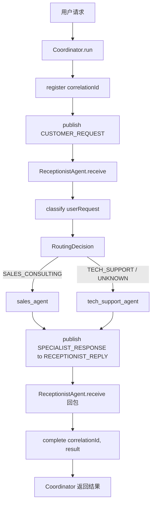
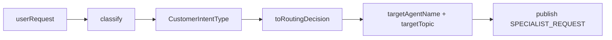
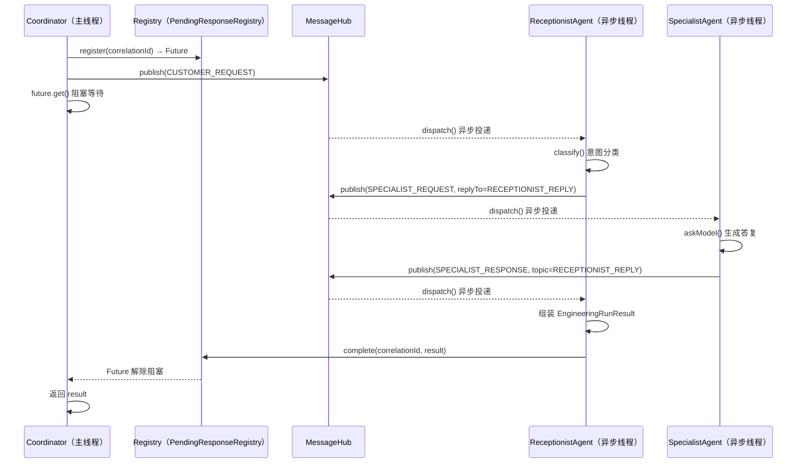
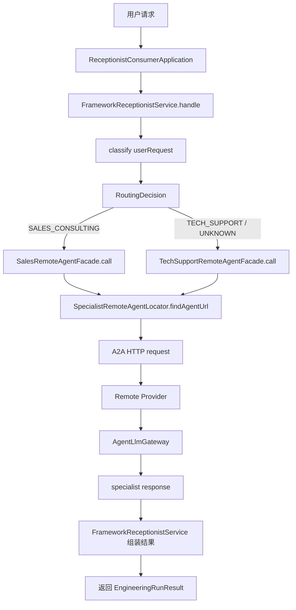

# 多智能体工程范式从0到1掌握指南

## 1. 这篇文档要解决什么问题

很多人第一次看到 `module-multi-agent-engineering` 时，通常会卡在这几层：

- 第一层是范式层：这和 Supervisor、AutoGen 有什么本质区别，不都是"多个 Agent 协作"吗
- 第二层是机制层：[`MessageHub`](../module-multi-agent-engineering/src/main/java/com/xbk/agent/framework/engineering/handwritten/hub/MessageHub.java)、`correlationId`、`replyTo`、[`PendingResponseRegistry`](../module-multi-agent-engineering/src/main/java/com/xbk/agent/framework/engineering/handwritten/runtime/PendingResponseRegistry.java) 到底是什么，为什么要这些东西
- 第三层是工程层：为什么会有三个独立 Spring Boot 进程，Nacos 和 RocketMQ 是干什么的

最常见的困惑通常有这几类：

1. `HandwrittenEngineeringCoordinator.run()` 调用之后控制权去哪了，为什么最后能拿到结果
2. `correlationId` 和 `replyTo` 有什么区别，各自解决什么问题
3. [`PendingResponseRegistry`](../module-multi-agent-engineering/src/main/java/com/xbk/agent/framework/engineering/handwritten/runtime/PendingResponseRegistry.java) 里为什么要用 `CompletableFuture`，谁在等、谁在完成
4. 框架版为什么需要三个进程，而不是像手写版一样放在一个 JVM 里
5. [`InMemoryMessageHub`](../module-multi-agent-engineering/src/main/java/com/xbk/agent/framework/engineering/handwritten/hub/InMemoryMessageHub.java) 和 [`MqBackedMessageHub`](../module-multi-agent-engineering/src/main/java/com/xbk/agent/framework/engineering/handwritten/hub/MqBackedMessageHub.java) 分别对应什么场景
6. 手写版和框架版到底在对照什么，为什么要同时保留两套

这篇文档不是脱离仓库讲框架百科，也不是只讲一个模块的目录说明。

它真正要做的事情是：

**借 `module-multi-agent-engineering` 这个落地案例，把消息驱动多智能体范式的本体机制和 A2A 工程化落地方式，从 0 到 1 讲明白。**

读完之后，你应该能自己回答下面这些问题：

- 消息驱动和直接调用在架构上有什么本质差异
- `correlationId` 是怎么把异步消息链和同步等待点连接起来的
- Spring AI Alibaba 的 A2A 协议解决的是什么工程问题
- 为什么三进程架构是 A2A 的最小完整演示
- 这套模块在仓库整体学习路径里处于什么位置

---

## 2. 先说人话：多智能体工程化范式是什么

你可以先别把它想成"更复杂的多智能体名词"。

它最朴素的意思是：

**不让多个 Agent 互相直接调用，而是把消息放到一个公共频道里，让关心这条消息的 Agent 自己去订阅和处理。**

你可以把它想成一个典型的公司客服场景：

- 用户打来电话，前台（Receptionist）接听
- 前台判断你的问题属于技术类还是销售类
- 前台把工单放到对应的"任务队列"上（技术队列 / 销售队列）
- 技术专家或销售顾问各自监听自己的队列，有任务就认领
- 专家处理完之后，把结果放回"前台回包队列"
- 前台收到结果，整理成完整回复交给用户

这个场景里最重要的事实是：

- 前台不直接打电话叫专家过来
- 专家不直接找用户拿问题
- 所有信息流动都通过"任务队列"中转

**所以这个范式的本质不是"有几个 Agent"，而是：所有 Agent 之间通过消息总线通信，彻底消除直接依赖。**

这样设计的好处是：

- 加一个新专家（比如财务顾问）只需要订阅一个新主题，不需要改任何现有代码
- 专家可以单独部署在另一台机器上，通信方式从内存队列换成真实 MQ 也不影响业务逻辑
- 任何一个专家挂掉，不会直接让整条链崩溃

一句话说透：

**这个范式不是"多个人一起干活"，而是"通过公共频道让每个人只关心自己应该干的事"。**

---

## 3. 它和 Supervisor、AutoGen、GraphFlow、CAMEL 到底差在哪

仓库里已经有多个相邻范式模块，如果边界不建立清楚，很容易把它们全混成"多智能体"。

### 3.1 AutoGen Conversation

更像：

**几个人在同一个群里轮流发言。**

关键点是：

- 所有人共享同一份群聊历史
- 发言顺序相对固定
- 没有一个中心调度者每轮重新决定下一步找谁
- Agent 之间有直接的双向会话关系

### 3.2 CAMEL Roleplay

更像：

**两个互补角色按协议来回接力。**

关键点是：

- 强调两个角色之间的边界
- 强调对话接力和控制权交接
- 一方发言，另一方响应，是显式双向交互

### 3.3 Supervisor

更像：

**一个主管每轮都重新拿回控制权。**

关键点是：

- 中心化控制，控制权始终在主管手里
- 子 Agent 完成后必须返回 Supervisor
- 是否继续、交给谁、是否结束，全部由 Supervisor 判断

### 3.4 GraphFlow

更像：

**一张预先定义好的流程图，节点按边走。**

关键点是：

- 流程路径在编译期确定
- 执行路径沿着图结构流转
- 状态是在节点间显式传递的

### 3.5 多智能体工程化范式（本模块）

更像：

**每个 Agent 订阅自己的频道，消息来了就处理，处理完发回去。**

关键点是：

- Agent 之间**没有直接依赖**，只依赖 MessageHub
- 路由是由意图分类动态决定的，不是硬编码的图
- 通信机制可以从内存队列无缝升级到真实 MQ 或跨进程 A2A 协议
- 扩展新专家只需要订阅新主题，不修改已有代码

可以直接记成一句话：

- `AutoGen`：重点是共享群聊上下文
- `CAMEL`：重点是角色接力和控制权交接
- `Supervisor`：重点是中心化任务调度与多轮收敛
- `GraphFlow`：重点是显式状态图编排
- **工程化范式**：重点是**消息总线解耦 + 意图路由 + 异步回包**

---

## 4. 先建立一张技术栈地图

如果不先把这个模块里的技术分层看清，很容易把多个概念搅在一起。

`module-multi-agent-engineering` 实际上分成 4 层：

| 层次 | 代表对象 | 在本模块里的职责 |
| --- | --- | --- |
| 范式层 | `module-multi-agent-engineering` | 表达消息驱动、意图路由、异步回包的核心设计 |
| 统一协议层 | `framework-core`、`AgentLlmGateway`、[`EngineeringRunResult`](../module-multi-agent-engineering/src/main/java/com/xbk/agent/framework/engineering/api/EngineeringRunResult.java) | 对模型调用、消息结构和统一运行结果提供项目级抽象 |
| 消息传输层 | [`InMemoryMessageHub`](../module-multi-agent-engineering/src/main/java/com/xbk/agent/framework/engineering/handwritten/hub/InMemoryMessageHub.java) / [`MqBackedMessageHub`](../module-multi-agent-engineering/src/main/java/com/xbk/agent/framework/engineering/handwritten/hub/MqBackedMessageHub.java) / RocketMQ | 在进程内和跨进程两种场景下传递消息 |
| A2A 运行时层 | Spring AI Alibaba A2A 协议、Nacos、[`ReceptionistConsumerApplication`](../module-multi-agent-engineering/src/main/java/com/xbk/agent/framework/engineering/framework/app/ReceptionistConsumerApplication.java) 三进程 | 把 Agent 能力标准化成网络服务，实现真正跨进程协作 |

这张图最关键的启发是：

- `AgentLlmGateway` 解决的是"统一模型边界"
- [`MessageHub`](../module-multi-agent-engineering/src/main/java/com/xbk/agent/framework/engineering/handwritten/hub/MessageHub.java) 解决的是"消息如何在 Agent 间传递"
- A2A 协议解决的是"Agent 能力如何跨进程暴露和调用"

它们不是一层能力，也不应该混着理解。

换句话说：

- 手写版重点研究消息驱动范式的 runtime 本体
- 框架版重点研究如何把同一套业务逻辑工程化到真实分布式环境

---

## 5. 本模块里的两套实现，到底在对照什么

这个模块不是只写了一套多智能体，而是故意保留了两条实现线。

### 5.1 手写版（`handwritten/` 包）

它回答的是：

**如果完全不用真实 MQ 或 A2A 协议，消息驱动多智能体最小应该怎么写。**

这条线显式暴露了这些底牌：

- 一个 [`InMemoryMessageHub`](../module-multi-agent-engineering/src/main/java/com/xbk/agent/framework/engineering/handwritten/hub/InMemoryMessageHub.java)，在 JVM 内部模拟消息代理
- 一个 [`TopicSubscriptionRegistry`](../module-multi-agent-engineering/src/main/java/com/xbk/agent/framework/engineering/handwritten/hub/TopicSubscriptionRegistry.java)，维护主题和订阅者的映射
- 一个 [`AsyncMessageDispatcher`](../module-multi-agent-engineering/src/main/java/com/xbk/agent/framework/engineering/handwritten/hub/AsyncMessageDispatcher.java)，把消息消费放进线程池异步执行
- 一个 [`PendingResponseRegistry`](../module-multi-agent-engineering/src/main/java/com/xbk/agent/framework/engineering/handwritten/runtime/PendingResponseRegistry.java)，用 `CompletableFuture` 桥接异步链和同步等待
- 一个 [`ConversationContextStore`](../module-multi-agent-engineering/src/main/java/com/xbk/agent/framework/engineering/handwritten/runtime/ConversationContextStore.java)，保存跨消息边界需要复用的状态
- 一套 `correlationId` + `replyTo` 协议，保证回包能找到正确的等待点

所以手写版最适合回答的问题是：

> 消息驱动多智能体的最小 runtime，到底是"发布 → 订阅 → 异步处理 → 回包 → 唤醒等待点"这条链吗？

答案是：是的。

### 5.2 框架版（`framework/` 包）

它回答的是：

**如果把同一套业务逻辑部署到三个独立进程上，用 Spring AI Alibaba 的 A2A 协议打通，应该怎么做。**

这个版本里，开发者不再把所有 Agent 放在同一个 JVM 里，而是改成：

- [`TechSupportProviderApplication`](../module-multi-agent-engineering/src/main/java/com/xbk/agent/framework/engineering/framework/app/TechSupportProviderApplication.java)：单独进程，端口 8081，把技术专家能力通过 A2A 协议暴露
- [`SalesProviderApplication`](../module-multi-agent-engineering/src/main/java/com/xbk/agent/framework/engineering/framework/app/SalesProviderApplication.java)：单独进程，端口 8082，把销售顾问能力通过 A2A 协议暴露
- [`ReceptionistConsumerApplication`](../module-multi-agent-engineering/src/main/java/com/xbk/agent/framework/engineering/framework/app/ReceptionistConsumerApplication.java)：单独进程，端口 8080，接收用户请求，通过 A2A 协议调用远端专家

通信机制也从 [`InMemoryMessageHub`](../module-multi-agent-engineering/src/main/java/com/xbk/agent/framework/engineering/handwritten/hub/InMemoryMessageHub.java) 升级到：

- Nacos：负责 Agent 服务注册与发现
- A2A 协议（JSON-RPC over HTTP）：Agent 之间标准化通信
- 可选 RocketMQ：在需要异步消息持久化时替代内存 Hub

所以这两条实现线不是重复，而是在对照两种工程化程度：

- 单进程内存版：展示范式本体，适合理解机制
- 三进程 A2A 版：展示生产级工程落地，适合理解分布式 Agent 协作

仓库保留这两套实现，正是为了贯彻整个项目的对照学习方式：

**用手写版理解范式本体，用框架版理解企业落地。**

---

## 6. 先把核心对象翻成人话

真正卡新手的，往往不是代码量，而是术语本身。

你可以先把这些对象翻译成人话：

| 术语 | 在本模块里是什么意思 | 大白话理解 |
| --- | --- | --- |
| [`MessageHub`](../module-multi-agent-engineering/src/main/java/com/xbk/agent/framework/engineering/handwritten/hub/MessageHub.java) | 消息总线接口，Agent 通过它发布和订阅消息 | 公司内部的任务公告板 |
| [`InMemoryMessageHub`](../module-multi-agent-engineering/src/main/java/com/xbk/agent/framework/engineering/handwritten/hub/InMemoryMessageHub.java) | 基于线程池的进程内消息代理 | JVM 里的内存公告板，适合单机演示 |
| [`MqBackedMessageHub`](../module-multi-agent-engineering/src/main/java/com/xbk/agent/framework/engineering/handwritten/hub/MqBackedMessageHub.java) | 基于 RocketMQ 的持久化消息代理 | 真实的企业内部通讯系统 |
| [`MessageTopic`](../module-multi-agent-engineering/src/main/java/com/xbk/agent/framework/engineering/domain/message/MessageTopic.java) | 消息主题常量（CUSTOMER_REQUEST、RECEPTIONIST_REPLY 等） | 公告板上的不同栏目 |
| `correlationId` | 跨消息关联同一次请求的唯一标识 | 快递单号，用来把收件和发件关联起来 |
| `replyTo` | 专家处理完后应该把结果发到哪个主题 | 信封上的回寄地址 |
| [`PendingResponseRegistry`](../module-multi-agent-engineering/src/main/java/com/xbk/agent/framework/engineering/handwritten/runtime/PendingResponseRegistry.java) | 用 `correlationId` 索引 `CompletableFuture` 的注册表 | 快递代收点，Coordinator 在这里等结果 |
| [`ConversationContextStore`](../module-multi-agent-engineering/src/main/java/com/xbk/agent/framework/engineering/handwritten/runtime/ConversationContextStore.java) | 存储请求文本、路由决策、路由轨迹的会话状态 | 接待员的工作便签本 |
| [`DeliveryAuditLog`](../module-multi-agent-engineering/src/main/java/com/xbk/agent/framework/engineering/handwritten/runtime/DeliveryAuditLog.java) | 记录每条消息 publish / deliver / consume 三段时间戳 | 消息的快递追踪记录 |
| [`RoutingDecision`](../module-multi-agent-engineering/src/main/java/com/xbk/agent/framework/engineering/domain/routing/RoutingDecision.java) | 意图分类的完整输出，含目标主题、目标 Agent、路由理由 | 前台的派单决定 |
| [`EngineeringRunResult`](../module-multi-agent-engineering/src/main/java/com/xbk/agent/framework/engineering/api/EngineeringRunResult.java) | 整条链完成后的统一结果对象 | 客服工单的最终归档 |

这里最重要的两个理解是：

### 6.1 `correlationId` 和 `replyTo` 是两个不同层面的协议

`replyTo` 解决的是**路由问题**：

专家处理完请求，应该把结果发到哪个主题？
答案就在 `replyTo` 字段里：`RECEPTIONIST_REPLY`。

`correlationId` 解决的是**关联问题**：

一条结果消息到达 Receptionist 之后，它属于哪一次原始请求？Coordinator 在哪里等它？
答案就在 `correlationId` 里：用它在 [`PendingResponseRegistry`](../module-multi-agent-engineering/src/main/java/com/xbk/agent/framework/engineering/handwritten/runtime/PendingResponseRegistry.java) 里找到对应的 `Future`，然后 `complete()`。

可以这样记：

- `replyTo` = "把结果放到哪个邮箱"
- `correlationId` = "这封信是哪个客户的，收件人在几号窗口等"

### 6.2 [`PendingResponseRegistry`](../module-multi-agent-engineering/src/main/java/com/xbk/agent/framework/engineering/handwritten/runtime/PendingResponseRegistry.java) 是整条异步链的"同步桥"

Coordinator 对外提供的是同步 API（`run()` 直接返回结果），但底层整条链是异步消息驱动的。

这两者怎么打通？就靠 [`PendingResponseRegistry`](../module-multi-agent-engineering/src/main/java/com/xbk/agent/framework/engineering/handwritten/runtime/PendingResponseRegistry.java)：

1. Coordinator 在发消息之前，先在注册表里放一个空的 `Future`，键是 `correlationId`
2. 消息链异步跑完后，Receptionist 用 `correlationId` 找到这个 `Future`，调用 `complete(result)`
3. Coordinator 在 `future.get()` 处被唤醒，拿到结果返回

**注册表就是同步世界和异步世界之间的传话人。**

---

## 7. 手写版完整执行过程

这一节是全文最重要的部分。

先直接给你结论：

**手写版不是"调用几个方法然后等结果"，而是一条完整的发布-订阅-异步-回包链，Coordinator 只是发令枪和终点线，中间所有执行都在异步线程里完成。**

下面按代码真实结构把这条链拆开。

### 7.0 先把 4 个角色分清，不然后面的代码一定会看乱

这一章最容易混的，不是 [`MessageHub`](../module-multi-agent-engineering/src/main/java/com/xbk/agent/framework/engineering/handwritten/hub/MessageHub.java)、`correlationId` 这些术语，而是：

**到底是谁在分诊，谁在转发，谁在真正回答问题。**

先把 4 个角色固定住：

| 角色 | 在代码里是谁 | 职责 | 不负责什么 |
| --- | --- | --- | --- |
| 用户入口 | [`HandwrittenEngineeringCoordinator`](../module-multi-agent-engineering/src/main/java/com/xbk/agent/framework/engineering/handwritten/coordinator/HandwrittenEngineeringCoordinator.java) | 创建 `conversationId` / `correlationId`，注册等待点，发起第一次消息，最后拿结果返回 | 不负责意图分类，不负责专家回答 |
| 前台接待 | [`HandwrittenReceptionistAgent`](../module-multi-agent-engineering/src/main/java/com/xbk/agent/framework/engineering/handwritten/agent/HandwrittenReceptionistAgent.java) | 接收用户请求，调用 [`CustomerIntentClassifier`](../module-multi-agent-engineering/src/main/java/com/xbk/agent/framework/engineering/application/routing/CustomerIntentClassifier.java) 判断意图，记录路由轨迹，把消息转发给目标专家，收专家回包后组装最终结果 | 不直接产出技术答案或销售答案 |
| 分诊规则 | [`CustomerIntentClassifier`](../module-multi-agent-engineering/src/main/java/com/xbk/agent/framework/engineering/application/routing/CustomerIntentClassifier.java) | 把用户请求识别成 `TECH_SUPPORT` 或 `SALES_CONSULTING`，并映射成 [`RoutingDecision`](../module-multi-agent-engineering/src/main/java/com/xbk/agent/framework/engineering/domain/routing/RoutingDecision.java) | 不发消息，不直接调用专家 |
| 专家执行者 | `tech_support_agent` / `sales_agent` | 真正调用模型生成专业答复，然后按 `replyTo` 回包 | 不负责决定自己该不该处理这条消息 |

这里一定要把下面两件事分开：

- `CustomerIntentClassifier.classify()`：只是算出"应该交给谁"
- `messageHub.publish(...)` / `send(...)`：才是把消息真的发给那个专家

你可以先把手写版脑补成下面这张总流程图：



这张图里最重要的观察点有两个：

1. `ReceptionistAgent` 是前台，不是专家。
2. `classify()` 的结果是一个 [`RoutingDecision`](../module-multi-agent-engineering/src/main/java/com/xbk/agent/framework/engineering/domain/routing/RoutingDecision.java)，真正发给专家的是后面的 `publish(...)`。

### 7.1 第一步：Coordinator 创建关联标识并注册等待点

```
Coordinator.run(requestText)
  ↓
生成 conversationId、correlationId
  ↓
pendingResponseRegistry.register(correlationId) → 创建空 Future 存入注册表
```

这里必须先注册再发消息。
如果先发消息，极端情况下 Agent 处理极快，`complete()` 比 `register()` 先执行，Future 就找不到了。

### 7.2 第二步：向 CUSTOMER_REQUEST 主题发布消息

```
messageHub.publish(EngineeringMessage {
    topic = CUSTOMER_REQUEST
    correlationId = "engineering-correlation-xxx"
    replyTo = null（用户请求不需要，Receptionist 会在转发时设置）
    payload = CustomerServiceRequest(requestText)
})
```

`publish()` 之后，Coordinator 线程继续走到 `future.get()` 阻塞等待。
**从这一刻起，整条链都在线程池的异步线程里执行。**

### 7.3 第三步：InMemoryMessageHub 异步投递给 Receptionist

```
MessageHub.publish()
  ↓
TopicSubscriptionRegistry.getSubscribers("CUSTOMER_REQUEST") → [receptionistAgent]
  ↓
AsyncMessageDispatcher.dispatch(() → {
    DeliveryAuditLog.recordDelivered(...)
    receptionistAgent.receive(message)
    DeliveryAuditLog.recordConsumed(...)
})
```

`dispatch()` 把任务丢进线程池就返回了，Receptionist 在线程池线程里异步执行。

### 7.4 第四步：Receptionist 分析意图，向专家主题转发

```
ReceptionistAgent.receive(CUSTOMER_REQUEST 消息)
  ↓
CustomerIntentClassifier.classify() → RoutingDecision {
    intentType = TECH_SUPPORT / SALES_CONSULTING
    targetTopic = SUPPORT_TECH_REQUEST / SUPPORT_SALES_REQUEST
    targetAgentName = "tech_support_agent" / "sales_agent"
}
  ↓
ConversationContextStore.recordRoutingDecision(...)
ConversationContextStore.recordRoute(...)
  ↓
messageHub.publish(EngineeringMessage {
    topic = SUPPORT_TECH_REQUEST（或 SUPPORT_SALES_REQUEST）
    correlationId = 原 correlationId（原样透传！）
    replyTo = RECEPTIONIST_REPLY（告诉专家回包地址）
    payload = SpecialistRequestPayload(requestText, reason, intentType)
})
```

`correlationId` 必须原样透传，专家回包时还要用它找回 Coordinator 注册的 Future。

如果你把这一段代码看乱了，通常是把"分诊"和"转发"混成了一件事。实际上这里分成 3 个连续动作：

1. `classify(userRequest)`：先判断用户问题属于技术支持还是销售咨询。
2. `toRoutingDecision(intentType)`：再把意图类型翻译成具体目标，例如：
   - `SALES_CONSULTING -> sales_agent + SUPPORT_SALES_REQUEST`
   - `TECH_SUPPORT / UNKNOWN -> tech_support_agent + SUPPORT_TECH_REQUEST`
3. `messageHub.publish(...)`：最后才把消息真正发布到对应专家主题。

所以 `classify()` 看起来没有直接"去找专家"，是因为它只负责产出一张"派单结果"。
真正写入目标专家名的是 [`RoutingDecision`](../module-multi-agent-engineering/src/main/java/com/xbk/agent/framework/engineering/domain/routing/RoutingDecision.java)，真正把单子发出去的是后面的 `publish(...)`。

可以把这一步单独压缩成下面这个小图：



这也是为什么当前实现看上去像"默认总是技术专家"：

- 明确识别为销售咨询时，转给 `sales_agent`
- 明确识别为技术支持时，转给 `tech_support_agent`
- 连意图都不稳定时，也保守地转给 `tech_support_agent`

换句话说，不是 Receptionist 自己在回答技术问题，而是它的默认兜底路由偏向技术专家。

### 7.5 第五步：专家 Agent 处理请求，按 replyTo 回包

```
TechSupportAgent.receive(SPECIALIST_REQUEST 消息)
  ↓
askModel(systemPrompt, requestText) → LLM 生成技术答复
  ↓
messageHub.publish(EngineeringMessage {
    topic = message.getReplyTo()    ← 就是 RECEPTIONIST_REPLY
    correlationId = 原 correlationId（再次透传）
    payload = SpecialistResponsePayload(TECH_SUPPORT, answer)
})
```

专家不知道谁在等它，也不知道结果最终怎么用。它只负责：收请求 → 生成答复 → 往 `replyTo` 发出去。

### 7.6 第六步：Receptionist 收到专家回包，组装最终结果并唤醒 Coordinator

```
ReceptionistAgent.receive(SPECIALIST_RESPONSE 消息)
  ↓
组装 EngineeringRunResult {
    conversationId, requestText, intentType, specialistType
    routingDecision, specialistResponse, finalResponse
    routeTrail, trace（审计记录快照）
}
  ↓
pendingResponseRegistry.complete(correlationId, result)
  ↓
← Coordinator 线程在 future.get() 处被唤醒，返回 result
```

`complete()` 这一行是整条异步链的终点，也是同步等待的解锁时刻。

### 7.7 完整时序图



---

## 8. 框架版 A2A 完整过程

如果你已经把手写版的 7 步链路全部看懂了，现在来看框架版是怎么把同一件事换一种方式做的。

手写版的核心是：`publish → subscribe → 异步处理 → replyTo 回包 → complete(Future)`。
框架版把这条链压缩成了一次同步 HTTP 调用，但业务分工（分诊 → 选专家 → 拿答复 → 组装结果）完全没变。

如果说手写版重点是"消息驱动机制本体"，框架版重点就是"如何把 Agent 能力变成真实网络服务"。

### 8.0 先把框架版 4 个角色分清，和手写版一一对照

框架版如果直接看代码，也很容易乱，但它乱的点和手写版不完全一样。

手写版容易混的是：

- 谁在分诊
- 谁在转发
- 谁在等异步回包

框架版容易混的是：

- 谁在本地做意图分类
- 谁在决定调用哪个远端 Provider
- 谁在真正发起 HTTP / A2A 请求

先把角色固定住：

| 角色 | 在代码里是谁 | 职责 | 对照手写版 |
| --- | --- | --- | --- |
| 用户入口 | [`ReceptionistConsumerApplication`](../module-multi-agent-engineering/src/main/java/com/xbk/agent/framework/engineering/framework/app/ReceptionistConsumerApplication.java) | 暴露 HTTP 入口，接收外部请求，交给 [`FrameworkReceptionistService`](../module-multi-agent-engineering/src/main/java/com/xbk/agent/framework/engineering/framework/agent/FrameworkReceptionistService.java) | 对照手写版的 `Coordinator.run()` 入口 |
| 前台接待 | [`FrameworkReceptionistService`](../module-multi-agent-engineering/src/main/java/com/xbk/agent/framework/engineering/framework/agent/FrameworkReceptionistService.java) | 本地分类意图，选择对应专家 Facade，同步等待远端结果，组装 [`EngineeringRunResult`](../module-multi-agent-engineering/src/main/java/com/xbk/agent/framework/engineering/api/EngineeringRunResult.java) | 对照手写版的 [`HandwrittenReceptionistAgent`](../module-multi-agent-engineering/src/main/java/com/xbk/agent/framework/engineering/handwritten/agent/HandwrittenReceptionistAgent.java) |
| 分诊规则 | [`CustomerIntentClassifier`](../module-multi-agent-engineering/src/main/java/com/xbk/agent/framework/engineering/application/routing/CustomerIntentClassifier.java) | 识别技术 / 销售意图，产出 [`RoutingDecision`](../module-multi-agent-engineering/src/main/java/com/xbk/agent/framework/engineering/domain/routing/RoutingDecision.java) | 和手写版完全相同 |
| 专家调用层 | [`TechSupportRemoteAgentFacade`](../module-multi-agent-engineering/src/main/java/com/xbk/agent/framework/engineering/framework/client/TechSupportRemoteAgentFacade.java) / [`SalesRemoteAgentFacade`](../module-multi-agent-engineering/src/main/java/com/xbk/agent/framework/engineering/framework/client/SalesRemoteAgentFacade.java) | 通过 [`SpecialistRemoteAgentLocator`](../module-multi-agent-engineering/src/main/java/com/xbk/agent/framework/engineering/framework/client/SpecialistRemoteAgentLocator.java) 找 Provider 地址，再发起 A2A HTTP 请求 | 对照手写版的 `messageHub.publish(...)` + 专家消息投递 |

这里最关键的一点是：

**框架版没有把请求先投到 [`MessageHub`](../module-multi-agent-engineering/src/main/java/com/xbk/agent/framework/engineering/handwritten/hub/MessageHub.java) 再异步等待，而是本地分诊后，直接同步调用远端专家。**

所以你可以把框架版脑补成下面这张总流程图：



这张图里最重要的观察点有三个：

1. [`FrameworkReceptionistService`](../module-multi-agent-engineering/src/main/java/com/xbk/agent/framework/engineering/framework/agent/FrameworkReceptionistService.java) 依然是前台，不是技术专家也不是销售专家。
2. [`CustomerIntentClassifier`](../module-multi-agent-engineering/src/main/java/com/xbk/agent/framework/engineering/application/routing/CustomerIntentClassifier.java) 依然只负责分诊，不直接发远端请求。
3. 真正发网络请求的是 `RemoteAgentFacade`，不是 [`CustomerIntentClassifier`](../module-multi-agent-engineering/src/main/java/com/xbk/agent/framework/engineering/application/routing/CustomerIntentClassifier.java)。

### 8.1 三进程架构是什么

框架版把三个 Agent 分拆成三个独立 Spring Boot 进程：

```
┌─────────────────────────────────┐
│  进程 1：TechSupportProvider     │  端口 8081
│  注册服务名：tech-support-agent  │
│  暴露：POST /（A2A JSON-RPC）    │
│  暴露：GET /.well-known/agent.json│
└─────────────────────────────────┘

┌─────────────────────────────────┐
│  进程 2：SalesProvider           │  端口 8082
│  注册服务名：sales-agent         │
│  暴露：POST /（A2A JSON-RPC）    │
│  暴露：GET /.well-known/agent.json│
└─────────────────────────────────┘

┌────────────────────────────────────┐
│  进程 3：ReceptionistConsumer      │  端口 8080
│  依赖 Nacos 发现专家服务地址        │
│  接收：POST /engineering/handle    │
│  通过 A2A 协议调用远端 Provider     │
└────────────────────────────────────┘

          以上三个进程共同依赖：
          ┌──────────┐
          │  Nacos   │  127.0.0.1:8848
          │ 服务注册  │  namespace: engineering-a2a
          └──────────┘
```

### 8.2 A2A 协议解决的是什么问题

手写版里 Agent 之间的通信是 Java 方法调用（通过 MessageHub 间接完成）。

框架版把这层调用升级成了标准 HTTP + JSON-RPC：

- Provider 进程启动时向 Nacos 注册服务
- Provider 暴露 `GET /.well-known/agent.json` 返回 AgentCard（描述自己的能力）
- Consumer 通过 Nacos 查找 Provider 地址，用标准 A2A 协议发请求

这样的好处是：

- Provider 和 Consumer 可以分别扩容
- Provider 可以用任何语言实现，只要遵守 A2A 协议
- Consumer 不需要知道 Provider 在哪台机器，Nacos 负责发现

### 8.3 框架版的核心组件

| 组件 | 职责 |
| --- | --- |
| [`FrameworkReceptionistService`](../module-multi-agent-engineering/src/main/java/com/xbk/agent/framework/engineering/framework/agent/FrameworkReceptionistService.java) | 接收用户请求，分类意图，通过 Facade 调用远端专家 |
| [`SalesRemoteAgentFacade`](../module-multi-agent-engineering/src/main/java/com/xbk/agent/framework/engineering/framework/client/SalesRemoteAgentFacade.java) | 封装对 sales-agent Provider 的 A2A 调用 |
| [`TechSupportRemoteAgentFacade`](../module-multi-agent-engineering/src/main/java/com/xbk/agent/framework/engineering/framework/client/TechSupportRemoteAgentFacade.java) | 封装对 tech-support-agent Provider 的 A2A 调用 |
| [`SpecialistRemoteAgentLocator`](../module-multi-agent-engineering/src/main/java/com/xbk/agent/framework/engineering/framework/client/SpecialistRemoteAgentLocator.java) | 通过 Nacos 查找 Provider 地址 |
| [`A2aNacosCommonConfig`](../module-multi-agent-engineering/src/main/java/com/xbk/agent/framework/engineering/framework/config/A2aNacosCommonConfig.java) | Nacos 连接参数配置 |
| [`SalesA2aServerConfig`](../module-multi-agent-engineering/src/main/java/com/xbk/agent/framework/engineering/framework/config/SalesA2aServerConfig.java) | 把销售顾问能力注册成 A2A 服务端点 |
| [`TechSupportA2aServerConfig`](../module-multi-agent-engineering/src/main/java/com/xbk/agent/framework/engineering/framework/config/TechSupportA2aServerConfig.java) | 把技术专家能力注册成 A2A 服务端点 |
| [`EngineeringAgentCardSupport`](../module-multi-agent-engineering/src/main/java/com/xbk/agent/framework/engineering/framework/support/EngineeringAgentCardSupport.java) | 生成 A2A 标准的 AgentCard |

### 8.4 框架版的调用链路

```
用户请求
  ↓
ReceptionistConsumerApplication（端口 8080）
  ↓
FrameworkReceptionistService.handle(requestText)
  ↓
CustomerIntentClassifier.classify() → RoutingDecision
  ↓
SpecialistRemoteAgentLocator 通过 Nacos 查找目标 Provider 地址
  ↓
TechSupportRemoteAgentFacade / SalesRemoteAgentFacade
  ↓
A2A 协议 HTTP 请求 → Provider 进程（8081 或 8082）
  ↓
Provider 调用 AgentLlmGateway 生成答复
  ↓
HTTP 响应返回 Consumer
  ↓
FrameworkReceptionistService 组装 EngineeringRunResult
```

框架版没有手写版那套 `correlationId` + `CompletableFuture` 桥，因为这里是**同步 HTTP 调用**，不需要异步等待。

如果把这一段和手写版 7.4 对照起来看，可以把框架版也拆成 3 个连续动作：

1. `classify(userRequest)`：先判断这是技术问题还是销售问题。
2. `callSpecialist(decision)`：再根据 [`RoutingDecision`](../module-multi-agent-engineering/src/main/java/com/xbk/agent/framework/engineering/domain/routing/RoutingDecision.java) 选择 `salesFacade` 或 `techSupportFacade`。
3. `facade.call(...)`：最后由 Facade 内部完成 Nacos 定位、A2A 请求发送、响应提取。

也就是说，框架版里"选专家"这件事并不是靠消息主题订阅完成的，而是靠本地 `if` 分支完成的：

- `SALES_CONSULTING -> salesFacade.call(...)`
- 其他情况（包括 `UNKNOWN`）-> `techSupportFacade.call(...)`

所以两套实现虽然外表不同，但核心分工其实是对齐的：

- [`CustomerIntentClassifier`](../module-multi-agent-engineering/src/main/java/com/xbk/agent/framework/engineering/application/routing/CustomerIntentClassifier.java) 决定"应该找谁"
- 后续通信层决定"怎么真的把请求送过去"

手写版的通信层是 [`MessageHub`](../module-multi-agent-engineering/src/main/java/com/xbk/agent/framework/engineering/handwritten/hub/MessageHub.java)

框架版的通信层是 `RemoteAgentFacade + A2A HTTP`

### 8.5 框架版的两层架构：主链路 vs MQ 增强层

很多人第一次看到框架版代码里同时出现 `A2AClient`、`RocketMQTemplate`、`Nacos` 时，最常问的一个问题是：

**框架版到底是同步还是异步？MQ 不是用来做异步通信的吗，为什么主链路是阻塞的？**

答案是：框架版的架构分成了两层，主链路和 MQ 增强层各管各的事。

```
┌─────────────────────────────────────────────────────┐
│              主链路（A2A 同步调用）                    │
│                                                      │
│  用户请求 → 意图分类 → Facade.call() → HTTP 同步等待   │
│          → 拿到专家回复 → 组装结果返回                  │
│                                                      │
│  ★ 这条路是阻塞的，走 A2A 协议，不经过 MQ             │
└─────────────────────────────────────────────────────┘

┌─────────────────────────────────────────────────────┐
│          增强层（MQ 异步，旁路，可关闭）                │
│                                                      │
│  1. RoutingAuditEventPublisher → 审计：把路由决策      │
│     异步发到 MQ，供后台分析，失败了也不影响主链路       │
│                                                      │
│  2. SpecialistEscalationPublisher → 升级：专家超时     │
│     或搞不定时，把升级任务投到 MQ，后台异步处理         │
│                                                      │
│  3. AsyncResultCallbackListener → 回调：长耗时场景     │
│     专家先返回"已接受"，处理完后通过 MQ 通知结果       │
│                                                      │
│  ★ 这三条路全是旁路，engineering.mq.enabled=false      │
│    整层关掉，主链路照跑                                │
└─────────────────────────────────────────────────────┘
```

为什么主链路用同步而不是 MQ？

因为框架版走的是 **A2A 协议**（Agent-to-Agent），本质是一次 HTTP 请求-响应。Consumer（接待员）向 Provider（专家）发起 HTTP POST，等 Provider 返回 HTTP Response 后继续往下走。这和你调一个 REST API 没有本质区别——发请求、等响应、拿结果，天然就是同步阻塞的。

MQ 在框架版里扮演的角色，用一张表说清：

| MQ 组件 | 角色 | 是否在主链路上 | 失败后果 |
| --- | --- | --- | --- |
| [`RoutingAuditEventPublisher`](../module-multi-agent-engineering/src/main/java/com/xbk/agent/framework/engineering/framework/messaging/RoutingAuditEventPublisher.java) | 审计旁路 — 记录路由决策 | 否 | 只打 warn 日志，主链路不受影响 |
| [`SpecialistEscalationPublisher`](../module-multi-agent-engineering/src/main/java/com/xbk/agent/framework/engineering/framework/messaging/SpecialistEscalationPublisher.java) | 升级补偿 — 专家搞不定时投递升级任务 | 否 | 同上 |
| [`AsyncResultCallbackListener`](../module-multi-agent-engineering/src/main/java/com/xbk/agent/framework/engineering/framework/messaging/AsyncResultCallbackListener.java) | 异步回调 — 长耗时场景的补充通道 | 否 | 同上 |

而且整个 MQ 层默认是**关闭**的（[`EngineeringMqEnhancementConfig`](../module-multi-agent-engineering/src/main/java/com/xbk/agent/framework/engineering/framework/config/EngineeringMqEnhancementConfig.java) 中 `enabled = false`）。

所以结论非常明确：

**MQ 是给主链路加保险、加审计、加升级能力的旁路增强层，不是用来传递"接待员→专家"这条核心请求的。核心请求走的是 A2A 同步 HTTP 调用。**

如果你把这一点和手写版放在一起对比，区别就更清楚了：

| | 手写版 | 框架版 |
| --- | --- | --- |
| 主链路通信 | MessageHub（内存消息总线） | A2A HTTP 同步调用 |
| 主链路是否阻塞 | 间接阻塞（`future.get()`） | 直接阻塞（HTTP 等响应） |
| MQ 的角色 | 不涉及 MQ（[`InMemoryMessageHub`](../module-multi-agent-engineering/src/main/java/com/xbk/agent/framework/engineering/handwritten/hub/InMemoryMessageHub.java) 是线程池，不是 MQ） | 旁路增强：审计 / 升级 / 回调 |
| MQ 挂了会怎样 | — | 主链路不受影响 |

---

## 9. 手写版 vs 框架版对照表

如果你把手写版和框架版拆着看，很容易只看到两堆不同代码；把它们放到同一张表里，就会立刻清楚很多。

| 维度 | 手写版 | 框架版 |
| --- | --- | --- |
| 部署方式 | 单进程 JVM | 三个独立 Spring Boot 进程 |
| 消息传输 | [`InMemoryMessageHub`](../module-multi-agent-engineering/src/main/java/com/xbk/agent/framework/engineering/handwritten/hub/InMemoryMessageHub.java)（线程池） | A2A 协议（HTTP + JSON-RPC）|
| 服务发现 | 无（直接在构造器注册订阅） | Nacos（动态注册与发现） |
| Agent 通信 | `messageHub.publish()` → 订阅者异步接收 | `RemoteAgentFacade.call()` → HTTP 同步调用 |
| 路由决策 | `ReceptionistAgent` 分类后发布到专家主题 | [`FrameworkReceptionistService`](../module-multi-agent-engineering/src/main/java/com/xbk/agent/framework/engineering/framework/agent/FrameworkReceptionistService.java) 分类后调用对应 Facade |
| 异步桥 | [`PendingResponseRegistry`](../module-multi-agent-engineering/src/main/java/com/xbk/agent/framework/engineering/handwritten/runtime/PendingResponseRegistry.java) + `CompletableFuture` | 无（框架版是同步 HTTP，不需要桥） |
| 会话状态 | [`ConversationContextStore`](../module-multi-agent-engineering/src/main/java/com/xbk/agent/framework/engineering/handwritten/runtime/ConversationContextStore.java)（内存） | 请求-响应在 HTTP 边界内完成，无跨请求状态 |
| 审计轨迹 | [`DeliveryAuditLog`](../module-multi-agent-engineering/src/main/java/com/xbk/agent/framework/engineering/handwritten/runtime/DeliveryAuditLog.java) 三段式记录 | [`A2aInvocationTraceSupport`](../module-multi-agent-engineering/src/main/java/com/xbk/agent/framework/engineering/framework/support/A2aInvocationTraceSupport.java) 记录调用信息 |
| 扩展新专家 | 新建 Agent 类 + 订阅新主题 | 新建 Provider 进程 + 在 Nacos 注册 |
| 统一返回 | [`EngineeringRunResult`](../module-multi-agent-engineering/src/main/java/com/xbk/agent/framework/engineering/api/EngineeringRunResult.java) | [`EngineeringRunResult`](../module-multi-agent-engineering/src/main/java/com/xbk/agent/framework/engineering/api/EngineeringRunResult.java)（相同结构） |

这张表真正想说明的是：

**两套实现的差异不是"一个聪明、一个笨"，而是"一个把机制摊开在 JVM 里，一个把机制提升到网络协议层"。**

---

## 10. 手写版看懂后，下一步怎么学框架版

如果你已经把手写版看懂了，下一步最容易犯的错，不是"学得慢"，而是：

**一下子把框架版、Nacos、A2A、RocketMQ 四样东西同时往脑子里塞。**

这样会直接把三层不同问题混成一团：

- 框架版主链路到底怎么跑
- Nacos 到底负责什么
- MQ 在这里究竟是主通信，还是增强层

所以最稳的学习策略不是"按技术名词一个个看"，而是：

**先学框架版主链路，再学 Nacos 服务发现，最后再学 MQ。**

### 10.1 先建立一个总判断：框架版主链路不是 MQ

你先把这句话钉死：

**在本模块里，框架版的主链路是 `Receptionist -> Nacos 发现 -> A2A HTTP -> Provider`，不是 RocketMQ。**

也就是说：

- [`CustomerIntentClassifier`](../module-multi-agent-engineering/src/main/java/com/xbk/agent/framework/engineering/application/routing/CustomerIntentClassifier.java) 先在 Consumer 本地做意图分类
- [`FrameworkReceptionistService`](../module-multi-agent-engineering/src/main/java/com/xbk/agent/framework/engineering/framework/agent/FrameworkReceptionistService.java) 根据 [`RoutingDecision`](../module-multi-agent-engineering/src/main/java/com/xbk/agent/framework/engineering/domain/routing/RoutingDecision.java) 选择调用哪个 Facade
- [`TechSupportRemoteAgentFacade`](../module-multi-agent-engineering/src/main/java/com/xbk/agent/framework/engineering/framework/client/TechSupportRemoteAgentFacade.java) / [`SalesRemoteAgentFacade`](../module-multi-agent-engineering/src/main/java/com/xbk/agent/framework/engineering/framework/client/SalesRemoteAgentFacade.java) 通过 Nacos 找到远端 Provider
- 最终通过 A2A HTTP 请求拿回专家答复

RocketMQ 在框架版里默认只是增强层，不替代这条主链路。

如果这一点没立住，后面一接触 MQ，很容易误以为：

- Nacos 负责转发请求
- MQ 才是框架版主链路
- A2A 只是个可有可无的包装层

这些理解都是错的。

### 10.2 第一步：先学"不依赖外部服务"的框架版主链路

这一阶段先不要启动 Nacos，也不要启动 RocketMQ。
目标只有一个：

**先把框架版的本地控制流看清楚。**

推荐顺序：

1. [`FrameworkReceptionistService`](../module-multi-agent-engineering/src/main/java/com/xbk/agent/framework/engineering/framework/agent/FrameworkReceptionistService.java)
   看前台如何在本地完成 `classify -> callSpecialist -> assemble result`
2. [`TechSupportRemoteAgentFacade`](../module-multi-agent-engineering/src/main/java/com/xbk/agent/framework/engineering/framework/client/TechSupportRemoteAgentFacade.java) / [`SalesRemoteAgentFacade`](../module-multi-agent-engineering/src/main/java/com/xbk/agent/framework/engineering/framework/client/SalesRemoteAgentFacade.java)
   看 Facade 如何承担"真正发远端请求"的职责
3. [`FrameworkReceptionistRoutingTest`](../module-multi-agent-engineering/src/test/java/com/xbk/agent/framework/engineering/framework/FrameworkReceptionistRoutingTest.java)
   看测试如何钉住"技术问题必须走 tech facade，销售问题必须走 sales facade"
4. [`EngineeringComparisonTest`](../module-multi-agent-engineering/src/test/java/com/xbk/agent/framework/engineering/EngineeringComparisonTest.java)
   对照手写版和框架版，确认两套实现的业务语义是一致的

这一阶段你应该能回答 3 个问题：

- 为什么框架版的前台还是 [`FrameworkReceptionistService`](../module-multi-agent-engineering/src/main/java/com/xbk/agent/framework/engineering/framework/agent/FrameworkReceptionistService.java)，而不是专家 Provider
- 为什么 [`CustomerIntentClassifier`](../module-multi-agent-engineering/src/main/java/com/xbk/agent/framework/engineering/application/routing/CustomerIntentClassifier.java) 只负责分诊，不负责发 HTTP
- 为什么 Facade 是框架版里真正的通信层

### 10.3 第二步：再接 Nacos，专门学习"服务发现"这层

当你已经看懂框架版主链路之后，再接 Nacos。

这一阶段的目标不是学习"消息传输"，而是看明白：

**Consumer 到底是怎么知道技术专家和销售顾问现在在哪台机器上的。**

推荐顺序：

1. [`A2aNacosCommonConfig`](../module-multi-agent-engineering/src/main/java/com/xbk/agent/framework/engineering/framework/config/A2aNacosCommonConfig.java)
   看 Nacos 地址、命名空间、服务名这些公共配置
2. [`SpecialistRemoteAgentLocator`](../module-multi-agent-engineering/src/main/java/com/xbk/agent/framework/engineering/framework/client/SpecialistRemoteAgentLocator.java)
   看 Consumer 如何通过 Nacos 找到目标 Provider URL
3. [`TechSupportProviderApplication`](../module-multi-agent-engineering/src/main/java/com/xbk/agent/framework/engineering/framework/app/TechSupportProviderApplication.java) / [`SalesProviderApplication`](../module-multi-agent-engineering/src/main/java/com/xbk/agent/framework/engineering/framework/app/SalesProviderApplication.java) / [`ReceptionistConsumerApplication`](../module-multi-agent-engineering/src/main/java/com/xbk/agent/framework/engineering/framework/app/ReceptionistConsumerApplication.java)
   看三进程是如何拆开的
4. [`TechSupportA2aServerConfig`](../module-multi-agent-engineering/src/main/java/com/xbk/agent/framework/engineering/framework/config/TechSupportA2aServerConfig.java) / [`SalesA2aServerConfig`](../module-multi-agent-engineering/src/main/java/com/xbk/agent/framework/engineering/framework/config/SalesA2aServerConfig.java)
   看 Provider 侧如何把专家能力暴露成 A2A 端点
5. [`A2aNacosDiscoverySmokeTest`](../module-multi-agent-engineering/src/test/java/com/xbk/agent/framework/engineering/framework/A2aNacosDiscoverySmokeTest.java)
   看 Nacos 发现链路是否正常
6. [`FrameworkA2aRoutingTest`](../module-multi-agent-engineering/src/test/java/com/xbk/agent/framework/engineering/framework/FrameworkA2aRoutingTest.java)
   看真实三进程 + Nacos 的完整路由是否打通

这一阶段你要建立的理解是：

- Nacos 不负责转发请求
- Nacos 只负责告诉 Consumer："你要找的专家现在在哪"
- 真正的请求传输仍然是 A2A HTTP

### 10.4 第三步：最后再学 MQ，而且要分成两条线

MQ 在这个模块里有两种完全不同的学习线，如果不拆开看，最容易混。

**第一条：框架版 MQ 增强层**

这一条对应的是：

- [`EngineeringMqEnhancementConfig`](../module-multi-agent-engineering/src/main/java/com/xbk/agent/framework/engineering/framework/config/EngineeringMqEnhancementConfig.java)
- [`RoutingAuditEventPublisher`](../module-multi-agent-engineering/src/main/java/com/xbk/agent/framework/engineering/framework/messaging/RoutingAuditEventPublisher.java)
- [`SpecialistEscalationPublisher`](../module-multi-agent-engineering/src/main/java/com/xbk/agent/framework/engineering/framework/messaging/SpecialistEscalationPublisher.java)
- [`AsyncResultCallbackListener`](../module-multi-agent-engineering/src/main/java/com/xbk/agent/framework/engineering/framework/messaging/AsyncResultCallbackListener.java)
- [`MqEnhancementIntegrationTest`](../module-multi-agent-engineering/src/test/java/com/xbk/agent/framework/engineering/framework/MqEnhancementIntegrationTest.java)

它解决的问题是：

- 路由审计
- 专家升级任务
- 长耗时专家的异步回调

这条线的关键理解是：

**MQ 是增强层，不是 A2A 主链路的替代品。**

**第二条：手写版 MQ 总线替换线**

这一条对应的是：

- [`RocketMqTopicBindingSupport`](../module-multi-agent-engineering/src/main/java/com/xbk/agent/framework/engineering/handwritten/hub/RocketMqTopicBindingSupport.java)
- [`RocketMqMessageProducer`](../module-multi-agent-engineering/src/main/java/com/xbk/agent/framework/engineering/handwritten/hub/RocketMqMessageProducer.java)
- [`MqBackedMessageHub`](../module-multi-agent-engineering/src/main/java/com/xbk/agent/framework/engineering/handwritten/hub/MqBackedMessageHub.java)
- [`MqBackedMessageHubTest`](../module-multi-agent-engineering/src/test/java/com/xbk/agent/framework/engineering/handwritten/MqBackedMessageHubTest.java)

它解决的问题是：

**如何把手写版 [`InMemoryMessageHub`](../module-multi-agent-engineering/src/main/java/com/xbk/agent/framework/engineering/handwritten/hub/InMemoryMessageHub.java) 换成真正的 RocketMQ 传输。**

所以一定要分清：

- [`MqBackedMessageHub`](../module-multi-agent-engineering/src/main/java/com/xbk/agent/framework/engineering/handwritten/hub/MqBackedMessageHub.java)：MQ 是主传输
- [`EngineeringMqEnhancementConfig`](../module-multi-agent-engineering/src/main/java/com/xbk/agent/framework/engineering/framework/config/EngineeringMqEnhancementConfig.java)：MQ 是辅助增强

### 10.5 最稳的实操顺序

如果你的目标是"把框架版真正学透，而不是只会启动项目"，最稳的顺序是：

1. 先读第 8 章，再读本模块 `README` 的 A2A 部分，建立总图景。
2. 先跑 [`FrameworkReceptionistRoutingTest`](../module-multi-agent-engineering/src/test/java/com/xbk/agent/framework/engineering/framework/FrameworkReceptionistRoutingTest.java)，在无 Nacos、无 Provider、无 MQ 的条件下看懂主链路。
3. 再读 [`FrameworkReceptionistService`](../module-multi-agent-engineering/src/main/java/com/xbk/agent/framework/engineering/framework/agent/FrameworkReceptionistService.java)、[`SpecialistRemoteAgentLocator`](../module-multi-agent-engineering/src/main/java/com/xbk/agent/framework/engineering/framework/client/SpecialistRemoteAgentLocator.java)、两个 Facade，把"分诊 / 发现 / 调用"三层职责拆开。
4. 再启动 Nacos 和三个 A2A 进程，跑 [`FrameworkA2aRoutingTest`](../module-multi-agent-engineering/src/test/java/com/xbk/agent/framework/engineering/framework/FrameworkA2aRoutingTest.java) 或直接 `curl` 调用 Consumer。
5. 只有当 A2A 主链路已经完全看懂之后，再去打开 MQ 增强层。
6. 如果你还想继续对照"纯消息驱动 + MQ"这条线，再去看 [`MqBackedMessageHub`](../module-multi-agent-engineering/src/main/java/com/xbk/agent/framework/engineering/handwritten/hub/MqBackedMessageHub.java)。

一句话总结这条学习路径：

**先学框架版怎么跑，再学它怎么发现对端，最后学它怎么做异步增强。**

---

## 11. 测试在保证什么

如果你只是看目录，不一定知道这个模块到底保证了哪些行为。测试刚好回答这个问题。

### 11.1 [`EngineeringComparisonTest`](../module-multi-agent-engineering/src/test/java/com/xbk/agent/framework/engineering/EngineeringComparisonTest.java)

这是最关键的对照测试。

它钉住的是：

- 手写版和框架版对技术类问题必须都路由到 `TECH_SUPPORT`
- 手写版和框架版对销售类问题必须都路由到 `SALES_CONSULTING`
- 两套实现必须都能产出结构完整的 [`EngineeringRunResult`](../module-multi-agent-engineering/src/main/java/com/xbk/agent/framework/engineering/api/EngineeringRunResult.java)（9 个字段全不为空）

这里有两个专门的脚本化 Gateway：

- `ScriptedEngineeringGateway`：适用于手写版，需要三阶段脚本（分类 + 技术回答 + 销售回答）
- `FixedIntentGateway`：适用于框架版，只需要固定返回意图分类结果

脚本化 Gateway 的意义是：测试不依赖真实模型，关注点纯化成**路由控制流是否正确**。

### 11.2 [`HandwrittenEngineeringRoutingTest`](../module-multi-agent-engineering/src/test/java/com/xbk/agent/framework/engineering/handwritten/HandwrittenEngineeringRoutingTest.java)

钉住的是手写版的路由轨迹：

- 技术问题走完后，`routeTrail` 必须包含 `receptionist_agent → tech_support_agent`
- 销售问题走完后，`routeTrail` 必须包含 `receptionist_agent → sales_agent`

### 11.3 [`InMemoryMessageHubTest`](../module-multi-agent-engineering/src/test/java/com/xbk/agent/framework/engineering/handwritten/InMemoryMessageHubTest.java)

钉住的是 MessageHub 本体行为：

- 订阅之后发布消息，订阅者必须收到
- 审计日志必须记录 publish / deliver / consume 三段记录
- 多个订阅者订阅同一主题，每个都必须收到

### 11.4 [`FrameworkReceptionistRoutingTest`](../module-multi-agent-engineering/src/test/java/com/xbk/agent/framework/engineering/framework/FrameworkReceptionistRoutingTest.java) 和 [`FrameworkA2aRoutingTest`](../module-multi-agent-engineering/src/test/java/com/xbk/agent/framework/engineering/framework/FrameworkA2aRoutingTest.java)

钉住的是框架版路由行为：

- 框架版 Receptionist 对技术类问题必须调用 [`TechSupportRemoteAgentFacade`](../module-multi-agent-engineering/src/main/java/com/xbk/agent/framework/engineering/framework/client/TechSupportRemoteAgentFacade.java)
- 框架版 Receptionist 对销售类问题必须调用 [`SalesRemoteAgentFacade`](../module-multi-agent-engineering/src/main/java/com/xbk/agent/framework/engineering/framework/client/SalesRemoteAgentFacade.java)
- 使用 Mock Facade，不依赖 Nacos 或真实 Provider

### 11.5 [`OpenAiEngineeringDemoPropertySupportTest`](../module-multi-agent-engineering/src/test/java/com/xbk/agent/framework/engineering/OpenAiEngineeringDemoPropertySupportTest.java)

钉住的是 Demo 配置文件能否被正确读取：

- `llm.api-key` 是否被识别
- `demo.engineering.openai.enabled` 是否生效

---

## 12. 手写版怎么跑 Demo

手写版 Demo 是 [`HandwrittenEngineeringOpenAiDemo`](../module-multi-agent-engineering/src/test/java/com/xbk/agent/framework/engineering/HandwrittenEngineeringOpenAiDemo.java)，通过真实 OpenAI 模型跑完完整客服路由链。

### 12.1 前置条件

| 条件 | 说明 |
| --- | --- |
| Java 版本 | Java 21 |
| OpenAI API Key | 需要能访问 `gpt-4o` 的有效 Key |
| 网络 | 能访问 `https://api.openai.com` |

### 12.2 第一步：创建本地配置文件

在 `module-multi-agent-engineering/src/test/resources/` 下准备两个本地文件。

先创建共享的 LLM 本地配置：

```text
application-llm-local.yml
```

内容如下：

```yaml
llm:
  provider: openai-compatible
  base-url: https://api.openai.com
  api-key: sk-xxxxxxxxxxxxxxxx   # 填你的真实 OpenAI API Key
  model: gpt-4o
  chat-completions-path: /v1/chat/completions
```

再创建 Demo 专用开关：

```text
application-openai-engineering-demo-local.yml
```

内容如下：

```yaml
demo:
  engineering:
    openai:
      enabled: true              # 必须显式开启，否则测试会被跳过
```

### 12.3 第二步：运行 Demo 测试

在 IDE 里直接运行 [`HandwrittenEngineeringOpenAiDemo`](../module-multi-agent-engineering/src/test/java/com/xbk/agent/framework/engineering/HandwrittenEngineeringOpenAiDemo.java) 里的测试方法：

```
shouldRunHandwrittenEngineeringAgainstRealOpenAiModel
```

或者用 Maven 命令：

```bash
mvn test -pl module-multi-agent-engineering \
  -Dtest=HandwrittenEngineeringOpenAiDemo \
  -Dspring.profiles.active=openai-engineering-demo
```

### 12.4 预期输出

如果配置正确，控制台会打印完整的运行结果，包括：

- 意图分类结果（TECH_SUPPORT 或 SALES_CONSULTING）
- 路由轨迹（`receptionist_agent → tech_support_agent`）
- 专家原始回答
- Receptionist 润色后的最终回复
- 消息审计轨迹（publish / deliver / consume 时间戳）

### 12.5 为什么默认是跳过的

[`HandwrittenEngineeringOpenAiDemo`](../module-multi-agent-engineering/src/test/java/com/xbk/agent/framework/engineering/HandwrittenEngineeringOpenAiDemo.java) 开头有两个 `Assumptions.assumeTrue(...)`：

```java
Assumptions.assumeTrue(OpenAiEngineeringDemoPropertySupport.isDemoEnabled(), ...);
Assumptions.assumeTrue(OpenAiEngineeringDemoPropertySupport.hasConfiguredApiKey(), ...);
```

这保证了：

- 日常 `mvn test` 不会误打外网
- 没配 Key 的环境不会因为 Demo 失败
- Demo 是可选验证，不是主测试链路的一部分

---

## 13. Spring AI Alibaba 框架版（A2A 三进程）怎么跑

框架版需要启动三个独立进程，并依赖本地 Nacos。步骤比手写版复杂，但更接近真实生产部署。

### 13.1 前置条件

| 条件 | 说明 |
| --- | --- |
| Java 版本 | Java 21 |
| Nacos Server | 本地启动，地址 `127.0.0.1:8848` |
| OpenAI API Key | 三个进程都需要（通过配置文件注入） |

### 13.2 第一步：启动本地 Nacos

使用 Docker 一键启动 Nacos 单机版：

```bash
docker run -d --name nacos \
  -p 8848:8848 \
  -e MODE=standalone \
  nacos/nacos-server:v2.3.2
```

启动后访问 `http://localhost:8848/nacos`（默认账号 nacos / nacos）确认 Nacos 已就绪。

在 Nacos 控制台手动创建命名空间 `engineering-a2a`，或使用默认的 `public` 命名空间（修改 `application-a2a-nacos-local.yml` 中的 `namespace` 为空即可）。

### 13.3 第二步：补共享 LLM 本地配置

这一步创建或编辑：

```text
module-multi-agent-engineering/src/test/resources/application-llm-local.yml
```

原因很简单：手写版 `openai-engineering-demo` 和 A2A 的 `a2a-nacos-local` 现在都会显式导入这份共享文件，所以它就是整个工程模块本地 `llm.*` 的唯一入口。

`application-a2a-nacos-local.yml` 继续只负责 Nacos/A2A 公共配置；
`application-openai-engineering-demo-local.yml` 只负责 Demo 开关，不再承载共享 LLM 参数。

建议把 `application-llm-local.yml` 补成下面这样：

```yaml
llm:
  provider: openai-compatible
  base-url: https://api.openai.com
  api-key: sk-xxxxxxxxxxxxxxxx
  model: gpt-4o
  chat-completions-path: /v1/chat/completions
```

如果你用的不是官方 OpenAI，而是兼容 OpenAI 的中转网关，就把 `base-url`、`api-key`、`model` 替换成你自己的实际值。

### 13.4 第三步：按顺序启动三个进程

**必须先启动 Provider，再启动 Consumer**，因为 Consumer 启动时会通过 Nacos 验证 Provider 是否可达。

**终端 1：启动技术专家 Provider（端口 8081）**

在 IDE 里运行 `TechSupportProviderApplication.main()`，或：

```bash
mvn spring-boot:run -pl module-multi-agent-engineering \
  -Dspring-boot.run.mainClass=com.xbk.agent.framework.engineering.framework.app.TechSupportProviderApplication \
  -Dspring-boot.run.profiles=a2a-tech-provider,a2a-nacos-local
```

等日志出现 `Registered service: tech-support-agent` 后继续。

**终端 2：启动销售顾问 Provider（端口 8082）**

运行 `SalesProviderApplication.main()`，或：

```bash
mvn spring-boot:run -pl module-multi-agent-engineering \
  -Dspring-boot.run.mainClass=com.xbk.agent.framework.engineering.framework.app.SalesProviderApplication \
  -Dspring-boot.run.profiles=a2a-sales-provider,a2a-nacos-local
```

**终端 3：启动接待员 Consumer（端口 8080）**

运行 `ReceptionistConsumerApplication.main()`，或：

```bash
mvn spring-boot:run -pl module-multi-agent-engineering \
  -Dspring-boot.run.mainClass=com.xbk.agent.framework.engineering.framework.app.ReceptionistConsumerApplication \
  -Dspring-boot.run.profiles=a2a-receptionist-consumer,a2a-nacos-local
```

### 13.5 第四步：验证 AgentCard 可访问

三个进程都启动后，可以先验证 A2A 服务端点是否正常：

```bash
# 验证技术专家 AgentCard
curl http://localhost:8081/.well-known/agent.json

# 验证销售顾问 AgentCard
curl http://localhost:8082/.well-known/agent.json
```

正常应返回包含 Agent 能力描述的 JSON。

### 13.6 第五步：发送测试请求

向接待员 Consumer 发送请求：

```bash
# 技术类问题
curl -X POST http://localhost:8080/engineering/handle \
  -H "Content-Type: application/json" \
  -d '{"request": "我的 Spring Boot 服务启动时报 NullPointerException，帮我排查原因。"}'

# 销售类问题
curl -X POST http://localhost:8080/engineering/handle \
  -H "Content-Type: application/json" \
  -d '{"request": "我想了解企业版的购买方案和报价。"}'
```

### 13.7 使用 [`A2aNacosDiscoverySmokeTest`](../module-multi-agent-engineering/src/test/java/com/xbk/agent/framework/engineering/framework/A2aNacosDiscoverySmokeTest.java) 快速验证

如果不想手动启动三进程，可以用 [`A2aNacosDiscoverySmokeTest`](../module-multi-agent-engineering/src/test/java/com/xbk/agent/framework/engineering/framework/A2aNacosDiscoverySmokeTest.java)。

这个测试会：

- 检测本地 Nacos 是否可达
- 检测两个 Provider 是否已注册
- 如果 Nacos 不可达则自动跳过，不会导致 CI 失败

### 13.8 从 0 到跑通 FrameworkA2aRoutingTest：完整实操手册

> **本节和 13.1-13.7 的关系：** 13.1-13.7 是通用的三进程启动指南（适用于手动 curl 验证或 Demo 演示），本节专门针对"把集成测试跑绿"这一个目标，把每一步该看到什么、可能卡在哪、怎么排查都写清楚。两节在环境准备上有重叠，但本节更细致，且包含测试专属的排查逻辑。

如果你前面都只是看文档，这一节就是真正动手的时候。

目标很明确：**把 [`FrameworkA2aRoutingTest`](../module-multi-agent-engineering/src/test/java/com/xbk/agent/framework/engineering/framework/FrameworkA2aRoutingTest.java) 里的两个测试方法全部跑绿**。

先说这个测试到底干了什么：

```java
@SpringBootTest(classes = ReceptionistConsumerApplication.class)
@ActiveProfiles({"a2a-receptionist-consumer", "a2a-nacos-local"})
@EnabledIfSystemProperty(named = "a2a.integration", matches = "true")
class FrameworkA2aRoutingTest {

    @Autowired
    private FrameworkReceptionistService receptionistService;

    @Test
    void shouldRouteTechQuestionToRemoteTechProvider() {
        EngineeringRunResult result = receptionistService.handle("我的服务启动时报 NullPointerException，帮我排查。");
        assertEquals(CustomerIntentType.TECH_SUPPORT, result.getIntentType());
        assertEquals(SpecialistType.TECH_SUPPORT, result.getSpecialistType());
        assertNotNull(result.getSpecialistResponse());
        assertNotNull(result.getFinalResponse());
    }

    @Test
    void shouldRouteSalesQuestionToRemoteSalesProvider() {
        EngineeringRunResult result = receptionistService.handle("我想了解企业版购买方案和报价。");
        assertEquals(CustomerIntentType.SALES_CONSULTING, result.getIntentType());
        assertEquals(SpecialistType.SALES, result.getSpecialistType());
        assertNotNull(result.getSpecialistResponse());
    }
}
```

三个关键注解决定了它的运行条件：

| 注解 | 含义 | 如果条件不满足 |
| --- | --- | --- |
| `@SpringBootTest(classes = ReceptionistConsumerApplication.class)` | 以 Consumer 身份启动 Spring 上下文 | 上下文启动失败 |
| `@ActiveProfiles({"a2a-receptionist-consumer", "a2a-nacos-local"})` | 加载 Consumer 配置 + Nacos 公共配置 | Bean 装配失败 |
| `@EnabledIfSystemProperty(named = "a2a.integration", matches = "true")` | 必须传 `-Da2a.integration=true` 才激活 | 测试直接跳过（不是失败） |

也就是说，这个测试运行时，JVM 里启动的是 Consumer 进程，它会：

1. 在本地调用 LLM 做意图分类
2. 通过 Nacos 查找 Provider 地址
3. 通过 A2A HTTP 调用远端 Provider
4. Provider 调用 LLM 生成专家答复

所以跑通这个测试，需要 4 样东西全部就绪：**Nacos + TechSupport Provider + Sales Provider + LLM API Key**。

#### 第 1 步：确认 Java 版本

```bash
java -version
```

必须是 Java 21 或更高版本。如果不是，请先安装。

#### 第 2 步：启动 Nacos

```bash
docker run -d --name nacos \
  -p 8848:8848 \
  -e MODE=standalone \
  nacos/nacos-server:v2.3.2
```

**怎么确认 Nacos 起来了：**

```bash
curl -s http://127.0.0.1:8848/nacos/v1/console/health/readiness
```

如果返回 `ok` 或 `{"status":"UP"}`，说明就绪。也可以打开浏览器访问 `http://localhost:8848/nacos`，默认账号密码都是 `nacos`。

**创建命名空间：**

进入 Nacos 控制台 → 命名空间 → 新建命名空间 → 名称填 `engineering-a2a`。

如果你嫌麻烦，也可以跳过这步，把 `application-a2a-nacos-local.yml` 中的 `namespace: engineering-a2a` 改为空字符串（使用 public 命名空间）。

**可能卡在这里的原因：**

| 症状 | 原因 | 解决 |
| --- | --- | --- |
| `docker: command not found` | 没装 Docker | 装 Docker Desktop 或 Colima |
| 端口 8848 被占用 | 已有 Nacos 在跑 | `docker ps` 确认，复用即可 |
| Nacos 启动了但控制台打不开 | 端口映射问题 | 检查 `docker port nacos` |

#### 第 3 步：配置 LLM API Key

三个进程（两个 Provider + 测试里的 Consumer）都需要调用 LLM。
在 `module-multi-agent-engineering/src/test/resources/` 下找到或创建 `application-llm-local.yml`：

```yaml
llm:
  provider: openai-compatible
  api-key: sk-你的真实ApiKey        # 必须替换
  base-url: https://你的接口地址      # 如果用 OpenAI 官方就填 https://api.openai.com
  model: gpt-4o                      # 替换成你实际可用的模型
  chat-completions-path: /v1/chat/completions
```

**注意：** 这个文件现在已经在 `.gitignore` 中，不要提交到仓库。

**怎么确认 Key 是好的：**

先跑一下不需要 Nacos 的手写版 Demo（可选）：

```bash
mvn test -pl module-multi-agent-engineering \
  -Dtest=HandwrittenEngineeringOpenAiDemo \
  -Ddemo.engineering.openai.enabled=true
```

如果手写版 Demo 跑得通，说明 LLM 连接没问题。

#### 第 4 步：启动技术专家 Provider（端口 8081）

打开第一个终端：

```bash
cd /Users/xiexu/xiaofu/agent-learning

mvn spring-boot:run -pl module-multi-agent-engineering \
  -Dspring-boot.run.mainClass=com.xbk.agent.framework.engineering.framework.app.TechSupportProviderApplication \
  -Dspring-boot.run.profiles=a2a-tech-provider,a2a-nacos-local
```

或者在 IDEA 里直接运行 `TechSupportProviderApplication.main()`（确保 Active Profiles 配了 `a2a-tech-provider,a2a-nacos-local`）。

**怎么确认启动成功：**

1. 日志里出现类似 `Started TechSupportProviderApplication in X seconds`
2. 日志里有 Nacos 注册信息（`nacos registry, tech-support-agent` 等）
3. 验证 AgentCard 端点：

```bash
curl http://localhost:8081/.well-known/agent.json
```

应该返回 JSON，里面有 `"name": "tech-support-agent"` 字样。

4. 在 Nacos 控制台 → 服务管理 → 服务列表 → 选择 `engineering-a2a` 命名空间 → 能看到 `tech-support-agent`

**可能卡在这里的原因：**

| 症状 | 原因 | 解决 |
| --- | --- | --- |
| `Port 8081 already in use` | 端口被占 | `lsof -i :8081` 找到进程并关闭 |
| `No such profile: a2a-tech-provider` | profile 文件缺失 | 确认 `src/test/resources/application-a2a-tech-provider.yml` 存在 |
| Nacos 注册失败 | Nacos 没起来或命名空间没创建 | 回到第 2 步检查 |
| `Bean creation error` | API Key 没配置 | 回到第 3 步检查 |

#### 第 5 步：启动销售顾问 Provider（端口 8082）

打开第二个终端：

```bash
cd /Users/xiexu/xiaofu/agent-learning

mvn spring-boot:run -pl module-multi-agent-engineering \
  -Dspring-boot.run.mainClass=com.xbk.agent.framework.engineering.framework.app.SalesProviderApplication \
  -Dspring-boot.run.profiles=a2a-sales-provider,a2a-nacos-local
```

**怎么确认启动成功：**

```bash
curl http://localhost:8082/.well-known/agent.json
```

应该返回 `"name": "sales-agent"` 的 AgentCard。
Nacos 控制台里也应该多出 `sales-agent` 服务。

#### 第 6 步：先用 curl 手动验证一次完整链路（可选但强烈推荐）

在两个 Provider 都启动的情况下，不启动 Consumer 进程，直接 curl 调用 Provider：

```bash
# 直接调用技术专家 Provider（绕过 Consumer，只验证 Provider 能回答）
curl -X POST http://localhost:8081/ \
  -H "Content-Type: application/json" \
  -d '{
    "jsonrpc": "2.0",
    "id": "test-001",
    "method": "message/send",
    "params": {
      "message": {
        "role": "user",
        "parts": [{"kind": "text", "text": "NullPointerException 怎么排查？"}],
        "messageId": "msg-test",
        "contextId": "ctx-test"
      }
    }
  }'
```

如果返回的 JSON 里有 `"state": "completed"` 和非空的 `text` 字段，说明 Provider 的 LLM 调用链路完全打通。

**为什么建议先走这一步：**

如果最后测试失败了，你不知道是 Consumer → Nacos → Provider 这条链的哪一环出了问题。
先用 curl 直接打 Provider，就能把 Provider 和 LLM 这两层先钉死，后面排查范围缩小到 Nacos 发现层。

#### 第 7 步：运行 FrameworkA2aRoutingTest

打开第三个终端。注意：**不需要像 13.4 那样手动启动 Consumer 进程**，`@SpringBootTest` 会在测试 JVM 内自动启动一个 Consumer 上下文：

```bash
cd /Users/xiexu/xiaofu/agent-learning

mvn test -pl module-multi-agent-engineering \
  -Dtest=FrameworkA2aRoutingTest \
  -Da2a.integration=true \
  -Dspring.profiles.active=a2a-receptionist-consumer,a2a-nacos-local
```

或者在 IDEA 里运行测试类，但要在 VM Options 里加 `-Da2a.integration=true`。

**怎么确认跑过了（不是跳过了）：**

看 Maven 输出：

```
Tests run: 2, Failures: 0, Errors: 0, Skipped: 0
```

如果看到 `Skipped: 2`，说明 `-Da2a.integration=true` 没传进去。

**跑过了但断言失败的排查：**

| 失败的断言 | 含义 | 排查方向 |
| --- | --- | --- |
| `intentType` 不是 `TECH_SUPPORT` | Consumer 本地意图分类错了 | 检查 LLM 是否正常响应，换个更明确的模型 |
| `specialistResponse` 为 null | A2A 调用 Provider 没拿到结果 | 检查 Provider 日志、Nacos 注册状态 |
| `IllegalStateException: 未找到可用的 Agent 服务实例` | Nacos 发现失败 | 检查 Provider 是否注册、命名空间是否一致 |
| `Connection refused: localhost:8081` | Provider 没启动 | 回到第 4 步 |
| `SocketTimeoutException` | LLM 响应太慢（>30s） | 增大 `engineering.a2a.timeout` 或换更快的模型 |

#### 完整环境检查清单

跑测试之前，用这个清单过一遍，全部打勾了再跑：

```
□ Java 21+
□ Nacos 已启动，http://localhost:8848/nacos 可访问
□ Nacos 命名空间 engineering-a2a 已创建（或改用 public）
□ application-llm-local.yml 已配好真实 API Key
□ （如果要跑手写版 Demo）application-openai-engineering-demo-local.yml 已开启 demo 开关
□ TechSupport Provider 已启动，curl AgentCard 返回正常
□ Sales Provider 已启动，curl AgentCard 返回正常
□ Nacos 控制台能看到 tech-support-agent 和 sales-agent 两个服务
□ （可选）curl 直接调用 Provider 能拿到 LLM 回答
```

#### 整条链路到底经过了哪些类

当测试里的 `receptionistService.handle("NullPointerException...")` 被调用时，执行路径是：

```
FrameworkA2aRoutingTest
  │
  ▼
FrameworkReceptionistService.handle()           ← Consumer 进程内（测试 JVM）
  │
  ├─ CustomerIntentClassifier.classify()        ← 本地调用 LLM → 返回 TECH_SUPPORT
  │
  ├─ callSpecialist() → techSupportFacade.call()
  │    │
  │    ├─ A2aNacosCommonConfig.getAgent().getTechName()    → "tech-support-agent"
  │    ├─ SpecialistRemoteAgentLocator.findAgentUrl()      → Nacos 查询 → http://localhost:8081
  │    ├─ A2aInvocationTraceSupport.recordInvocationStart()
  │    ├─ A2AClient.sendMessage()                          → HTTP POST http://localhost:8081/
  │    │    │
  │    │    ▼  ──── 网络边界 ────
  │    │
  │    │  TechSupportA2aController.handleA2aRequest()      ← Provider 进程（8081）
  │    │    ├─ extractUserText() → "NullPointerException..."
  │    │    ├─ TechSupportAgentFactory.handle()             ← 调用 LLM
  │    │    └─ buildJsonRpcResponse()                       ← 返回 Task JSON
  │    │
  │    │    ──── 网络边界 ────
  │    │
  │    ├─ A2aResponseExtractor.extractText()               → 提取专家回复文本
  │    └─ A2aInvocationTraceSupport.recordInvocationSuccess()
  │
  ├─ HandwrittenAgentPromptTemplates.receptionistSummary() ← 组装最终答复
  │
  └─ return EngineeringRunResult                           ← 断言在这里验证
```

这张图告诉你的是：**如果测试失败了，你可以精确定位问题出在哪一层**。

- 断言 `intentType` 失败 → 问题在 [`CustomerIntentClassifier`](../module-multi-agent-engineering/src/main/java/com/xbk/agent/framework/engineering/application/routing/CustomerIntentClassifier.java)（LLM 返回了错误意图）
- 断言 `specialistResponse` 为 null → 问题在 `A2AClient.sendMessage()` 或 Provider 侧
- 异常 `IllegalStateException` → 问题在 [`SpecialistRemoteAgentLocator`](../module-multi-agent-engineering/src/main/java/com/xbk/agent/framework/engineering/framework/client/SpecialistRemoteAgentLocator.java)（Nacos 发现失败）
- 异常 `RuntimeException: A2A 调用技术专家 Agent 失败` → 问题在 HTTP 层或 Provider 内部

---

## 14. 推荐阅读顺序

第 10 节讲的是"手写版看懂后，怎么学框架版"——是框架版的专项学习策略。
本节是整个模块从手写版到框架版的**完整源码阅读顺序**，覆盖所有关键类和测试。

如果你想顺着源码真正掌握这个模块，推荐顺序如下：

**第一步：先建立行为直觉（测试）**

1. [`EngineeringComparisonTest`](../module-multi-agent-engineering/src/test/java/com/xbk/agent/framework/engineering/EngineeringComparisonTest.java)
   先建立"两套实现保证什么行为一致"的直觉
2. [`HandwrittenEngineeringRoutingTest`](../module-multi-agent-engineering/src/test/java/com/xbk/agent/framework/engineering/handwritten/HandwrittenEngineeringRoutingTest.java)
   了解手写版路由轨迹的预期

**第二步：理解消息总线（手写版 Hub 层）**

3. [`MessageHub`](../module-multi-agent-engineering/src/main/java/com/xbk/agent/framework/engineering/handwritten/hub/MessageHub.java) 接口
   先看接口，理解 subscribe / publish / snapshotAuditRecords 三个核心操作
4. [`InMemoryMessageHub`](../module-multi-agent-engineering/src/main/java/com/xbk/agent/framework/engineering/handwritten/hub/InMemoryMessageHub.java) + [`TopicSubscriptionRegistry`](../module-multi-agent-engineering/src/main/java/com/xbk/agent/framework/engineering/handwritten/hub/TopicSubscriptionRegistry.java) + [`AsyncMessageDispatcher`](../module-multi-agent-engineering/src/main/java/com/xbk/agent/framework/engineering/handwritten/hub/AsyncMessageDispatcher.java)
   看三者如何协作完成异步分发
5. [`InMemoryMessageHubTest`](../module-multi-agent-engineering/src/test/java/com/xbk/agent/framework/engineering/handwritten/InMemoryMessageHubTest.java)
   用测试验证你对 Hub 的理解

**第三步：理解运行时状态（手写版 runtime 层）**

6. [`PendingResponseRegistry`](../module-multi-agent-engineering/src/main/java/com/xbk/agent/framework/engineering/handwritten/runtime/PendingResponseRegistry.java)
   理解 CompletableFuture 作为同步桥的机制
7. [`ConversationContextStore`](../module-multi-agent-engineering/src/main/java/com/xbk/agent/framework/engineering/handwritten/runtime/ConversationContextStore.java)
   理解跨消息边界的会话状态如何保存
8. [`DeliveryAuditLog`](../module-multi-agent-engineering/src/main/java/com/xbk/agent/framework/engineering/handwritten/runtime/DeliveryAuditLog.java)
   理解三段式审计追踪

**第四步：理解完整执行链（手写版 Agent 层）**

9. [`AbstractHandwrittenAgent`](../module-multi-agent-engineering/src/main/java/com/xbk/agent/framework/engineering/handwritten/agent/AbstractHandwrittenAgent.java)
   理解 askModel() 的通用模型调用模式
10. [`HandwrittenReceptionistAgent`](../module-multi-agent-engineering/src/main/java/com/xbk/agent/framework/engineering/handwritten/agent/HandwrittenReceptionistAgent.java)
    重点看 handleCustomerRequest() 和 handleSpecialistResponse() 两个方法
11. [`HandwrittenSalesAgent`](../module-multi-agent-engineering/src/main/java/com/xbk/agent/framework/engineering/handwritten/agent/HandwrittenSalesAgent.java) / [`HandwrittenTechSupportAgent`](../module-multi-agent-engineering/src/main/java/com/xbk/agent/framework/engineering/handwritten/agent/HandwrittenTechSupportAgent.java)
    看专家 Agent 如何响应请求并按 replyTo 回包
12. [`HandwrittenEngineeringCoordinator`](../module-multi-agent-engineering/src/main/java/com/xbk/agent/framework/engineering/handwritten/coordinator/HandwrittenEngineeringCoordinator.java)
    从入口看整条链如何被驱动

**第五步：理解工程化落地（框架版）**

13. [`FrameworkReceptionistService`](../module-multi-agent-engineering/src/main/java/com/xbk/agent/framework/engineering/framework/agent/FrameworkReceptionistService.java)
    看框架版如何用同步 HTTP 替代异步消息链
14. [`SalesRemoteAgentFacade`](../module-multi-agent-engineering/src/main/java/com/xbk/agent/framework/engineering/framework/client/SalesRemoteAgentFacade.java) / [`TechSupportRemoteAgentFacade`](../module-multi-agent-engineering/src/main/java/com/xbk/agent/framework/engineering/framework/client/TechSupportRemoteAgentFacade.java)
    看 A2A 调用是如何封装的
15. [`SalesA2aServerConfig`](../module-multi-agent-engineering/src/main/java/com/xbk/agent/framework/engineering/framework/config/SalesA2aServerConfig.java) / [`TechSupportA2aServerConfig`](../module-multi-agent-engineering/src/main/java/com/xbk/agent/framework/engineering/framework/config/TechSupportA2aServerConfig.java)
    看 Provider 如何把 Agent 能力暴露成 A2A 端点
16. [`FrameworkA2aRoutingTest`](../module-multi-agent-engineering/src/test/java/com/xbk/agent/framework/engineering/framework/FrameworkA2aRoutingTest.java) / [`FrameworkReceptionistRoutingTest`](../module-multi-agent-engineering/src/test/java/com/xbk/agent/framework/engineering/framework/FrameworkReceptionistRoutingTest.java)
    用测试验证框架版路由行为

**第六步：真实模型对照验证**

17. [`HandwrittenEngineeringOpenAiDemo`](../module-multi-agent-engineering/src/test/java/com/xbk/agent/framework/engineering/HandwrittenEngineeringOpenAiDemo.java)
    配好 Key 跑一次，感受真实模型驱动的完整链路

这个顺序的核心逻辑是：

**先看行为 → 再看消息总线机制 → 再看运行时状态 → 再看完整 Agent 链 → 再看工程化落地 → 最后跑真实 Demo。**

---

## 15. 一句话总结

多智能体工程化范式的本质，不是"多加几个 Agent 互相调用"，而是把多智能体系统里的**通信机制显式工程化**：先在 JVM 内用消息总线彻底解耦 Agent，再通过 A2A 协议把这种解耦提升到网络层，最终让每个 Agent 都能独立部署、独立扩容、独立演进。

在这个仓库里，`module-multi-agent-engineering` 同时保留手写版与 Spring AI Alibaba 版，目的不是重复实现，而是让你真正看清楚：

- 消息驱动多智能体的核心机制到底是什么
- `correlationId` + `CompletableFuture` 如何在异步世界里保留同步语义
- Spring AI Alibaba 的 A2A 协议又是怎样把这套机制提升成真实分布式能力的
