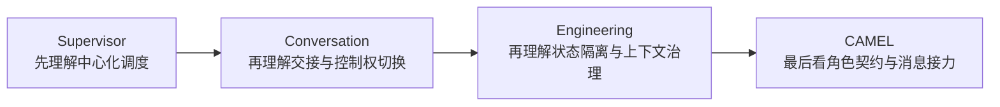
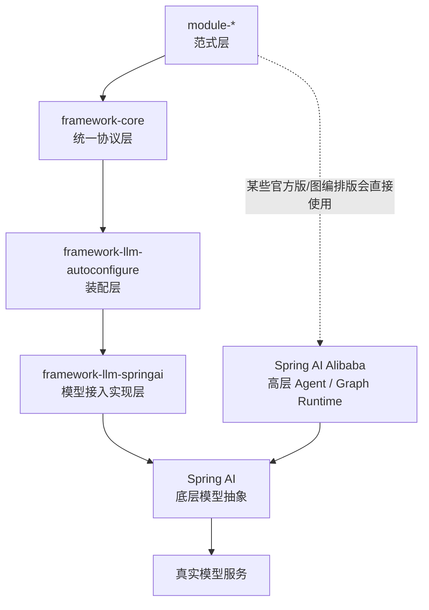
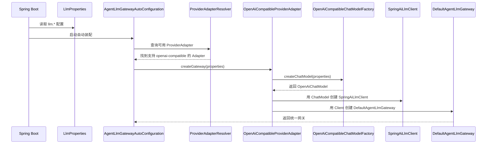
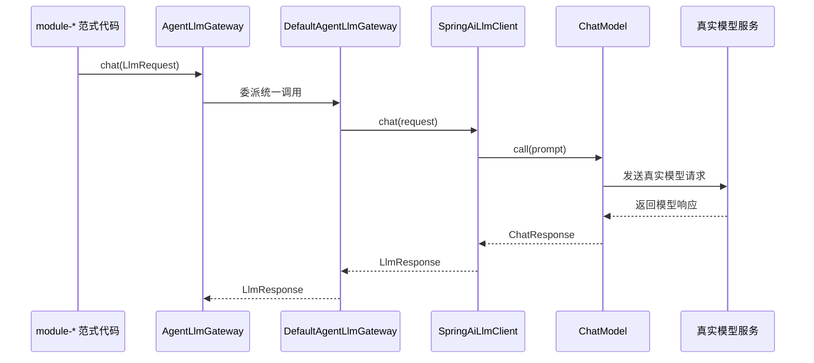

# 项目整体架构导读

## 1. 先给结论

如果你现在的感觉是：

- `ReAct` 大概知道怎么跑
- 但整个项目为什么还要拆成 `framework-core`、`framework-llm-*`、`module-*`
- `AgentLlmGateway`、`ProviderAdapter`、`Spring AI`、`Spring AI Alibaba`
- 每个词单看都认识，连起来就不顺

那你的困惑是正常的。

这个项目真正难的地方，不是某个单词，而是：

**你还没有把“范式怎么组织运行时”和“模型怎么被接进来”这两件事接成一条线。**

这篇文档不再只讲底层装配，而是按下面 4 个问题来讲：

1. 这个仓库到底分几层，每层负责什么
2. 现在有哪些范式模块，应该先学哪个
3. `llm.provider=openai-compatible` 配上之后，底层到底发生了什么
4. `framework-llm-springai`、`Spring AI`、`Spring AI Alibaba` 到底是什么关系

## 2. 先建立一张全局地图

这个仓库可以先粗分成 3 大层：

| 层次 | 模块 | 主要职责 |
| --- | --- | --- |
| 基础协议层 | `framework-core` | 统一消息、模型、工具、内存等协议 |
| 模型接入层 | `framework-llm-autoconfigure`、`framework-llm-springai` | 根据 `llm.*` 配置自动接入真实模型 |
| 范式实验层 | `module-*` | 用不同 Agent / Workflow 范式组织运行时 |

如果你只记一句话，可以先记这句：

- `framework-core` 决定“上层怎么统一问模型和调工具”
- `framework-llm-*` 决定“底层怎么真正把模型接起来”
- `module-*` 决定“这些能力怎么被组织成 ReAct、Plan-and-Solve、Reflection、Graph Flow、多智能体”

## 3. 这个项目里到底有哪些模块

根 `pom.xml` 里当前主要模块有：

- `framework-core`
- `framework-llm-autoconfigure`
- `framework-llm-springai`
- `module-react-paradigm`
- `module-plan-replan-paradigm`
- `module-reflection-paradigm`
- `module-graph-flow-paradigm`
- `module-multi-agent-supervisor`
- `module-multi-agent-conversation`
- `module-multi-agent-engineering`
- `module-multi-agent-camel`

这说明它不是一个“只做单体 Agent”的仓库，而是在同时覆盖：

- 单 Agent 范式
- 规划型范式
- 反思型范式
- 图编排范式
- 多智能体范式

## 4. 先学哪个模块，顺序最合理

如果你是第一次系统看这个仓库，推荐顺序如下。

### 4.1 第一步：先学 ReAct

入口：

- [ReAct范式新手导读](./ReAct范式新手导读.md)
- [module-react-paradigm README](../module-react-paradigm/README.md)

原因很简单：

- ReAct 是最基础的“推理 + 行动 + 观察”闭环
- 能最快建立对 Agent runtime 的直觉
- 也是后面其它范式的认知起点

### 4.2 第二步：再学 Plan-and-Solve

入口：

- [Plan-and-Solve范式新手导读](./Plan-and-Solve范式新手导读.md)
- [module-plan-replan-paradigm README](../module-plan-replan-paradigm/README.md)

它解决的是：

- 当任务明显更像“先拆路线再执行”时，为什么不应该继续硬堆 ReAct

### 4.3 第三步：再学 Reflection

入口：

- [Reflection范式新手导读](./Reflection范式新手导读.md)
- [module-reflection-paradigm README](../module-reflection-paradigm/README.md)

它解决的是：

- 当第一次结果已经基本可用，但质量不够高时，如何做显式评审和再修订

### 4.4 第四步：再学 Graph Flow 和多智能体

入口：

- [module-graph-flow-paradigm README](../module-graph-flow-paradigm/README.md)
- [module-multi-agent-supervisor README](../module-multi-agent-supervisor/README.md)
- [module-multi-agent-conversation README](../module-multi-agent-conversation/README.md)
- [module-multi-agent-engineering README](../module-multi-agent-engineering/README.md)
- [CAMEL范式从0到1掌握指南](./CAMEL范式从0到1掌握指南.md)
- [module-multi-agent-camel README](../module-multi-agent-camel/README.md)

这些模块更偏：

- 企业级编排
- 多角色协作
- 控制权路由
- 状态隔离

不适合作为第一站，但很适合作为“从单 Agent 走向 Workflow / Multi-Agent”的下一步。

如果你已经学到了这里，想专门补 CAMEL，建议不要一上来直接扎进源码，而是先按这个顺序：

原因很简单：

- `module-multi-agent-supervisor` 先帮你建立“多个专家不等于乱聊，必须有人调度”的直觉
- `module-multi-agent-conversation` 再帮你建立“控制权可以在角色间交接”的直觉
- `module-multi-agent-engineering` 再帮你建立“上下文不是随便拼字符串，而是要治理状态”的直觉
- 到 `module-multi-agent-camel` 时，你才会真正看懂“角色契约 + 对话协议 + 停止规则”为什么必须同时存在

## 5. 这些范式模块之间怎么选

可以先用下面这张表快速判断：

| 模块 | 适合问题 | 核心特征 |
| --- | --- | --- |
| `module-react-paradigm` | 需要动态查工具、边做边调整 | Thought -> Action -> Observation |
| `module-plan-replan-paradigm` | 需要先拆计划再执行 | 先规划、后执行 |
| `module-reflection-paradigm` | 第一次结果基本可用，但需要再审一轮 | 生成 -> 评审 -> 修订 |
| `module-graph-flow-paradigm` | 需要显式分支、回环、状态机 | 节点、边、状态图 |
| `module-multi-agent-supervisor` | 需要中心化调度多个专家 | Supervisor 统一路由 |
| `module-multi-agent-conversation` | 更像群聊式交接协作 | Handoff / 控制权转移 |
| `module-multi-agent-engineering` | 更关心状态隔离、上下文工程 | 消息驱动、显式状态引用 |
| `module-multi-agent-camel` | 更关心角色契约、消息接力和控制权流转 | CAMEL 多角色协作 |

如果你只能记一个选择原则，可以记成：

- 需要动态查工具：先想 ReAct
- 需要先拆路线：先想 Plan-and-Solve
- 需要做完再审：先想 Reflection
- 需要显式分支和状态机：先想 Graph Flow
- 需要多个专家协作：再看多智能体模块

## 6. 项目的三层架构到底怎么连起来

先看一张最重要的结构图：

这张图想表达的是：

- 你们自己的统一协议线是：`framework-core -> framework-llm-* -> Spring AI`
- 某些高层范式会额外直接用 Spring AI Alibaba 的 Agent / Graph Runtime

也就是说，这个仓库不是只走一条技术线，而是同时研究两件事：

1. 自己的统一协议和模型接入体系
2. 官方高层 Agent / Graph 能力的工程化落地

## 7. 基础协议层到底在干什么

`framework-core` 最好理解成：

**整个仓库的公共语言层。**

它定义的不是某个范式，而是所有范式共享的基础协议，例如：

- `AgentLlmGateway`
- `LlmRequest`
- `LlmResponse`
- `Message`
- `ToolCall`
- `ToolRegistry`
- `MemorySession`

如果没有这层，你很快会遇到两个问题：

- 每个模块都在直接依赖某个底层 SDK
- 工具、消息、模型响应的语义在不同模块里都不一样

所以 `framework-core` 的价值不是“代码很多”，而是：

**把所有上层模块都钉在同一套协议上。**

## 8. 模型接入层到底在干什么

### 8.1 `framework-llm-autoconfigure`

它最适合理解成：

**根据 `llm.*` 配置，自动把统一模型入口装起来。**

核心事情有两件：

- 读取 `LlmProperties`
- 根据 `llm.provider` 找到匹配的 `ProviderAdapter`

### 8.2 `framework-llm-springai`

它最适合理解成：

**你们自己写的、建立在 Spring AI 之上的模型接入实现模块。**

这句话很重要，因为很多人第一次看会混淆：

- `framework-llm-springai`
- `Spring AI`
- `Spring AI Alibaba`

它们不是同一个概念。

## 9. `framework-llm-springai`、`Spring AI`、`Spring AI Alibaba` 到底是什么关系

先给最短答案：

- `framework-llm-springai`
  - 是你们自己写的模块
- `Spring AI`
  - 是第三方底层模型抽象和客户端框架
- `Spring AI Alibaba`
  - 是第三方更高层的 Agent / Graph / Multi-Agent 能力体系

所以：

**`framework-llm-springai` 不是 `Spring AI Alibaba`，它是建立在 `Spring AI` 之上的自研接入层。**

可以先用下面这三句话记忆：

1. `framework-core` 规定“上层怎么统一问模型”
2. `framework-llm-springai` 负责把这套统一问法翻译成 Spring AI 调用
3. Spring AI Alibaba 更多出现在高层 Agent / Graph 范式里

## 10. `llm.provider=openai-compatible` 配上之后，系统到底干了什么

这是最容易让人“每个词都认识，连起来却不懂”的地方。

先看启动装配时序图：

这条链路里最重要的不是细节，而是职责分工：

- `Factory` 负责造底层 `ChatModel`
- `Adapter` 负责把它接进统一网关体系
- `AutoConfiguration` 负责在启动时把整条链自动装起来

## 11. `OpenAiCompatibleProviderAdapter` 和 `OpenAiCompatibleChatModelFactory` 到底是什么关系

最短答案：

- `OpenAiCompatibleChatModelFactory`
  - 负责“造底层 Spring AI `ChatModel`”
- `OpenAiCompatibleProviderAdapter`
  - 负责“把 openai-compatible 接进统一网关体系”

所以两者的关系不是并列重复，而是：

**Adapter 会调用 Factory。**

如果用一句更好记的话：

- `Factory` 偏造对象
- `Adapter` 偏接体系

## 12. 真正运行时，请求是怎么一路打到模型的

启动装配完成后，运行阶段的链路是这样的：

这张图想表达的核心直觉只有一个：

- 上层只认统一入口 `AgentLlmGateway`
- 底层到底怎么接模型，由实现层和适配层负责

这也是为什么范式模块不应该直接耦合到底层 SDK。

## 13. 为什么有些范式模块又会直接出现 `ChatModel`、`ReactAgent`、`FlowAgent`

这不是架构混乱，而是因为有两类实现目标。

### 13.1 一类是“手写版 / 统一协议版”

它们更强调：

- 学范式本体
- 保持对运行时控制流的完全可见
- 统一走 `framework-core` 抽象

例如：

- `module-react-paradigm` 里的手写版 `ReActAgent`
- `module-plan-replan-paradigm` 里的手写版 Plan-and-Solve
- `module-reflection-paradigm` 里的手写版 Reflection

### 13.2 另一类是“官方版 / 图编排版 / 框架版”

它们更强调：

- 学习 Spring AI Alibaba 的高层运行时
- 对照官方 Agent / Graph 能力
- 看状态键、节点、边和调度器如何显式化

例如：

- `ReactAgent`
- `SequentialAgent`
- `FlowAgent`
- `OverAllState`

所以这里不是“架构不统一”，而是故意保留了：

- 范式本体学习线
- 官方运行时学习线

## 14. 这个项目真正的学习主线是什么

如果只看目录，很容易误以为这是很多零散 Demo。

其实它有一条很清楚的主线：

### 14.1 第一条主线：从统一协议到真实模型接入

推荐顺序：

1. `framework-core`
2. `framework-llm-autoconfigure`
3. `framework-llm-springai`

这条线解决的是：

- 上层统一怎么问模型
- 底层真实怎么把模型接起来

### 14.2 第二条主线：从单 Agent 范式到复杂工作流

推荐顺序：

1. `module-react-paradigm`
2. `module-plan-replan-paradigm`
3. `module-reflection-paradigm`
4. `module-graph-flow-paradigm`

这条线解决的是：

- 同样的模型能力，如何组织成不同 runtime

### 14.3 第三条主线：从单 Agent 到多智能体

推荐顺序：

1. `module-multi-agent-supervisor`
2. `module-multi-agent-conversation`
3. `module-multi-agent-engineering`
4. `module-multi-agent-camel`

这条线解决的是：

- 当不再是一个 Agent 单独工作时，控制权、状态和上下文该怎么治理

如果你已经走到第 4 步，也就是 `module-multi-agent-camel`，推荐你把学习动作再拆细一点：

1. 先读 [CAMEL范式从0到1掌握指南](./CAMEL范式从0到1掌握指南.md)
2. 再读 `module-multi-agent-camel` README
3. 再看手写版 `HandwrittenCamelAgent`
4. 再看 `CamelConversationMemory`
5. 最后再看 `AlibabaCamelFlowAgent` 和两个 handoff node

这里的顺序不要反。

因为 CAMEL 最容易卡人的地方，不是 API，而是下面这 3 个问题：

- 为什么两个角色必须用不同 prompt
- 为什么手写版要维护 transcript 视角转换
- 为什么框架版不再拼整段历史，而是只传最小 baton

如果这 3 个问题没想清楚，你会觉得 CAMEL 只是“多了几个类”；  
如果这 3 个问题想清楚了，你就会明白它和 ReAct、Plan-and-Solve、Reflection 的边界到底在哪。

## 15. 现在最值得你记住的 5 个判断标准

如果你读完这篇总导读，还想把整个仓库真正装进脑子里，可以先记住这 5 个判断问题：

1. 这个问题是在问“范式怎么组织”，还是“模型怎么接入”
2. 当前代码是在统一协议层，还是在高层运行时层
3. 这个场景更适合 ReAct、Plan-and-Solve、Reflection，还是 Graph Flow
4. 当前实现是在学范式本体，还是在学 Spring AI Alibaba 官方 runtime
5. 我现在读的模块，解决的是单 Agent 问题，还是多智能体协作问题

如果这 5 个问题你都能答清楚，这个仓库的整体结构就已经基本打通了。

## 16. 最后再收成一句话

这个项目不是“很多 Demo 堆在一起”，而是三条线并行推进的结果：

- 一条线做统一协议和模型接入
- 一条线做单 Agent 与工作流范式
- 一条线做多智能体协作

你真正需要建立的，不是记住所有名词，而是看清：

**每个模块到底处在这三条线里的哪一层、解决哪一类问题。**
