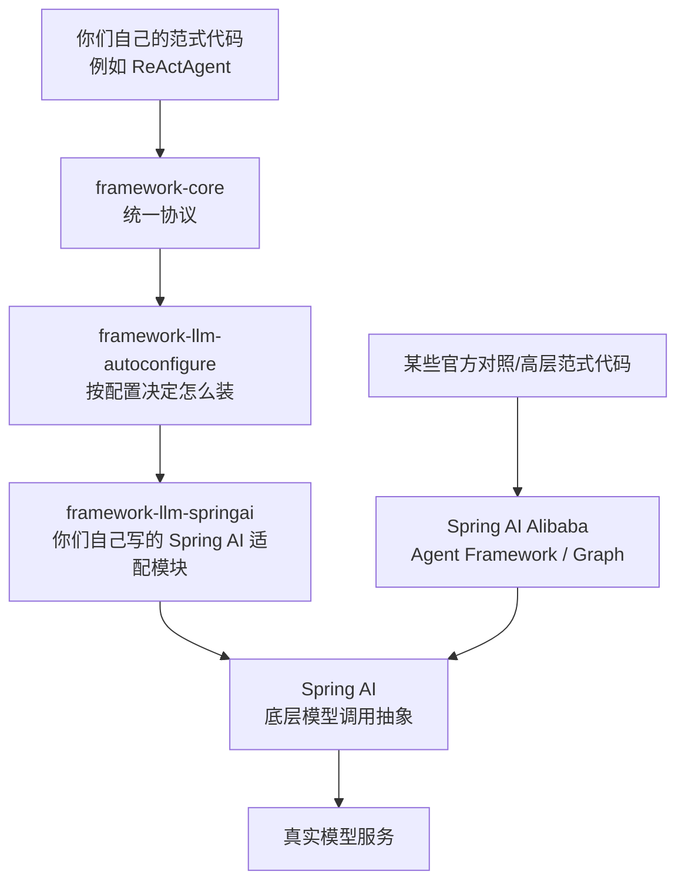
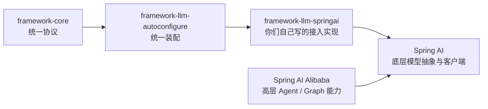
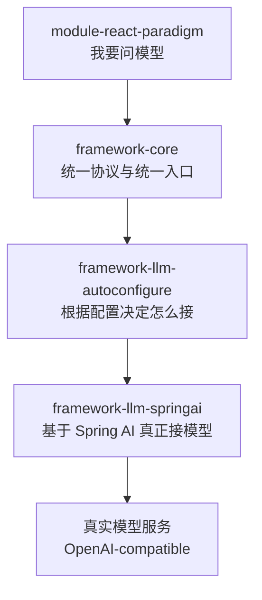
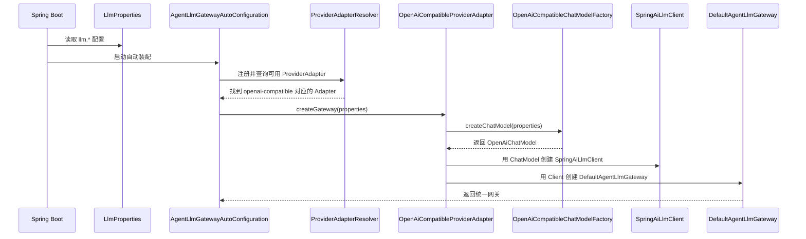
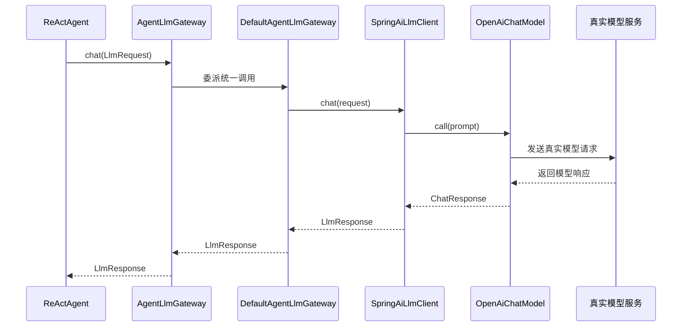

# 项目整体架构导读

## 1. 先给结论

如果你现在的感觉是：

- `ReAct` 我大概知道怎么跑
- 但整个项目为什么要拆成 `framework-core`、`framework-llm-*`、`module-*`
- 尤其是 `Gateway`、`Provider`、`ProviderAdapter`、`AutoConfiguration`、`framework-llm-springai`
- 看着每个词都认识，连起来就不懂

那你的困惑是正常的。

这个项目真正难的地方，不是某个单词，而是：

**你还没有把“上层怎么问模型”和“底层怎么把模型接进来”这两件事连成一条线。**

所以这篇文档不再按抽象术语去讲，而是按一条真实链路去讲：

1. 上层为什么只看到 `AgentLlmGateway`
2. 配置 `llm.provider=openai-compatible` 后，底层到底发生了什么
3. `OpenAiCompatibleProviderAdapter` 和 `OpenAiCompatibleChatModelFactory` 到底是什么关系
4. `framework-llm-springai` 在整个架构里到底处于哪一层

## 2. 先不要背术语，先看一条真实链路

先只记一句大白话：

`module-react-paradigm` 只负责“我要问模型”；  
`framework-llm-autoconfigure` 负责“这次该用哪种接法”；  
`framework-llm-springai` 负责“真的把请求发到模型那边去”。

如果把这三句话记住，后面很多术语都会顺下来。

## 3. 用生活例子理解整个项目

把整个过程想成“公司要寄快递”。

### 3.1 各角色的生活类比

- `AgentLlmGateway`
  - 像公司前台
  - 业务同事只找前台说“我要寄这个件”
  - 不关心最后到底走哪家快递

- `Provider`
  - 像“这次选哪家快递”
  - 比如顺丰、京东、邮政
  - 在这个项目里，它表达的是“这次用哪种模型接入方式”

- `ProviderAdapter`
  - 像“这家快递的对接员”
  - 公司内部是统一寄件格式
  - 但不同快递下单方式不同
  - 对接员负责把公司统一格式，翻译成某家快递能接的方式

- `ChatModelFactory`
  - 像“具体去下单的工具工厂”
  - 它真的负责造出能干活的对象
  - 在这个项目里，它负责造出真正可以调用模型的 `ChatModel`

- `AutoConfiguration`
  - 像行政在背后自动把流程接好
  - 你没有手动创建前台、对接员、账号、快递单模板
  - 系统启动时它自动装配好了

- `framework-llm-springai`
  - 像“真正会下单、会调快递系统的执行部门”
  - 它不是概念层
  - 它是具体干活的一层

## 4. 这几个词放回你这个项目里分别是什么意思

### 4.1 Gateway

在这个项目里，`Gateway` 最好直接理解成：

**统一入口。**

对应文件：

- [AgentLlmGateway.java](/Users/sxie/xbk/agent-learning/framework-core/src/main/java/com/xbk/agent/framework/core/llm/AgentLlmGateway.java)

它的意思不是“某个具体模型客户端”，而是：

- 上层统一通过它问模型
- 上层不直接关心底层接的是哪家模型

所以它像一个门面。

### 4.2 Provider

`Provider` 最好理解成：

**这次到底走哪种模型接入方式。**

在当前项目里，它不是业务方概念，而是配置层概念。

比如当前已经落地的一种就是：

- `openai-compatible`

它表达的意思不是“你一定在用 OpenAI 官方”，而是：

- 你这次走的是“兼容 OpenAI Chat Completions 协议”的接入方式

### 4.3 ProviderAdapter

`ProviderAdapter` 最好理解成：

**把统一配置接到某种具体 provider 实现上的适配器。**

对应文件：

- [ProviderAdapter.java](/Users/sxie/xbk/agent-learning/framework-llm-autoconfigure/src/main/java/com/xbk/agent/framework/llm/autoconfigure/ProviderAdapter.java)
- [OpenAiCompatibleProviderAdapter.java](/Users/sxie/xbk/agent-learning/framework-llm-springai/src/main/java/com/xbk/agent/framework/llm/springai/openai/OpenAiCompatibleProviderAdapter.java)

它不是最终真正调用模型的人。

它做的事是：

- 判断“我支不支持这个 provider”
- 如果支持，就创建对应的 `AgentLlmGateway`

### 4.4 ChatModelFactory

这个词你可以直接理解成：

**负责造出真正能调用模型的底层对象。**

对应文件：

- [OpenAiCompatibleChatModelFactory.java](/Users/sxie/xbk/agent-learning/framework-llm-springai/src/main/java/com/xbk/agent/framework/llm/springai/openai/OpenAiCompatibleChatModelFactory.java)

它负责的不是统一网关，而是：

- 根据 `base-url`
- 根据 `api-key`
- 根据 `model`
- 造出 Spring AI 的 `OpenAiChatModel`

### 4.5 AutoConfiguration

`AutoConfiguration` 最好理解成：

**Spring Boot 启动时自动装 Bean 的地方。**

对应文件：

- [AgentLlmGatewayAutoConfiguration.java](/Users/sxie/xbk/agent-learning/framework-llm-autoconfigure/src/main/java/com/xbk/agent/framework/llm/autoconfigure/AgentLlmGatewayAutoConfiguration.java)
- [SpringAiProviderAutoConfiguration.java](/Users/sxie/xbk/agent-learning/framework-llm-springai/src/main/java/com/xbk/agent/framework/llm/springai/autoconfigure/SpringAiProviderAutoConfiguration.java)

它的核心价值不是业务逻辑，而是：

- 读取配置
- 发现合适的 adapter
- 自动把最终对象装配出来

## 5. 你最关心的问题：`OpenAiCompatibleProviderAdapter` 和 `OpenAiCompatibleChatModelFactory` 到底是什么关系

先给最短答案：

- `OpenAiCompatibleChatModelFactory`
  - 负责“造出具体的 Spring AI `ChatModel`”
- `OpenAiCompatibleProviderAdapter`
  - 负责“把 `openai-compatible` 这种 provider 接到统一网关体系里”

所以两者的关系不是并列重复，而是：

**Adapter 会调用 Factory。**

### 5.1 用一句话区分

如果你脑子里只能记一句：

- `Factory` 负责造底层模型对象
- `Adapter` 负责把这个底层对象接进你们自己的框架

### 5.2 用生活例子区分

继续用“寄快递”类比：

- `OpenAiCompatibleChatModelFactory`
  - 像“帮你生成顺丰下单客户端的工厂”
  - 它负责把账号、接口地址、模板配置好
  - 最终造出一个真的能下单的工具

- `OpenAiCompatibleProviderAdapter`
  - 像“顺丰对接员”
  - 它知道如果公司这次选择了顺丰，就该调用哪个工厂、造什么工具、最后挂到公司的统一寄件入口上

所以：

- 工厂偏“造对象”
- 适配器偏“接体系”

### 5.3 放回真实代码里怎么理解

当前你这个仓库里的链路是：

1. 统一配置 `llm.provider=openai-compatible`
2. 自动装配层看到这个 provider
3. 找到支持它的 `OpenAiCompatibleProviderAdapter`
4. `OpenAiCompatibleProviderAdapter` 内部调用 `OpenAiCompatibleChatModelFactory`
5. `OpenAiCompatibleChatModelFactory` 造出 Spring AI 的 `OpenAiChatModel`
6. Adapter 再把这个 `ChatModel` 包成你们框架自己的 `AgentLlmGateway`

所以顺序一定是：

**先造底层模型对象，再挂到统一网关上。**

这就是 `Factory -> Adapter -> Gateway` 的关系。

## 6. `framework-llm-springai`、`Spring AI`、`Spring AI Alibaba` 到底是什么关系

这一部分确实是最容易混的。

先直接给结论：

- `framework-llm-springai`
  - 是**你们自己写的模块**
- `Spring AI`
  - 是**第三方底层模型抽象/调用框架**
- `Spring AI Alibaba`
  - 是**另一套第三方高层 Agent / Graph 能力体系**

所以：

**`framework-llm-springai` 不是 `Spring AI Alibaba`。**

它和两者的关系是：

- 它建立在 `Spring AI` 之上
- 它和 `Spring AI Alibaba` 不是同一个层级的概念

### 6.1 先用一句最直白的话区分

你可以先这样记：

- `Spring AI`
  - 更像“模型连接层”
- `framework-llm-springai`
  - 更像“你们自己写的 Spring AI 适配实现层”
- `Spring AI Alibaba`
  - 更像“更高层的 Agent / Graph 能力层”

### 6.2 为什么我敢这样说

因为从这个仓库的依赖上就能直接看出来。

`framework-llm-springai` 依赖的是：

- `org.springframework.ai:spring-ai-openai`

也就是标准的 `Spring AI` 相关能力。

而 `module-react-paradigm` 额外依赖的是：

- `com.alibaba.cloud.ai:spring-ai-alibaba-agent-framework`

也就是说，在这个仓库里：

- `framework-llm-springai` 这层主要在用 `Spring AI`
- 某些范式模块又会额外引入 `Spring AI Alibaba` 的 Agent Framework 做官方能力对照或高层范式实验

### 6.3 先看这张关系图



这张图最关键的不是记所有框，而是看清两条线：

第一条线：

- 你们自己的统一协议体系
- 通过 `framework-llm-springai`
- 落到 `Spring AI`
- 再去调真实模型

第二条线：

- 某些官方对照 Demo 或更高层范式
- 会直接使用 `Spring AI Alibaba`
- 它关注的是 Agent、Graph、Hook 这些更高层能力

### 6.4 所以 `framework-llm-springai` 到底是什么

现在可以更准确地说：

`framework-llm-springai` 不是：

- 业务模块
- 范式模块
- Spring AI Alibaba 的别名

它真正的定位是：

**你们自己写的、基于 Spring AI 的模型接入实现模块。**

更大白话一点：

- `framework-core` 负责规定“上层怎么统一问模型”
- `framework-llm-springai` 负责把这套统一问法，翻译成 Spring AI 的真实调用

所以它最像：

- 翻译层
- 桥接层
- 落地实现层

### 6.5 那为什么项目描述里又写了 Spring AI Alibaba

因为这个仓库不是只走一条技术线。

它同时在做两件事：

1. 走“你们自己的统一协议 + Spring AI 接入层”这条线  
   也就是：
   - `framework-core`
   - `framework-llm-autoconfigure`
   - `framework-llm-springai`

2. 也在研究和对照官方高层能力  
   也就是：
   - `Spring AI Alibaba Agent Framework`
   - `Graph`
   - `Supervisor`
   - `Sequential`
   - `Handoffs`

所以你会在根 `pom.xml` 里同时看到：

- `spring-ai-bom`
- `spring-ai-alibaba-bom`

这不冲突。

因为它们在这个仓库里的职责不是完全一样的。

### 6.6 再看一张“谁负责什么”的对照图



这张图只想帮你建立一个判断：

- `Spring AI` 和 `Spring AI Alibaba` 不要看成同一层
- `framework-llm-springai` 也不要看成第三方框架本身
- 它是你们写在中间的一层适配实现

### 6.7 你现在最该记住的区分

如果你脑子里现在只能留下三句，就记这三句：

1. `framework-llm-springai` 是你们自己的模块，不是 Spring AI Alibaba
2. `framework-llm-springai` 建立在 Spring AI 之上
3. Spring AI Alibaba 在这个仓库里更多用于高层 Agent / Graph 能力，而不是替代你们自己的统一模型接入层

## 7. 先看这张职责图



这张图只表达一件事：

- 上层范式不直接碰底层 SDK
- 中间要经过统一协议层和装配层
- 最后才由实现层真正去调模型

## 8. 再看启动装配时序图

这张图回答的是：

**当你写了 `llm.provider=openai-compatible` 之后，系统启动时到底发生了什么。**



看完这张图，你应该抓住两件事：

1. `AutoConfiguration` 负责自动装配流程
2. `Adapter` 和 `Factory` 在装配链里职责不同，不是重复

## 9. 再看一次真正调用模型的时序图

这张图回答的是：

**为什么上层只看到 `AgentLlmGateway.chat(...)`，却仍然能打到真实模型。**



看完这张图，你要建立的直觉是：

- 上层只认 `AgentLlmGateway`
- 下面可以有很多实现方式
- 当前实现方式是 `SpringAiLlmClient + OpenAiChatModel`

## 10. 顺着源码文件把这条链真正读一遍

如果你现在已经大概看懂了图，下一步最好的方式不是继续背术语，而是直接顺着源码文件读一遍。

这里要先分清两个阶段：

- 启动阶段
  - Spring Boot 启动时，系统怎么把这些对象装起来
- 运行阶段
  - 真正调用 `chat(...)` 时，请求怎么一路打到模型

很多人会看乱，就是因为把这两个阶段混在了一起。

### 10.1 先看启动阶段的源码链

启动阶段最适合按下面这个顺序读：

```text
LlmProperties
-> AgentLlmGatewayAutoConfiguration
-> ProviderAdapterResolver
-> OpenAiCompatibleProviderAdapter
-> OpenAiCompatibleChatModelFactory
-> SpringAiLlmClient
-> DefaultAgentLlmGateway
```

#### 第 1 个文件：`LlmProperties`

文件：

- `framework-llm-autoconfigure/src/main/java/com/xbk/agent/framework/llm/autoconfigure/LlmProperties.java`

这个类最适合理解成：

**统一配置的承载对象。**

你在配置文件里写的这些值：

- `llm.provider`
- `llm.base-url`
- `llm.api-key`
- `llm.model`

最终都会先进入这里。

所以它的定位不是业务逻辑，而是：

- 先把统一配置收进来
- 给后面的装配链使用

#### 第 2 个文件：`AgentLlmGatewayAutoConfiguration`

文件：

- [AgentLlmGatewayAutoConfiguration.java](/Users/sxie/xbk/agent-learning/framework-llm-autoconfigure/src/main/java/com/xbk/agent/framework/llm/autoconfigure/AgentLlmGatewayAutoConfiguration.java)

这个类最适合理解成：

**启动时负责把统一模型入口装起来的人。**

你看这个文件时，最重要的是盯住这一句：

```java
return resolver.getRequiredAdapter(provider).createGateway(properties);
```

它表达的意思非常直接：

1. 先从配置里拿到 `provider`
2. 再让解析器去一堆 adapter 里点名，找出支持这个 provider 的那个
3. 然后让这个 adapter 创建最终的 `AgentLlmGateway`

所以这个类负责的不是“直接调用模型”，而是：

- 决定该找谁来接这条 provider 链

#### 第 3 个文件：`ProviderAdapterResolver`

文件：

- [ProviderAdapterResolver.java](/Users/sxie/xbk/agent-learning/framework-llm-autoconfigure/src/main/java/com/xbk/agent/framework/llm/autoconfigure/ProviderAdapterResolver.java)

这个类最适合理解成：

**专门帮自动装配层“点名找人”的那个类。**

你可以先粗暴理解成：

- 系统里可能已经有好几个 `ProviderAdapter`
- 但这次配置只会选其中一个
- `ProviderAdapterResolver` 的工作，就是把这个“该选谁”找出来

比如以后系统里可能同时有：

- `openai-compatible`
- `dashscope`
- `anthropic`

如果你现在配置的是：

- `llm.provider=openai-compatible`

那它做的事其实很简单：

1. 看看当前上下文里一共有多少个 `ProviderAdapter`
2. 挨个问它们：你支不支持 `openai-compatible`
3. 找到那个唯一匹配的 adapter
4. 把它交回给自动装配层继续往下走

所以它不负责：

- 不负责造 `ChatModel`
- 不负责造 `AgentLlmGateway`
- 不负责真正发模型请求

它只负责一件事：

- 这次到底该把哪个 adapter 交出来

#### 第 4 个文件：`OpenAiCompatibleProviderAdapter`

文件：

- [OpenAiCompatibleProviderAdapter.java](/Users/sxie/xbk/agent-learning/framework-llm-springai/src/main/java/com/xbk/agent/framework/llm/springai/openai/OpenAiCompatibleProviderAdapter.java)

这个类最适合理解成：

**把 `openai-compatible` 接到你们统一网关体系里的人。**

看它时要抓住两点：

1. 它通过 `supports(...)` 声明自己支持 `openai-compatible`
2. 它通过 `createGateway(...)` 负责创建最终的统一网关

最关键的是这一句：

```java
return new DefaultAgentLlmGateway(
    new SpringAiLlmClient(
        chatModelFactory.createChatModel(properties)
    )
);
```

这一句拆开看就是：

1. 先让 `Factory` 造 `ChatModel`
2. 再把 `ChatModel` 包成 `SpringAiLlmClient`
3. 再把 `SpringAiLlmClient` 包成 `DefaultAgentLlmGateway`

所以它的本质职责是：

**接体系。**

#### 第 5 个文件：`OpenAiCompatibleChatModelFactory`

文件：

- [OpenAiCompatibleChatModelFactory.java](/Users/sxie/xbk/agent-learning/framework-llm-springai/src/main/java/com/xbk/agent/framework/llm/springai/openai/OpenAiCompatibleChatModelFactory.java)

这个类最适合理解成：

**负责造底层 Spring AI 模型对象的人。**

你看这个文件时，只要看懂 3 步：

1. 用 `baseUrl`、`apiKey`、`chatCompletionsPath` 造 `OpenAiApi`
2. 用 `model` 造 `OpenAiChatOptions`
3. 最后组装成 `OpenAiChatModel`

所以它只做一件事：

- 造底层 `ChatModel`

它不负责统一网关，也不负责装配整个体系。

#### 第 6 个文件：`SpringAiLlmClient`

文件：

- [SpringAiLlmClient.java](/Users/sxie/xbk/agent-learning/framework-llm-springai/src/main/java/com/xbk/agent/framework/llm/springai/adapter/SpringAiLlmClient.java)

这个类在启动阶段出现，是因为 `Adapter` 会创建它。

但它真正重要的是：

- 它属于运行阶段

所以启动阶段你先只记住：

- 它是最终挂进 `DefaultAgentLlmGateway` 里的那个客户端

#### 第 7 个文件：`DefaultAgentLlmGateway`

文件：

- [DefaultAgentLlmGateway.java](/Users/sxie/xbk/agent-learning/framework-core/src/main/java/com/xbk/agent/framework/core/llm/DefaultAgentLlmGateway.java)

这个类最适合理解成：

**统一入口的默认门面实现。**

它不自己直接懂 OpenAI，也不自己直接懂 Spring AI。

它只是把统一的 `chat(...)` 委派给底层 `LlmClient`。

### 10.2 再看运行阶段的源码链

真正运行时，最适合按下面这个顺序看：

```text
ReActAgent
-> AgentLlmGateway.chat(...)
-> DefaultAgentLlmGateway
-> SpringAiLlmClient.chat(...)
-> OpenAiChatModel.call(...)
-> 真实模型
```

#### 第 1 个文件：`ReActAgent`

文件：

- [ReActAgent.java](/Users/sxie/xbk/agent-learning/module-react-paradigm/src/main/java/com/xbk/agent/framework/react/application/executor/ReActAgent.java)

你看这个文件时，重点只盯一件事：

- 它在运行时怎么问模型

关键调用是：

```java
LlmResponse response = agentLlmGateway.chat(buildRequest(conversationId, history));
```

这句话说明：

- `ReActAgent` 只认 `AgentLlmGateway`
- 它不关心底层到底是 Spring AI 还是别的

这就是上层和底层解耦真正发生的地方。

#### 第 2 个文件：`AgentLlmGateway`

文件：

- [AgentLlmGateway.java](/Users/sxie/xbk/agent-learning/framework-core/src/main/java/com/xbk/agent/framework/core/llm/AgentLlmGateway.java)

这个文件你已经见过，但现在要换个角度看它：

- 启动阶段，它是“被装出来的目标对象”
- 运行阶段，它是“上层真正调用的统一入口”

#### 第 3 个文件：`DefaultAgentLlmGateway`

文件：

- [DefaultAgentLlmGateway.java](/Users/sxie/xbk/agent-learning/framework-core/src/main/java/com/xbk/agent/framework/core/llm/DefaultAgentLlmGateway.java)

运行阶段你最应该看的是：

- `chat(request)` 直接委派给 `llmClient.chat(request)`

所以它的本质是：

- 门面
- 委派层

#### 第 4 个文件：`SpringAiLlmClient`

文件：

- [SpringAiLlmClient.java](/Users/sxie/xbk/agent-learning/framework-llm-springai/src/main/java/com/xbk/agent/framework/llm/springai/adapter/SpringAiLlmClient.java)

这个类在运行阶段最重要。

因为真正“把你们自己的 `LlmRequest` 翻译成 Spring AI 调用”的人就是它。

它做了 3 步：

1. 把你们的消息和选项转成 Spring AI 的 `Prompt`
2. 调用 `ChatModel.call(prompt)`
3. 再把 Spring AI 的响应转回你们自己的 `LlmResponse`

所以这一层是真正的：

- 翻译层
- 桥接层
- 运行时调用层

#### 第 5 个对象：`OpenAiChatModel`

这个对象不是你们自己定义的类，而是 Spring AI 的底层模型对象。

它是前面 `Factory` 造出来的。

在运行阶段，真正打到模型的是它的：

- `call(prompt)`

所以你可以把它理解成：

- 真正会发起底层模型请求的对象

### 10.3 再用一句话把启动和运行区分开

如果你还是容易混，可以只记这个区别：

- 启动阶段回答的是：
  - 这些对象怎么被装出来
- 运行阶段回答的是：
  - 已经装好的对象怎么真正把请求发到模型

## 11. 关键模块到底各自负责什么

| 模块 | 大白话职责 | 你现在应该怎么理解它 |
| --- | --- | --- |
| `framework-core` | 定义统一规则 | 相当于框架内部的公共语言 |
| `framework-llm-autoconfigure` | 决定怎么装 | 相当于装配层 |
| `framework-llm-springai` | 真正接模型 | 相当于 Spring AI 实现层 |
| `module-react-paradigm` | 用底座跑一种范式 | 相当于当前最完整的样板模块 |
| 其它 `module-*` | 表达未来范式方向 | 现在更多是路线图和边界占位 |

## 12. 现在最值得先看的文件

如果你想最短路径搞懂上面的链路，不要一次看十几个文件。

先只看这 6 个：

1. `framework-core/src/main/java/com/xbk/agent/framework/core/llm/AgentLlmGateway.java`
2. `framework-llm-autoconfigure/src/main/java/com/xbk/agent/framework/llm/autoconfigure/LlmProperties.java`
3. `framework-llm-autoconfigure/src/main/java/com/xbk/agent/framework/llm/autoconfigure/AgentLlmGatewayAutoConfiguration.java`
4. `framework-llm-springai/src/main/java/com/xbk/agent/framework/llm/springai/openai/OpenAiCompatibleProviderAdapter.java`
5. `framework-llm-springai/src/main/java/com/xbk/agent/framework/llm/springai/openai/OpenAiCompatibleChatModelFactory.java`
6. `framework-llm-springai/src/main/java/com/xbk/agent/framework/llm/springai/adapter/SpringAiLlmClient.java`

你看这 6 个文件时，只问自己一个问题：

**上层一句 `chat(...)`，最后是怎么一路变成真实模型调用的？**

这个问题一旦通了，`Gateway`、`Provider`、`ProviderAdapter`、`AutoConfiguration`、`framework-llm-springai` 这几个词就会一起通。

## 13. 你现在最容易混淆的 4 件事

### 13.1 `Gateway` 不是具体模型 SDK

它是统一入口。

### 13.2 `Provider` 不是某个 Java 类

它是“当前选哪种接入方式”的标识。

### 13.3 `ProviderAdapter` 不是最终直接调用模型的人

它负责把统一配置接到某种具体 provider 实现上。

### 13.4 `Factory` 不是统一网关

它负责造具体的底层模型对象。

## 14. 最后只记住三句话

如果你现在信息有点多，最后只记这三句：

1. 上层只认 `AgentLlmGateway`
2. `ProviderAdapter` 负责把某种 provider 接到统一网关体系里
3. `OpenAiCompatibleChatModelFactory` 负责造真正能调用模型的 `ChatModel`

你只要把这三句吃透，整个模型接入层就不会再那么抽象。
