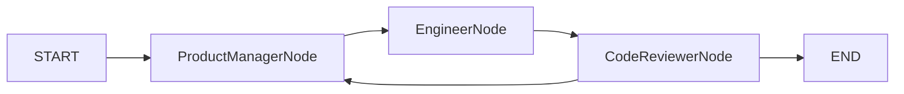

# module-multi-agent-conversation

## 模块定位

`module-multi-agent-conversation` 承载的是 **AutoGen 风格的对话驱动群聊范式**。  
它关注的核心不是“谁接管谁”，而是：

- 多个专家是否共享同一份群聊上下文
- 发言是否按固定顺序轮询推进
- 审查意见如何被广播回整个团队继续消费

这个模块当前以 `ProductManager -> Engineer -> CodeReviewer` 的软件开发团队为例，
演示如何围绕“获取并打印实时比特币价格的 Python 脚本”做自动化群聊协作。

## 当前实现

模块里有两套并行实现，而且两套都统一走 `AgentLlmGateway`：

- `RoundRobinGroupChat`
  手写版协调器，显式维护全局 `sharedMessages`、`transcript`、轮询顺序和最大轮次。
- `AlibabaConversationFlowAgent`
  框架版协调器，使用 `FlowAgent + StateGraph + OverAllState` 驱动 `ProductManagerNode -> EngineerNode -> CodeReviewerNode` 的循环图。

这两套实现解决的是同一件事，但学习重点不同：

- 手写版回答：RoundRobin 群聊的底层 runtime 到底是什么
- 框架版回答：企业里如何把共享群聊上下文交给状态图治理

## 关键概念

- `ConversationMemory`
  手写版的共享群聊记忆，里面保存一份全局 `List<Message>`，所有角色都读取同一份历史。
- `ConversationTurn`
  记录单轮群聊的角色、轮次和内容，主要用于日志和回放。
- `ConversationRoleContract`
  定义 ProductManager、Engineer、CodeReviewer 三个角色的系统提示和职责边界。
- `ConversationStateSupport`
  框架版的状态支撑类，负责把 `shared_messages` 和 `transcript` 在 `OverAllState` 中稳定保存和恢复。

## 和 CAMEL 的差异

这个模块和 `module-multi-agent-roleplay` 都是多智能体，但重点不同：

- `roleplay/CAMEL`
  更关注“角色交棒”和“当前谁掌控流程”
- `conversation/AutoGen`
  更关注“同一份群聊历史如何被所有专家持续共享”

一句话说透：

- CAMEL 更像一对一接力
- AutoGen RoundRobin 更像三个人在同一个群里轮流说话

## 工程落点

### 手写版

- 全局维护一份 `sharedMessages`
- ProductManager、Engineer、CodeReviewer 依次轮询
- 每轮输出都会广播回共享历史
- 只有 `CodeReviewer` 有权输出 `<AUTOGEN_TASK_DONE>`

### Spring AI Alibaba 版

- 状态里显式维护 `shared_messages`
- 每个节点只做“读共享历史 -> 生成 -> 写回共享历史”
- 图结构固定为：

这让框架版和手写版的核心差异非常清楚：

- 手写版自己当群主
- 框架版把群聊状态交给 `StateGraph`

## 适用场景

- 多专家共享同一份会话历史的分析任务
- 固定轮询推进的自动化群聊
- 需要把代码产出、审查意见、下一步需求都放进同一个上下文的任务

不适合的场景：

- 强控制权交接的角色扮演协作
- 必须由中心调度者统一决策每一步的工作流
- 分布式跨进程消息网络

## 结论

`module-multi-agent-conversation` 的价值，不是“多几个 Agent 一起聊天”，而是让你真正看见：

- 群聊共享上下文怎么维护
- 固定轮询怎么推进
- 审查意见怎么回流到整个团队
- 同一个范式如何分别用手写 runtime 和 Spring AI Alibaba 状态图落地

## 延伸阅读

- 顶层导读：[`docs/项目整体架构导读.md`](../docs/项目整体架构导读.md)
- 专题导读：[`docs/AutoGen多智能体群聊与SpringAIAlibaba从0到1掌握指南.md`](../docs/AutoGen多智能体群聊与SpringAIAlibaba从0到1掌握指南.md)
