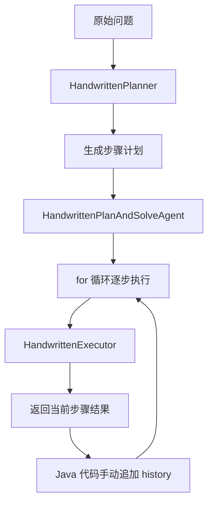
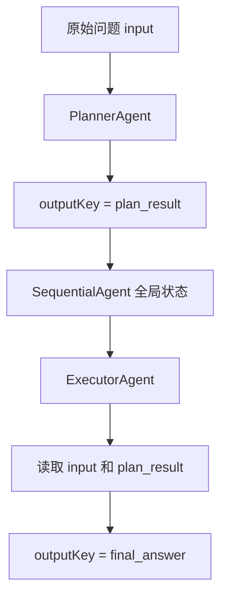

# module-plan-replan-paradigm

## 新手导航

如果你是第一次接触这个模块，建议先读：

- [Plan-and-Solve范式新手导读](../docs/Plan-and-Solve范式新手导读.md)

这篇导读会先用“买苹果问题”讲清：

- Plan-and-Solve 到底是什么
- 手写版和 Spring AI Alibaba 版有什么区别
- `description`、`systemPrompt`、`instruction` 怎么分工
- `input`、`plan_result`、`final_answer` 是怎么在状态里流转的

看完这篇导读，再回来看当前 README 和源码，会顺很多。

## 模块定位

`module-plan-replan-paradigm` 用于承载“先谋后动”的复杂任务求解范式。  
它的目标不是让 Agent 更会“即兴发挥”，而是让 Agent 在面对多步骤、长链路、高风险任务时，先产出一份可执行蓝图，再按蓝图执行，并在必要时重规划。

这是一种典型的企业级模式：  
当任务代价高、错误成本大、子任务之间存在明显依赖时，先计划再执行几乎总是比纯 ReAct 更稳。

## 🎯 最佳实践场景

**复杂长篇研报生成或数学求解**：拒绝盲目行动，强制大模型先输出包含子任务的“执行蓝图（JSON）”，再由执行器按蓝图严谨地逐步执行。

## 理论背景

纯 ReAct 的优势是灵活，但在复杂任务上容易出现三类问题：

- 只关注局部最优，逐步偏离整体目标
- 在长链路中丢失中间约束
- 遇到异常时不知道该继续、回退还是重做

Plan-Execute-Replan 的思想正是为了解决这些问题。

它把问题分成两个不同认知阶段：

1. `Planning Phase`
   先把问题拆成有顺序、有依赖、有完成标准的子任务列表。
2. `Solving Phase`
   按照计划逐步执行，而不是在每一轮都重新即兴决定全局路线。

如果执行阶段发现世界状态发生变化、某个假设不成立、或者某个子任务失败，则进入 `Replan`，对剩余计划进行局部修正，而不是把全部任务推倒重来。

## 运行机制

该模块建议采用 4 段式执行模型：

### 1. 规划

模型先基于用户目标生成结构化计划。  
计划至少应包含：

- 子任务编号
- 子任务目标
- 依赖关系
- 完成标准
- 预期输出

### 2. 执行

调度器按顺序取出当前子任务，调用工具、子流程或 ReAct 子 Agent 完成执行。

### 3. 状态评估

每完成一步，都要判断：

- 当前子任务是否完成
- 后续计划是否仍然成立
- 是否需要补充信息、回滚或跳过

### 4. 重规划

如果发现：

- 工具执行结果与原假设冲突
- 外部环境变化导致后续子任务失效
- 子任务失败且可替代路径存在

则只重写剩余计划，而不是整体重启。

## 买苹果问题双实现对照

为了把 Plan-and-Solve 真正看懂，这个模块里已经落了一道最小对照样例：

> 一个水果店周一卖出了15个苹果。周二卖出的苹果数量是周一的两倍。周三卖出的数量比周二少了5个。请问这三天总共卖出了多少个苹果？

最终答案都是：

- 周一：15
- 周二：30
- 周三：25
- 总数：70

但两套实现的工程思路完全不同。

### 1. 纯手写底层逻辑版

这套实现对应“Plan-and-Solve 的原始 runtime 思路”。

核心类有 3 个：

- `HandwrittenPlanner`
- `HandwrittenExecutor`
- `HandwrittenPlanAndSolveAgent`

对应代码入口：

- `src/main/java/com/xbk/agent/framework/planreplan/application/executor/HandwrittenPlanner.java`
- `src/main/java/com/xbk/agent/framework/planreplan/application/executor/HandwrittenExecutor.java`
- `src/main/java/com/xbk/agent/framework/planreplan/application/coordinator/HandwrittenPlanAndSolveAgent.java`

运行链路如下：



这一版最重要的观察点不是“答案对不对”，而是：

- 计划是你自己解析的
- 循环是你自己写的
- `history` 是你自己维护的
- 每一步发给模型什么上下文，也是你自己拼的

换句话说，这一版里：

**模型只负责出计划和执行单步，整个运行时控制权仍然在 Java 代码手里。**

### 2. Spring AI Alibaba 原生顺序编排版

这套实现对应“企业级编排 runtime 思路”。

核心封装类：

- `AlibabaSequentialPlanAndSolveAgent`

对应代码入口：

- `src/main/java/com/xbk/agent/framework/planreplan/infrastructure/agentframework/AlibabaSequentialPlanAndSolveAgent.java`

这一版内部并不是手写 `for` 循环，而是：

- 创建 `PlannerAgent`
- 创建 `ExecutorAgent`
- 用 `SequentialAgent` 把两个子 Agent 串起来

运行链路如下：



这一版最重要的观察点是：

- 计划结果不是你自己手动塞回下一轮 Prompt
- Planner 的输出先写到状态里
- Executor 再通过 `{input}`、`{plan_result}` 这种占位符读取状态
- 阶段切换由框架 runtime 负责编排

换句话说，这一版里：

**Java 代码更像是在声明“有哪些阶段、每一阶段输出到哪个状态键”，而不是亲自写循环推进。**

### 3. `history` 累加 与 `outputKey` 状态流转 的工程差异

这是这两套代码最值得反复看的地方。

#### 手写版：`history` 是运行时自己维护的

在 `HandwrittenPlanAndSolveAgent` 里，每完成一步，Java 代码都会：

1. 拿到当前步骤结果
2. 追加一条 `StepExecutionRecord`
3. 在下一轮执行前把全部 `history` 再拼进 Prompt

这意味着：

- 控制力最强
- 每一步上下文长什么样完全可控
- 适合学习底层逻辑
- 但一旦流程变复杂，Java 代码会越来越像“手写调度器”

所以手写版更像：

**程序员自己维护一个 mini runtime。**

#### 框架版：`outputKey` 是状态容器里的阶段交接协议

在 `AlibabaSequentialPlanAndSolveAgent` 里：

- `PlannerAgent` 把结果写到 `plan_result`
- `ExecutorAgent` 从状态里读 `plan_result`
- 最终答案再写到 `final_answer`

这意味着：

- 阶段之间不再靠你手动拼接字符串传递
- 而是靠“状态键名”做显式交接
- 子 Agent 的职责边界更稳定
- 更适合扩展成更长的企业级流水线

所以框架版更像：

**程序员在设计状态协议，而不是手写每一轮调度细节。**

### 4. 为什么这两个版本都值得学

只学手写版，容易停留在：

- 我知道 Plan-and-Solve 要先规划再执行
- 但不知道企业项目为什么还要框架编排

只学框架版，容易停留在：

- 我会配 `SequentialAgent`
- 但不知道框架到底替我接管了哪些运行时工作

把这两个版本放在一起看，才能真正看清：

- 手写版是在学范式本体
- 框架版是在学工程化落地

### 5. 推荐阅读顺序

如果你想顺着源码真正吃透，推荐顺序如下：

1. 先看 `HandwrittenPlanner`
   - 看 Planner 的系统提示词如何强制输出编号步骤

2. 再看 `HandwrittenExecutor`
   - 看 `{question}`、`{plan}`、`{history}`、`{current_step}` 怎么被拼进执行提示词

3. 再看 `HandwrittenPlanAndSolveAgent`
   - 看 `for` 循环如何手动推进整条链

4. 最后看 `AlibabaSequentialPlanAndSolveAgent`
   - 看 `outputKey`、`includeContents`、`returnReasoningContents` 如何把阶段交接显式化

5. 再看测试
   - `src/test/java/com/xbk/agent/framework/planreplan/PlanAndSolveAppleProblemDemoTest.java`
   - 这里同时钉住了两套实现的预期行为，是最好的对照入口

### 6. 真实 OpenAI Demo 入口

除了上面的稳定桩测试，这个模块现在还补了两份真实模型 Demo，用来观察大模型真实输出下的执行轨迹：

- 手写版真实 Demo
  - `src/test/java/com/xbk/agent/framework/planreplan/HandwrittenPlanAndSolveOpenAiDemo.java`
- Spring AI Alibaba 顺序编排版真实 Demo
  - `src/test/java/com/xbk/agent/framework/planreplan/AlibabaSequentialPlanAndSolveOpenAiDemo.java`

对应配置文件在：

- `src/test/resources/application-openai-plan-solve-demo.yml`
- `src/test/resources/application-openai-plan-solve-demo-local.yml.example`

推荐做法：

1. 复制一份 `application-openai-plan-solve-demo-local.yml.example`
2. 重命名为 `application-openai-plan-solve-demo-local.yml`
3. 填写真实的 `llm.base-url`、`llm.api-key`、`llm.model`
4. 打开 `demo.plan-solve.openai.enabled=true`

这两份真实 Demo 的观察重点不同：

- `HandwrittenPlanAndSolveOpenAiDemo`
  - 重点看 `PLAN -> ...` 和 `HISTORY -> ...`
  - 它反映的是 Java 运行时代码如何自己累加 `history`

- `AlibabaSequentialPlanAndSolveOpenAiDemo`
  - 重点看 `STATE_KEYS -> ...`、`STATE_META -> ...`、`PLAN_RESULT`、`FINAL_ANSWER`
  - 它反映的是框架如何用 `outputKey` 把阶段结果写入全局状态，再由下游 Agent 读取

Alibaba 版日志现在推荐按这种方式阅读：

```text
=== SequentialAgent Plan-and-Solve + OpenAI(gpt-4o) 执行完成后的状态回放 ===
STATE_KEYS -> [_graph_execution_id_, input, messages, plan_result, final_answer]
STATE_META -> plan_result=AssistantMessage, final_answer=AssistantMessage

PLAN_RESULT
  1. 确定周一卖出的苹果数量。
  2. 计算周二卖出的苹果数量（周一的两倍）。
  3. 计算周三卖出的苹果数量（比周二少5个）。

FINAL_ANSWER
  周一卖出15个苹果。
  周二卖出30个苹果。
  周三卖出25个苹果。
  最终答案：70个苹果。
```

这样比直接打印 `PLAN_RESULT(text) -> 多行文本` 更适合日志场景，原因有两个：

- 多行正文被拆成独立分段，终端里不会出现“只有第一行带日志前缀，后面几行像裸文本”的问题
- `STATE_META` 单独保留了状态类型信息，但不会和真正的计划正文、答案正文混在一起

## Spring AI Alibaba 映射

这个模块与 Spring AI Alibaba 的映射不是“一个现成类名对一个模块”，而是一个**组合式落地模式**。

### 1. 结构化输出是规划阶段的核心抓手

官方文档明确支持 `outputType` 与 `outputSchema` 两种结构化输出策略。  
这意味着规划阶段不应该让模型返回一段自由文本，而应该强制它返回结构化计划对象。

推荐做法：

- 固定 `Plan`, `PlanStep`, `ExecutionDecision` 等 DTO
- 优先使用 `outputType`
- 在需要更强约束时使用 `outputSchema`

### 2. 状态持久化承载计划生命周期

规划结果、当前步骤、已完成子任务、失败原因、重规划次数，都不应散落在字符串 Prompt 中。  
这些状态应写入统一状态容器，由运行时调度器显式管理。

在 Spring AI Alibaba 侧，可以结合：

- `invoke` 返回的完整状态
- Graph Runtime 的状态对象
- `outputKey` 和占位符机制

把“计划文本”升级成“计划状态”。

### 3. 工具错误拦截是 Replan 的触发器

`ToolErrorInterceptor`、Hooks 与统一工具结果对象，是触发重规划的关键入口。  
它们让系统可以区分：

- 这是一个可重试错误
- 这是一个需要替换路径的错误
- 这是一个必须终止任务的错误

## 与 framework-core 的关系

这个模块高度依赖 `framework-core` 的三个能力：

- `AgentLlmGateway`：负责规划阶段和重规划阶段的结构化输出
- `Memory / Message`：负责保留执行轨迹与上下文
- `ToolRegistry`：负责子任务执行的外部能力调度

建议的实现方式不是让模块直接绑死某个 `ReactAgent` Builder，而是：

- 用 `framework-core.llm` 做规划与重规划
- 用 `framework-core.tool` 做执行
- 用模块内调度器决定“何时执行、何时重规划”

## 工程落地建议

### 1. 计划必须有完成定义

没有完成标准的子任务，本质上只是“待办清单”，不是可执行蓝图。

### 2. Replan 要有上限

重规划是一种纠偏能力，不是无限自救。  
应设置最大重规划次数与成本预算。

### 3. 计划与执行要解耦

规划模型负责“给出路线”，执行器负责“落地动作”。  
不要把执行逻辑再次混回 Prompt，让模型同时扮演 PM、执行器和审计员。

### 4. 优先局部重规划

企业任务里最贵的不是“算一次计划”，而是“推倒一切重做”。  
应尽量只修正剩余步骤。

## 适用场景与边界

### 适用场景

- 多步骤依赖明显的复杂任务
- 长链路工具编排
- 需要进度可追踪、状态可审计的任务

### 不适合的场景

- 只需一两步工具调用的简单任务
- 需要极低延迟的短问答
- 规划成本明显高于执行成本的场景

## 结论

Plan-Execute-Replan 的本质，不是让模型“先写个计划书”，而是把复杂任务求解从即兴对话升级为受控执行系统。

在本项目中，`module-plan-replan-paradigm` 应承担复杂任务编排的“蓝图层”，是从单 Agent 灵活执行迈向可治理复杂流程的关键一步。
